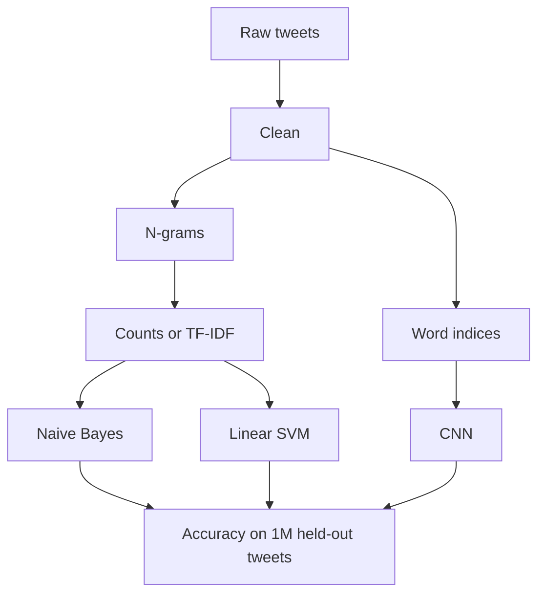

In spring 2019 I did a course project at KTH with two classmates. It was my first project on text. The question was simple: which classifier is best at telling positive tweets from negative ones? We tried Naive Bayes, a linear SVM and a small convolutional network. I expected the CNN to win, because in 2019 the neural network was supposed to win.

It didn't. A year and a half later I reread the notebook, and I think the more useful lesson is somewhere other than where we put it at the time.

## The data

We used Sentiment140, 1.6 million English tweets from 2009, each labelled positive or negative. The first notebook was exploration: which words show up on each side.

<figure class="fig">

negative tweets

positive tweets

<figcaption>Most frequent words in each class, from our exploration notebook. "Today", "now" and "lol" are large on both sides.</figcaption>
</figure>

The clouds already hint at the difficulty. The biggest words are the same on both sides. Sentiment sits in the smaller words and in how they combine.

## From a tweet to numbers

A model can't read a tweet; it needs a row of numbers. Everything before the model is about producing that row. Here is the whole pipeline at a glance:

**Cleaning.** Tweets are messy: mentions, links, HTML entities, inconsistent case, contractions. Our cleaning function handled them in a fixed order:

<figure class="fig">
<svg viewBox="0 0 680 244" role="img" aria-labelledby="c1t c1d">
  <title id="c1t">Cleaning one tweet, step by step</title>
  <desc id="c1d">A raw tweet with a mention, an HTML entity and a link is cleaned in four steps into the tokens: do, not, love, this, song, anymore, it, hurts.</desc>
  <text class="m" x="10" y="16">raw tweet · labelled negative from a :( that Sentiment140 already stripped</text>
  <text class="t" x="10" y="34" xml:space="preserve"><tspan class="tb">@jess_k</tspan> I don't love this song anymore <tspan class="tb">&amp;amp;</tspan> it hurts <tspan class="tb">http://bit.ly/x9</tspan></text>
  <text class="m" x="10" y="62">1 · decode HTML, remove mentions and links</text>
  <text class="t" x="10" y="80" xml:space="preserve">I don't love this song anymore <tspan class="tb">&amp;</tspan> it hurts</text>
  <text class="m" x="10" y="108">2 · lowercase, expand contractions</text>
  <text class="t" x="10" y="126" xml:space="preserve"><tspan class="tb">i</tspan> <tspan class="ta">do not</tspan> love this song anymore <tspan class="tb">&amp;</tspan> it hurts</text>
  <text class="m" x="10" y="154">3 · keep letters only, drop one-letter words</text>
  <text class="t" x="10" y="172" xml:space="preserve">do not love this song anymore it hurts</text>
  <text class="m" x="10" y="200">4 · split into tokens</text>
  <rect class="box" x="10" y="208" width="30" height="26" rx="13"/><text class="t" x="25.0" y="225" text-anchor="middle">do</text>
  <rect class="box" x="48" y="208" width="38" height="26" rx="13"/><text class="t" x="67.0" y="225" text-anchor="middle">not</text>
  <rect class="box" x="94" y="208" width="45" height="26" rx="13"/><text class="t" x="116.5" y="225" text-anchor="middle">love</text>
  <rect class="box" x="147" y="208" width="45" height="26" rx="13"/><text class="t" x="169.5" y="225" text-anchor="middle">this</text>
  <rect class="box" x="200" y="208" width="45" height="26" rx="13"/><text class="t" x="222.5" y="225" text-anchor="middle">song</text>
  <rect class="box" x="253" y="208" width="66" height="26" rx="13"/><text class="t" x="286.0" y="225" text-anchor="middle">anymore</text>
  <rect class="box" x="327" y="208" width="30" height="26" rx="13"/><text class="t" x="342.0" y="225" text-anchor="middle">it</text>
  <rect class="box" x="365" y="208" width="52" height="26" rx="13"/><text class="t" x="391.0" y="225" text-anchor="middle">hurts</text>
</svg>
<figcaption>One made-up tweet through our cleaning function. Orange marks noise that a later step removes; blue marks what a step changed. Expanding "don't" to "do not" was deliberate: it keeps the negation as its own word.</figcaption>
</figure>

**N-grams.** Next, each cleaned tweet is split into *n-grams*: single words (unigrams), pairs (bigrams) and triples (trigrams). Longer n-grams keep a little word order, which matters most for negation.

<figure class="fig">
<svg viewBox="0 0 680 150" role="img" aria-labelledby="c2t c2d">
  <title id="c2t">Unigrams, bigrams and trigrams of one tweet</title>
  <desc id="c2d">The tweet this is not good split into unigrams (this, is, not, good), bigrams (this is, is not, not good) and trigrams (this is not, is not good).</desc>
  <text class="t" x="10" y="18">tweet: <tspan class="ta">this is not good</tspan></text>
  <text class="m" x="10" y="51">unigrams</text>
  <rect class="box" x="110" y="34" width="45" height="26" rx="13"/><text class="t" x="132.5" y="51" text-anchor="middle">this</text>
  <rect class="box" x="163" y="34" width="30" height="26" rx="13"/><text class="t" x="178.0" y="51" text-anchor="middle">is</text>
  <rect class="box" x="201" y="34" width="38" height="26" rx="13"/><text class="t" x="220.0" y="51" text-anchor="middle">not</text>
  <rect class="box" x="247" y="34" width="45" height="26" rx="13"/><text class="t" x="269.5" y="51" text-anchor="middle">good</text>
  <text class="m" x="10" y="89">bigrams</text>
  <rect class="box" x="110" y="72" width="66" height="26" rx="13"/><text class="t" x="143.0" y="89" text-anchor="middle">this is</text>
  <rect class="box" x="184" y="72" width="59" height="26" rx="13"/><text class="t" x="213.5" y="89" text-anchor="middle">is not</text>
  <rect class="box" x="251" y="72" width="74" height="26" rx="13" style="stroke:var(--fig-a)"/><text class="ta" x="288.0" y="89" text-anchor="middle">not good</text>
  <text class="ta" x="339" y="89">negation kept as one feature</text>
  <text class="m" x="10" y="127">trigrams</text>
  <rect class="box" x="110" y="110" width="95" height="26" rx="13"/><text class="t" x="157.5" y="127" text-anchor="middle">this is not</text>
  <rect class="box" x="213" y="110" width="95" height="26" rx="13" style="stroke:var(--fig-a)"/><text class="ta" x="260.5" y="127" text-anchor="middle">is not good</text>
</svg>
<figcaption>N-grams are runs of consecutive words. With single words only, "not" and "good" are separate clues that pull in opposite directions; the bigram "not good" is one clear clue.</figcaption>
</figure>

**Bag of words and TF-IDF.** Finally, every n-gram in the training set becomes a column, and each tweet becomes a row saying how often each one appears. That's a *bag of words*: word order beyond the n-gram is thrown away. Plain counts treat every term alike, so common words dominate. *TF-IDF* (term frequency × inverse document frequency) scales each count down by how many tweets contain the term:

<figure class="fig">
<svg viewBox="0 0 680 262" role="img" aria-labelledby="c3t c3d">
  <title id="c3t">Bag-of-words counts and TF-IDF weights for three tweets</title>
  <desc id="c3d">Three tweets as rows and six terms as columns. Counts are all 0 or 1. With TF-IDF, good, which appears in every tweet, gets 0.23 to 0.28, while rarer terms such as not, today and morning get 0.40 to 0.48.</desc>
  <text class="h" x="10" y="16">BAG OF WORDS: HOW MANY TIMES EACH TERM APPEARS</text>
  <text class="m" x="226" y="36" text-anchor="middle">good</text>
  <text class="m" x="302" y="36" text-anchor="middle">not</text>
  <text class="m" x="378" y="36" text-anchor="middle">not good</text>
  <text class="m" x="454" y="36" text-anchor="middle">this</text>
  <text class="m" x="530" y="36" text-anchor="middle">today</text>
  <text class="m" x="606" y="36" text-anchor="middle">morning</text>
  <text class="t" x="10" y="61">this is not good</text>
  <rect class="box" x="190" y="44" width="72" height="24" rx="4"/>
  <rect class="fa" x="190" y="44" width="72" height="24" rx="4" opacity="0.55"/>
  <text class="t" x="226" y="60" text-anchor="middle">1</text>
  <rect class="box" x="266" y="44" width="72" height="24" rx="4"/>
  <rect class="fa" x="266" y="44" width="72" height="24" rx="4" opacity="0.55"/>
  <text class="t" x="302" y="60" text-anchor="middle">1</text>
  <rect class="box" x="342" y="44" width="72" height="24" rx="4"/>
  <rect class="fa" x="342" y="44" width="72" height="24" rx="4" opacity="0.55"/>
  <text class="t" x="378" y="60" text-anchor="middle">1</text>
  <rect class="box" x="418" y="44" width="72" height="24" rx="4"/>
  <rect class="fa" x="418" y="44" width="72" height="24" rx="4" opacity="0.55"/>
  <text class="t" x="454" y="60" text-anchor="middle">1</text>
  <rect class="box" x="494" y="44" width="72" height="24" rx="4"/>
  <text class="m" x="530" y="60" text-anchor="middle">0</text>
  <rect class="box" x="570" y="44" width="72" height="24" rx="4"/>
  <text class="m" x="606" y="60" text-anchor="middle">0</text>
  <text class="t" x="10" y="89">so good today</text>
  <rect class="box" x="190" y="72" width="72" height="24" rx="4"/>
  <rect class="fa" x="190" y="72" width="72" height="24" rx="4" opacity="0.55"/>
  <text class="t" x="226" y="88" text-anchor="middle">1</text>
  <rect class="box" x="266" y="72" width="72" height="24" rx="4"/>
  <text class="m" x="302" y="88" text-anchor="middle">0</text>
  <rect class="box" x="342" y="72" width="72" height="24" rx="4"/>
  <text class="m" x="378" y="88" text-anchor="middle">0</text>
  <rect class="box" x="418" y="72" width="72" height="24" rx="4"/>
  <text class="m" x="454" y="88" text-anchor="middle">0</text>
  <rect class="box" x="494" y="72" width="72" height="24" rx="4"/>
  <rect class="fa" x="494" y="72" width="72" height="24" rx="4" opacity="0.55"/>
  <text class="t" x="530" y="88" text-anchor="middle">1</text>
  <rect class="box" x="570" y="72" width="72" height="24" rx="4"/>
  <text class="m" x="606" y="88" text-anchor="middle">0</text>
  <text class="t" x="10" y="117">good morning all</text>
  <rect class="box" x="190" y="100" width="72" height="24" rx="4"/>
  <rect class="fa" x="190" y="100" width="72" height="24" rx="4" opacity="0.55"/>
  <text class="t" x="226" y="116" text-anchor="middle">1</text>
  <rect class="box" x="266" y="100" width="72" height="24" rx="4"/>
  <text class="m" x="302" y="116" text-anchor="middle">0</text>
  <rect class="box" x="342" y="100" width="72" height="24" rx="4"/>
  <text class="m" x="378" y="116" text-anchor="middle">0</text>
  <rect class="box" x="418" y="100" width="72" height="24" rx="4"/>
  <text class="m" x="454" y="116" text-anchor="middle">0</text>
  <rect class="box" x="494" y="100" width="72" height="24" rx="4"/>
  <text class="m" x="530" y="116" text-anchor="middle">0</text>
  <rect class="box" x="570" y="100" width="72" height="24" rx="4"/>
  <rect class="fa" x="570" y="100" width="72" height="24" rx="4" opacity="0.55"/>
  <text class="t" x="606" y="116" text-anchor="middle">1</text>
  <text class="h" x="10" y="150">TF-IDF: THE SAME COUNTS, WEIGHTED BY RARITY</text>
  <text class="m" x="226" y="170" text-anchor="middle">good</text>
  <text class="m" x="302" y="170" text-anchor="middle">not</text>
  <text class="m" x="378" y="170" text-anchor="middle">not good</text>
  <text class="m" x="454" y="170" text-anchor="middle">this</text>
  <text class="m" x="530" y="170" text-anchor="middle">today</text>
  <text class="m" x="606" y="170" text-anchor="middle">morning</text>
  <text class="t" x="10" y="195">this is not good</text>
  <rect class="box" x="190" y="178" width="72" height="24" rx="4"/>
  <rect class="fa" x="190" y="178" width="72" height="24" rx="4" opacity="0.26"/>
  <text class="t" x="226" y="194" text-anchor="middle">0.23</text>
  <rect class="box" x="266" y="178" width="72" height="24" rx="4"/>
  <rect class="fa" x="266" y="178" width="72" height="24" rx="4" opacity="0.46"/>
  <text class="t" x="302" y="194" text-anchor="middle">0.40</text>
  <rect class="box" x="342" y="178" width="72" height="24" rx="4"/>
  <rect class="fa" x="342" y="178" width="72" height="24" rx="4" opacity="0.46"/>
  <text class="t" x="378" y="194" text-anchor="middle">0.40</text>
  <rect class="box" x="418" y="178" width="72" height="24" rx="4"/>
  <rect class="fa" x="418" y="178" width="72" height="24" rx="4" opacity="0.46"/>
  <text class="t" x="454" y="194" text-anchor="middle">0.40</text>
  <rect class="box" x="494" y="178" width="72" height="24" rx="4"/>
  <text class="m" x="530" y="194" text-anchor="middle">0</text>
  <rect class="box" x="570" y="178" width="72" height="24" rx="4"/>
  <text class="m" x="606" y="194" text-anchor="middle">0</text>
  <text class="t" x="10" y="223">so good today</text>
  <rect class="box" x="190" y="206" width="72" height="24" rx="4"/>
  <rect class="fa" x="190" y="206" width="72" height="24" rx="4" opacity="0.32"/>
  <text class="t" x="226" y="222" text-anchor="middle">0.28</text>
  <rect class="box" x="266" y="206" width="72" height="24" rx="4"/>
  <text class="m" x="302" y="222" text-anchor="middle">0</text>
  <rect class="box" x="342" y="206" width="72" height="24" rx="4"/>
  <text class="m" x="378" y="222" text-anchor="middle">0</text>
  <rect class="box" x="418" y="206" width="72" height="24" rx="4"/>
  <text class="m" x="454" y="222" text-anchor="middle">0</text>
  <rect class="box" x="494" y="206" width="72" height="24" rx="4"/>
  <rect class="fa" x="494" y="206" width="72" height="24" rx="4" opacity="0.55"/>
  <text class="t" x="530" y="222" text-anchor="middle">0.48</text>
  <rect class="box" x="570" y="206" width="72" height="24" rx="4"/>
  <text class="m" x="606" y="222" text-anchor="middle">0</text>
  <text class="t" x="10" y="251">good morning all</text>
  <rect class="box" x="190" y="234" width="72" height="24" rx="4"/>
  <rect class="fa" x="190" y="234" width="72" height="24" rx="4" opacity="0.32"/>
  <text class="t" x="226" y="250" text-anchor="middle">0.28</text>
  <rect class="box" x="266" y="234" width="72" height="24" rx="4"/>
  <text class="m" x="302" y="250" text-anchor="middle">0</text>
  <rect class="box" x="342" y="234" width="72" height="24" rx="4"/>
  <text class="m" x="378" y="250" text-anchor="middle">0</text>
  <rect class="box" x="418" y="234" width="72" height="24" rx="4"/>
  <text class="m" x="454" y="250" text-anchor="middle">0</text>
  <rect class="box" x="494" y="234" width="72" height="24" rx="4"/>
  <text class="m" x="530" y="250" text-anchor="middle">0</text>
  <rect class="box" x="570" y="234" width="72" height="24" rx="4"/>
  <rect class="fa" x="570" y="234" width="72" height="24" rx="4" opacity="0.55"/>
  <text class="t" x="606" y="250" text-anchor="middle">0.48</text>
</svg>
<figcaption>Each tweet becomes a row of numbers, one column per term (only six of the columns are shown). "good" is in every tweet, so TF-IDF gives it the least weight. Values follow scikit-learn's default formula, with each row normalised over all its unigrams and bigrams.</figcaption>
</figure>

With about 100,000 training tweets and tens of thousands of columns or more, almost every cell is zero. Models built for this kind of sparse data are fast and hard to beat, which is part of why the linear ones did so well.

## The models we picked

We picked three models that use those numbers in different ways, plus a baseline that uses none:

- **TextBlob** was the baseline. It doesn't learn anything: it looks words up in a fixed dictionary of positive and negative scores. It showed what we got for free.
- **Multinomial Naive Bayes** learns how likely each term is in positive and in negative tweets, then multiplies those likelihoods for a new tweet. It assumes terms are independent, which isn't true, but it trains in seconds and is the standard first model for text.
- **A linear SVM** learns one weight per term and draws the boundary between the classes with as wide a margin as possible. With tens of thousands of sparse features, of which only a few matter in any one tweet, that's exactly the setting it's good at.
- **A convolutional network (CNN)** skips the counts. Each word becomes a small learned vector, and filters slide over windows of a few words at a time, learning to detect phrases wherever they appear. Ours was small: a 5,000-word vocabulary, 25-dimensional word vectors, and a short stack of convolution layers.

<figure class="fig">
<svg viewBox="0 0 680 296" role="img" aria-labelledby="c4t c4d">
  <title id="c4t">How each model scores this is not good</title>
  <desc id="c4d">Naive Bayes multiplies per-word likelihood ratios; not favours negative and good favours positive. The linear SVM sums learned weights, and the bigram not good has a large negative weight, so the sum is negative. The CNN turns words into vectors and a filter over a window of words fires on not good. All three output negative.</desc>
  <defs><marker id="cm" viewBox="0 0 10 10" refX="9" refY="5" markerWidth="7" markerHeight="7" orient="auto-start-reverse"><path class="arrow" d="M0,0 L10,5 L0,10 z"/></marker></defs>
  <circle class="fb" cx="16" cy="12" r="5"/><text class="m" x="26" y="16">pushes toward negative</text>
  <circle class="fa" cx="206" cy="12" r="5"/><text class="m" x="216" y="16">pushes toward positive</text>
  <text class="m" x="670" y="16" text-anchor="end">numbers are illustrative</text>
  <text class="t" x="10" y="57">Naive Bayes</text>
  <text class="m" x="10" y="75">how typical each word</text>
  <text class="m" x="10" y="90">is of each class</text>
  <rect class="box" x="180" y="40" width="45" height="26" rx="13"/><text class="t" x="202.5" y="57" text-anchor="middle">this</text>
  <rect class="box" x="233" y="40" width="30" height="26" rx="13"/><text class="t" x="248.0" y="57" text-anchor="middle">is</text>
  <rect class="box" x="271" y="40" width="38" height="26" rx="13"/><text class="t" x="290.0" y="57" text-anchor="middle">not</text>
  <rect class="box" x="317" y="40" width="45" height="26" rx="13"/><text class="t" x="339.5" y="57" text-anchor="middle">good</text>
  <text class="m" x="202.5" y="86" text-anchor="middle">≈1</text>
  <text class="m" x="248.0" y="86" text-anchor="middle">≈1</text>
  <text class="tb" x="290.0" y="86" text-anchor="middle">2.1×</text>
  <text class="ta" x="339.5" y="86" text-anchor="middle">1.8×</text>
  <path class="ln" d="M478,53 L552,53" marker-end="url(#cm)"/>
  <text class="m" x="515" y="46" text-anchor="middle">multiply</text>
  <rect class="box" x="556" y="40" width="114" height="26" rx="13" style="stroke:var(--fig-b)"/>
  <text class="tb" x="613" y="57" text-anchor="middle">negative</text>
  <text class="t" x="10" y="143">Linear SVM</text>
  <text class="m" x="10" y="161">one learned weight</text>
  <text class="m" x="10" y="176">per word or phrase</text>
  <rect class="box" x="180" y="126" width="45" height="26" rx="13"/><text class="t" x="202.5" y="143" text-anchor="middle">this</text>
  <rect class="box" x="233" y="126" width="30" height="26" rx="13"/><text class="t" x="248.0" y="143" text-anchor="middle">is</text>
  <rect class="box" x="271" y="126" width="38" height="26" rx="13"/><text class="t" x="290.0" y="143" text-anchor="middle">not</text>
  <rect class="box" x="317" y="126" width="45" height="26" rx="13"/><text class="t" x="339.5" y="143" text-anchor="middle">good</text>
  <rect class="box" x="370" y="126" width="74" height="26" rx="13"/><text class="t" x="407.0" y="143" text-anchor="middle">not good</text>
  <text class="m" x="202.5" y="172" text-anchor="middle">0</text>
  <text class="m" x="248.0" y="172" text-anchor="middle">0</text>
  <text class="tb" x="290.0" y="172" text-anchor="middle">−0.4</text>
  <text class="ta" x="339.5" y="172" text-anchor="middle">+0.6</text>
  <text class="tb" x="407.0" y="172" text-anchor="middle">−1.1</text>
  <path class="ln" d="M478,139 L552,139" marker-end="url(#cm)"/>
  <text class="m" x="515" y="132" text-anchor="middle">sum −0.9</text>
  <rect class="box" x="556" y="126" width="114" height="26" rx="13" style="stroke:var(--fig-b)"/>
  <text class="tb" x="613" y="143" text-anchor="middle">negative</text>
  <text class="t" x="10" y="229">CNN</text>
  <text class="m" x="10" y="247">word vectors, then</text>
  <text class="m" x="10" y="262">filters over windows</text>
  <rect class="box" x="180" y="212" width="45" height="26" rx="13"/><text class="t" x="202.5" y="229" text-anchor="middle">this</text>
  <rect class="box" x="233" y="212" width="30" height="26" rx="13"/><text class="t" x="248.0" y="229" text-anchor="middle">is</text>
  <rect class="box" x="271" y="212" width="38" height="26" rx="13"/><text class="t" x="290.0" y="229" text-anchor="middle">not</text>
  <rect class="box" x="317" y="212" width="45" height="26" rx="13"/><text class="t" x="339.5" y="229" text-anchor="middle">good</text>
  <rect class="fa" x="186.5" y="246" width="9" height="9" rx="2" opacity="0.25"/>
  <rect class="fa" x="197.5" y="246" width="9" height="9" rx="2" opacity="0.45"/>
  <rect class="fa" x="208.5" y="246" width="9" height="9" rx="2" opacity="0.65"/>
  <rect class="fa" x="232.0" y="246" width="9" height="9" rx="2" opacity="0.25"/>
  <rect class="fa" x="243.0" y="246" width="9" height="9" rx="2" opacity="0.45"/>
  <rect class="fa" x="254.0" y="246" width="9" height="9" rx="2" opacity="0.65"/>
  <rect class="fa" x="274.0" y="246" width="9" height="9" rx="2" opacity="0.25"/>
  <rect class="fa" x="285.0" y="246" width="9" height="9" rx="2" opacity="0.45"/>
  <rect class="fa" x="296.0" y="246" width="9" height="9" rx="2" opacity="0.65"/>
  <rect class="fa" x="323.5" y="246" width="9" height="9" rx="2" opacity="0.25"/>
  <rect class="fa" x="334.5" y="246" width="9" height="9" rx="2" opacity="0.45"/>
  <rect class="fa" x="345.5" y="246" width="9" height="9" rx="2" opacity="0.65"/>
  <path class="sb" d="M233,262 L233,268 L362,268 L362,262"/>
  <text class="tb" x="297.5" y="284" text-anchor="middle">filter fires on "not good"</text>
  <path class="ln" d="M478,225 L552,225" marker-end="url(#cm)"/>
  <text class="m" x="515" y="218" text-anchor="middle">max, dense</text>
  <rect class="box" x="556" y="212" width="114" height="26" rx="13" style="stroke:var(--fig-b)"/>
  <text class="tb" x="613" y="229" text-anchor="middle">negative</text>
</svg>
<figcaption>Three ways to reach the same answer. Naive Bayes and the SVM only see which words and phrases occur; the CNN sees word order inside each window. The numbers are made up to show the mechanics, not taken from our models.</figcaption>
</figure>

Naive Bayes and the SVM only see which terms occur. The CNN sees word order within a window, which is why I expected it to win.

## What we measured

After cleaning, we held out a balanced test set of one million tweets and trained on a sample of about 100,000. Before splitting, we removed any training tweet whose text also appeared in the test set. That was a good call, since Twitter is full of identical tweets.

On that test set:

| Model | Twitter accuracy |
| --- | --- |
| TextBlob, no training (baseline) | 0.59 |
| CNN (Keras, 5,000-word vocabulary) | 0.777 |
| Multinomial Naive Bayes, TF-IDF 1–3 grams | 0.784 |
| Linear SVM, TF-IDF 1–3 grams | 0.820 |

The linear SVM won, and that was the headline of our report. A fair reading is narrower. Anything trained beat the off-the-shelf lexicon by about twenty points, and the three trained models then sat within about four points of each other.

We ran the same three models on Amazon product reviews. All of them scored between 90% and 94%. **Changing the dataset moved accuracy by eleven to fifteen points. Changing the model moved it by about four.**

<figure class="fig">
<svg viewBox="0 0 680 190" role="img" aria-labelledby="s1t s1d">
  <title id="s1t">Accuracy by model on Twitter and Amazon reviews</title>
  <desc id="s1d">CNN 77.7% on Twitter, 92.75% on Amazon. Naive Bayes 78.4% and 89.97%. Linear SVM 82.0% and 93.71%.</desc>
  <circle class="fb" cx="66" cy="14" r="5"/><text class="t" x="76" y="18">Twitter (Sentiment140)</text>
  <circle class="fa" cx="266" cy="14" r="5"/><text class="t" x="276" y="18">Amazon reviews</text>
  <line class="grid" x1="150" x2="150" y1="36" y2="160"/><line class="grid" x1="272.5" x2="272.5" y1="36" y2="160"/>
  <line class="grid" x1="395" x2="395" y1="36" y2="160"/><line class="grid" x1="517.5" x2="517.5" y1="36" y2="160"/>
  <line class="grid" x1="640" x2="640" y1="36" y2="160"/>
  <text class="m" x="150" y="176" text-anchor="middle">75%</text><text class="m" x="272.5" y="176" text-anchor="middle">80%</text>
  <text class="m" x="395" y="176" text-anchor="middle">85%</text><text class="m" x="517.5" y="176" text-anchor="middle">90%</text>
  <text class="m" x="640" y="176" text-anchor="middle">95%</text>
  <text class="t" x="10" y="64">CNN</text>
  <line class="ln" x1="216.2" x2="584.9" y1="60" y2="60"/>
  <g tabindex="0"><title>CNN on Twitter: 77.7%</title><circle class="fb" cx="216.2" cy="60" r="6" style="stroke:var(--bg);stroke-width:2"/></g>
  <g tabindex="0"><title>CNN on Amazon: 92.75%</title><circle class="fa" cx="584.9" cy="60" r="6" style="stroke:var(--bg);stroke-width:2"/></g>
  <text class="m" x="204" y="64" text-anchor="end">77.7</text><text class="m" x="597" y="64">92.8</text>
  <text class="t" x="10" y="104">Naive Bayes</text>
  <line class="ln" x1="233.3" x2="516.8" y1="100" y2="100"/>
  <g tabindex="0"><title>Naive Bayes on Twitter: 78.4%</title><circle class="fb" cx="233.3" cy="100" r="6" style="stroke:var(--bg);stroke-width:2"/></g>
  <g tabindex="0"><title>Naive Bayes on Amazon: 89.97%</title><circle class="fa" cx="516.8" cy="100" r="6" style="stroke:var(--bg);stroke-width:2"/></g>
  <text class="m" x="221" y="104" text-anchor="end">78.4</text><text class="m" x="529" y="104">90.0</text>
  <text class="t" x="10" y="144">Linear SVM</text>
  <line class="ln" x1="321.5" x2="608.9" y1="140" y2="140"/>
  <g tabindex="0"><title>Linear SVM on Twitter: 82.0%</title><circle class="fb" cx="321.5" cy="140" r="6" style="stroke:var(--bg);stroke-width:2"/></g>
  <g tabindex="0"><title>Linear SVM on Amazon: 93.71%</title><circle class="fa" cx="608.9" cy="140" r="6" style="stroke:var(--bg);stroke-width:2"/></g>
  <text class="m" x="309" y="144" text-anchor="end">82.0</text><text class="m" x="621" y="144">93.7</text>
</svg>
<figcaption>Each line is one model on two datasets. The lines are long, while dots of the same colour sit close together: the data moved the result far more than the choice of model did.</figcaption>
</figure>

Reviews are longer, the words are more specific, and a star rating is a cleaner label than whatever a tweet implies. If I had to predict how well a sentiment model would do, knowing what text it would see would help me much more than knowing its architecture.

## The labels were already a model

Sentiment140 was never labelled by people. Its authors collected tweets containing emoticons, treated `:)` as positive and `:(` as negative, and then removed the emoticons from the text. So every one of our models learned to predict whether the author had typed a smiley.

That explains the gap with Amazon better than anything we tried. A tweet like "finally finished my exam :(" carries a negative label that the remaining words hardly support. Beyond a certain point, no classifier can recover information the labelling process never captured. Asking "why can't we get past 82%?" was really asking about the data.

## The stopword that mattered

The experiment I'm happiest with in hindsight is a small one. With Naive Bayes, we compared three ways of handling stopwords:

- keep every word: 0.78
- remove scikit-learn's standard English stopword list: 0.75
- remove our own list of the twenty most frequent words, excluding `not`: 0.77

<figure class="fig">

<figcaption>The original notebook plot: Naive Bayes validation accuracy as the vocabulary grows. The standard list (orange) stays lowest at every size.</figcaption>
</figure>

<figure class="fig">
<svg viewBox="0 0 680 150" role="img" aria-labelledby="s2t s2d">
  <title id="s2t">What each stopword setting leaves of "this is not good"</title>
  <desc id="s2d">Keeping every word leaves "this is not good", accuracy 0.78. The standard English list removes this, is and not, leaving "good", accuracy 0.75. Our list removes is but keeps not, leaving "this not good", accuracy 0.77.</desc>
  <text class="t" x="10" y="31">keep every word</text>
  <rect class="box" x="190" y="14" width="48" height="26" rx="13"/><text class="t" x="214" y="31" text-anchor="middle">this</text>
  <rect class="box" x="246" y="14" width="32" height="26" rx="13"/><text class="t" x="262" y="31" text-anchor="middle">is</text>
  <rect class="box" x="286" y="14" width="40" height="26" rx="13"/><text class="t" x="306" y="31" text-anchor="middle">not</text>
  <rect class="box" x="334" y="14" width="48" height="26" rx="13"/><text class="t" x="358" y="31" text-anchor="middle">good</text>
  <text class="m" x="670" y="31" text-anchor="end">0.78</text>
  <text class="t" x="10" y="76">standard English list</text>
  <rect class="box dash" x="190" y="59" width="48" height="26" rx="13" opacity=".5"/><text class="m" x="214" y="76" text-anchor="middle" text-decoration="line-through">this</text>
  <rect class="box dash" x="246" y="59" width="32" height="26" rx="13" opacity=".5"/><text class="m" x="262" y="76" text-anchor="middle" text-decoration="line-through">is</text>
  <rect class="box dash" x="286" y="59" width="40" height="26" rx="13" style="stroke:var(--fig-b)"/><text class="tb" x="306" y="76" text-anchor="middle" text-decoration="line-through">not</text>
  <rect class="box" x="334" y="59" width="48" height="26" rx="13"/><text class="t" x="358" y="76" text-anchor="middle">good</text>
  <text class="tb" x="396" y="76">reads as positive</text>
  <text class="m" x="670" y="76" text-anchor="end">0.75</text>
  <text class="t" x="10" y="121">our list, kept "not"</text>
  <rect class="box" x="190" y="104" width="48" height="26" rx="13"/><text class="t" x="214" y="121" text-anchor="middle">this</text>
  <rect class="box dash" x="246" y="104" width="32" height="26" rx="13" opacity=".5"/><text class="m" x="262" y="121" text-anchor="middle" text-decoration="line-through">is</text>
  <rect class="box" x="286" y="104" width="40" height="26" rx="13" style="stroke:var(--fig-a)"/><text class="ta" x="306" y="121" text-anchor="middle">not</text>
  <rect class="box" x="334" y="104" width="48" height="26" rx="13"/><text class="t" x="358" y="121" text-anchor="middle">good</text>
  <text class="ta" x="396" y="121">negation survives</text>
  <text class="m" x="670" y="121" text-anchor="end">0.77</text>
</svg>
<figcaption>One example sentence under each setting, with the Naive Bayes validation accuracy on the right.</figcaption>
</figure>

The standard list includes `not`. Dropping it turns "not good" into "good". Our cleaning step had already expanded contractions for this reason ("don't" became "do not"), and then the stopword list removed the part we had been careful to keep. The custom list skipped `not` deliberately, and in the notebook that exclusion is a single line: `del custom_stop_words[2]`.

It's the least impressive-looking line in the project, and it is also the best example of the actual job: find out what a preprocessing step removes before assuming it removes noise.

## What I would question a year on

Rereading your own work from eighteen months ago is humbling. A few things I would change.

**The CNN comparison was unfair.** It had a 5,000-word vocabulary, 25-dimensional embeddings, tweets cut at 50 tokens, and 100,000 training examples. The SVM had 1–3 grams over the full vocabulary. The training curve shows the same thing from another angle:

<figure class="fig">

<figcaption>CNN loss over 20 epochs, from the notebook. Training loss (blue) falls; validation loss (orange) rises from the first epoch.</figcaption>
</figure>

Validation loss went up from the very first epoch, so the network was memorising the training set rather than learning anything that transferred. With that curve, the right move was to stop, get more data or regularise more, not report its accuracy next to the others. So "the SVM beat the CNN" really means "a well-fed linear model beat a network that was overfitting". That can still be the right practical choice, but it's a different claim.

**One normalisation experiment never ran.** The lemmatisation and stemming cells build a normalised copy of the data and then split the *original* data for training. Their results match the unnormalised run exactly, and we concluded that normalisation made no difference. We never tested it.

**The validation AUC was computed from hard labels.** During the feature search, the ROC curve was built from predicted classes instead of scores, so the "AUC" matched accuracy almost exactly and added nothing. The final test runs used probabilities correctly. Even so, our README pairs the linear SVM's accuracy (82%) with an AUC of 0.86, which belongs to the RBF kernel. The linear model's own AUC is 0.88 in the saved notebook and 0.90 in our slides; those come from different runs, and we never wrote down which one the reported accuracy came from.

**The RBF SVM was scored on a 5% sample of the test set**, because the full set was too slow. It appears in our comparison table next to models scored on the full million.

None of these change the main conclusion. They do show that the numbers we were proudest of were the least carefully checked.

The notebooks, figures and report are on [GitHub](https://github.com/fadhilmch/big-data-project).

## References

1. Alec Go, Richa Bhayani and Lei Huang. *Twitter Sentiment Classification using Distant Supervision*. Stanford CS224N project report, 2009. <https://www-cs.stanford.edu/people/alecmgo/papers/TwitterDistantSupervision09.pdf> — the Sentiment140 emoticon-labelling method.
2. Christopher D. Manning, Prabhakar Raghavan and Hinrich Schütze. *Introduction to Information Retrieval*. Cambridge University Press, 2008. <https://nlp.stanford.edu/IR-book/> — covers TF-IDF and Naive Bayes text classification.
3. scikit-learn developers. *Feature extraction: text feature extraction*. scikit-learn documentation. <https://scikit-learn.org/stable/modules/feature_extraction.html#text-feature-extraction>
4. Steven Loria. *TextBlob: Quickstart*. TextBlob documentation. <https://textblob.readthedocs.io/en/dev/quickstart.html>
5. Corinna Cortes and Vladimir Vapnik. *Support-vector networks*. Machine Learning 20, 1995. <https://link.springer.com/article/10.1007/BF00994018>
6. Yoon Kim. *Convolutional Neural Networks for Sentence Classification*. EMNLP, 2014. <https://arxiv.org/abs/1408.5882>
