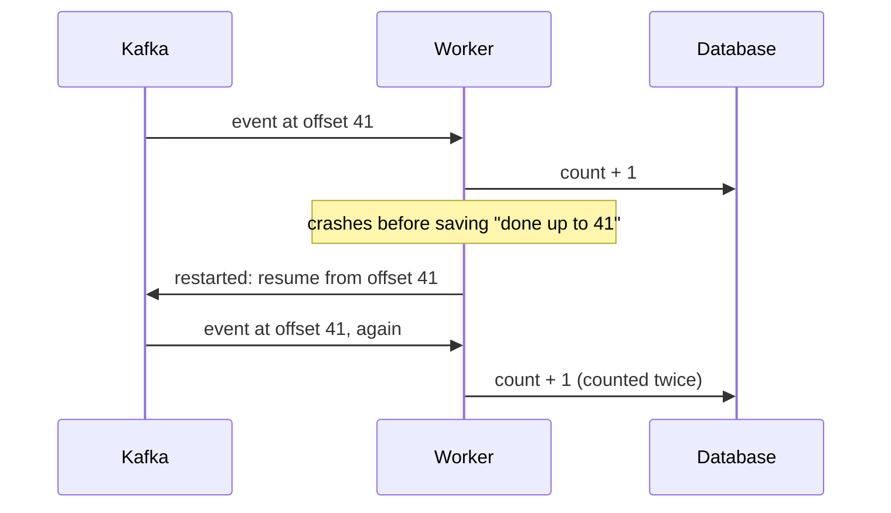

In autumn 2019, a classmate and I built a live chart of the artists people were sharing on Twitter. Tweets containing a Spotify link went into Kafka. Spark Streaming looked up each track's artist on the Spotify API, Cassandra stored the counts, and a Dash page redrew the top twenty every five seconds. It was my first streaming system.

It worked, and [the recording](https://youtu.be/eLnKT_aGahk) looks convincing: bars grow, artists move up and down. Reading the code again a year and a half later, I can see that we had built the *shape* of a streaming pipeline without most of the things that make one trustworthy. This post starts with the ideas behind data streaming, then goes through what we built, the five things a stream has to get right, and how I'd deploy the same idea on a real cluster.

## Data streaming, briefly

Most of the data I'd worked with until then sat still: a CSV, a table, a folder of files. Streaming starts from a different assumption. The data never stops arriving, and you want answers while it's still arriving.

### Batch or stream

A **batch** job processes a fixed chunk of data on a schedule: every night, every hour. A **stream** processor handles each event as it arrives and keeps its answer continuously up to date.

<figure class="fig">
<svg viewBox="0 0 680 196" role="img" aria-labelledby="b1t b1d">
  <title id="b1t">Batch versus stream processing</title>
  <desc id="b1d">The same events on two timelines. In batch, events pile up and a job produces a result at the end of each interval, so the first event waits for the next run. In a stream, each event produces an updated result right after it arrives.</desc>
  <defs><marker id="s1a" viewBox="0 0 10 10" refX="9" refY="5" markerWidth="7" markerHeight="7" orient="auto-start-reverse"><path class="arrow" d="M0,0 L10,5 L0,10 z"/></marker></defs>
  <text class="t" x="10" y="54">Batch</text>
  <text class="m" x="10" y="70">runs every hour</text>
  <text class="t" x="10" y="154">Stream</text>
  <text class="m" x="10" y="170">always on</text>
  <line class="grid" x1="120" x2="660" y1="58" y2="58"/>
  <line class="grid" x1="120" x2="660" y1="158" y2="158"/>
  <text class="m" x="660" y="16" text-anchor="end">time →</text>
  <circle cx="130" cy="12" r="4" style="fill:var(--muted)"/><text class="m" x="140" y="16">event</text>
  <rect class="fb" x="196" y="7" width="10" height="10" rx="2"/><text class="m" x="212" y="16">batch result</text>
  <rect class="fa" x="316" y="7" width="10" height="10" rx="2"/><text class="m" x="332" y="16">stream result</text>
  <circle cx="140" cy="58" r="4" style="fill:var(--muted)"/>
  <circle cx="140" cy="158" r="4" style="fill:var(--muted)"/>
  <line class="ln" x1="140" x2="140" y1="163" y2="176"/><rect class="fa" x="136" y="178" width="8" height="8" rx="2"/>
  <circle cx="168" cy="58" r="4" style="fill:var(--muted)"/>
  <circle cx="168" cy="158" r="4" style="fill:var(--muted)"/>
  <line class="ln" x1="168" x2="168" y1="163" y2="176"/><rect class="fa" x="164" y="178" width="8" height="8" rx="2"/>
  <circle cx="186" cy="58" r="4" style="fill:var(--muted)"/>
  <circle cx="186" cy="158" r="4" style="fill:var(--muted)"/>
  <line class="ln" x1="186" x2="186" y1="163" y2="176"/><rect class="fa" x="182" y="178" width="8" height="8" rx="2"/>
  <circle cx="232" cy="58" r="4" style="fill:var(--muted)"/>
  <circle cx="232" cy="158" r="4" style="fill:var(--muted)"/>
  <line class="ln" x1="232" x2="232" y1="163" y2="176"/><rect class="fa" x="228" y="178" width="8" height="8" rx="2"/>
  <circle cx="262" cy="58" r="4" style="fill:var(--muted)"/>
  <circle cx="262" cy="158" r="4" style="fill:var(--muted)"/>
  <line class="ln" x1="262" x2="262" y1="163" y2="176"/><rect class="fa" x="258" y="178" width="8" height="8" rx="2"/>
  <circle cx="283" cy="58" r="4" style="fill:var(--muted)"/>
  <circle cx="283" cy="158" r="4" style="fill:var(--muted)"/>
  <line class="ln" x1="283" x2="283" y1="163" y2="176"/><rect class="fa" x="279" y="178" width="8" height="8" rx="2"/>
  <circle cx="322" cy="58" r="4" style="fill:var(--muted)"/>
  <circle cx="322" cy="158" r="4" style="fill:var(--muted)"/>
  <line class="ln" x1="322" x2="322" y1="163" y2="176"/><rect class="fa" x="318" y="178" width="8" height="8" rx="2"/>
  <circle cx="351" cy="58" r="4" style="fill:var(--muted)"/>
  <circle cx="351" cy="158" r="4" style="fill:var(--muted)"/>
  <line class="ln" x1="351" x2="351" y1="163" y2="176"/><rect class="fa" x="347" y="178" width="8" height="8" rx="2"/>
  <circle cx="392" cy="58" r="4" style="fill:var(--muted)"/>
  <circle cx="392" cy="158" r="4" style="fill:var(--muted)"/>
  <line class="ln" x1="392" x2="392" y1="163" y2="176"/><rect class="fa" x="388" y="178" width="8" height="8" rx="2"/>
  <circle cx="418" cy="58" r="4" style="fill:var(--muted)"/>
  <circle cx="418" cy="158" r="4" style="fill:var(--muted)"/>
  <line class="ln" x1="418" x2="418" y1="163" y2="176"/><rect class="fa" x="414" y="178" width="8" height="8" rx="2"/>
  <circle cx="447" cy="58" r="4" style="fill:var(--muted)"/>
  <circle cx="447" cy="158" r="4" style="fill:var(--muted)"/>
  <line class="ln" x1="447" x2="447" y1="163" y2="176"/><rect class="fa" x="443" y="178" width="8" height="8" rx="2"/>
  <circle cx="506" cy="58" r="4" style="fill:var(--muted)"/>
  <circle cx="506" cy="158" r="4" style="fill:var(--muted)"/>
  <line class="ln" x1="506" x2="506" y1="163" y2="176"/><rect class="fa" x="502" y="178" width="8" height="8" rx="2"/>
  <circle cx="531" cy="58" r="4" style="fill:var(--muted)"/>
  <circle cx="531" cy="158" r="4" style="fill:var(--muted)"/>
  <line class="ln" x1="531" x2="531" y1="163" y2="176"/><rect class="fa" x="527" y="178" width="8" height="8" rx="2"/>
  <circle cx="572" cy="58" r="4" style="fill:var(--muted)"/>
  <circle cx="572" cy="158" r="4" style="fill:var(--muted)"/>
  <line class="ln" x1="572" x2="572" y1="163" y2="176"/><rect class="fa" x="568" y="178" width="8" height="8" rx="2"/>
  <circle cx="611" cy="58" r="4" style="fill:var(--muted)"/>
  <circle cx="611" cy="158" r="4" style="fill:var(--muted)"/>
  <line class="ln" x1="611" x2="611" y1="163" y2="176"/><rect class="fa" x="607" y="178" width="8" height="8" rx="2"/>
  <circle cx="640" cy="58" r="4" style="fill:var(--muted)"/>
  <circle cx="640" cy="158" r="4" style="fill:var(--muted)"/>
  <line class="ln" x1="640" x2="640" y1="163" y2="176"/><rect class="fa" x="636" y="178" width="8" height="8" rx="2"/>
  <line class="grid dash" x1="300" x2="300" y1="40" y2="100"/>
  <rect class="fb" x="294" y="84" width="12" height="12" rx="2"/>
  <line class="grid dash" x1="480" x2="480" y1="40" y2="100"/>
  <rect class="fb" x="474" y="84" width="12" height="12" rx="2"/>
  <line class="grid dash" x1="660" x2="660" y1="40" y2="100"/>
  <rect class="fb" x="654" y="84" width="12" height="12" rx="2"/>
  <text class="m" x="300" y="36" text-anchor="middle">job runs</text>
  <path class="sb" d="M140,110 L140,116 L300,116 L300,110"/>
  <text class="tb" x="220" y="132" text-anchor="middle">first event waits for the next run</text>
</svg>
<figcaption>The same events, processed two ways. Batch answers on a schedule; a stream updates its answer as each event arrives, so results are seconds old instead of up to an hour.</figcaption>
</figure>

The purpose is freshness. A batch job's answer is as old as the time since its last run. A stream's answer is seconds old, which matters when the question is "what's happening now": fraud, monitoring, or a live chart of what people are sharing. The cost is complexity. A batch job sees all its input at once and can simply be rerun if it fails; a stream must keep working, and keep being correct, while data keeps arriving.

### The log in the middle

Most streaming systems put a **log** between the things that produce events and the things that process them. Kafka is the best-known example. A log is the simplest possible data structure: an ordered list of events that you can only append to. Each event gets a position, its *offset*.

<figure class="fig">
<svg viewBox="0 0 680 186" role="img" aria-labelledby="b2t b2d">
  <title id="b2t">A topic partition as a log</title>
  <desc id="b2d">Twelve numbered cells form an append-only log. A producer appends event 11 at the end. An archive job reads at offset 4 and a dashboard job reads at offset 9, each keeping its own position.</desc>
  <defs><marker id="s2a" viewBox="0 0 10 10" refX="9" refY="5" markerWidth="7" markerHeight="7" orient="auto-start-reverse"><path class="arrow" d="M0,0 L10,5 L0,10 z"/></marker></defs>
  <text class="h" x="10" y="20">ONE PARTITION OF A TOPIC: AN ORDERED, APPEND-ONLY LOG</text>
  <rect class="box" x="10" y="34" width="38" height="40" rx="4"/>
  <text class="m" x="29" y="58" text-anchor="middle">0</text>
  <rect class="box" x="50" y="34" width="38" height="40" rx="4"/>
  <text class="m" x="69" y="58" text-anchor="middle">1</text>
  <rect class="box" x="90" y="34" width="38" height="40" rx="4"/>
  <text class="m" x="109" y="58" text-anchor="middle">2</text>
  <rect class="box" x="130" y="34" width="38" height="40" rx="4"/>
  <text class="m" x="149" y="58" text-anchor="middle">3</text>
  <rect class="box" x="170" y="34" width="38" height="40" rx="4"/>
  <text class="m" x="189" y="58" text-anchor="middle">4</text>
  <rect class="box" x="210" y="34" width="38" height="40" rx="4"/>
  <text class="m" x="229" y="58" text-anchor="middle">5</text>
  <rect class="box" x="250" y="34" width="38" height="40" rx="4"/>
  <text class="m" x="269" y="58" text-anchor="middle">6</text>
  <rect class="box" x="290" y="34" width="38" height="40" rx="4"/>
  <text class="m" x="309" y="58" text-anchor="middle">7</text>
  <rect class="box" x="330" y="34" width="38" height="40" rx="4"/>
  <text class="m" x="349" y="58" text-anchor="middle">8</text>
  <rect class="box" x="370" y="34" width="38" height="40" rx="4"/>
  <text class="m" x="389" y="58" text-anchor="middle">9</text>
  <rect class="box" x="410" y="34" width="38" height="40" rx="4"/>
  <text class="m" x="429" y="58" text-anchor="middle">10</text>
  <rect class="box" x="450" y="34" width="38" height="40" rx="4"/>
  <rect class="fa" x="450" y="34" width="38" height="40" rx="4" opacity=".35"/>
  <text class="t" x="469" y="58" text-anchor="middle">11</text>
  <rect class="box" x="540" y="32" width="130" height="44" rx="6"/>
  <text class="t" x="552" y="52">Producer</text>
  <text class="m" x="552" y="68">appends events</text>
  <path class="sa" d="M540,54 L492,54" marker-end="url(#s2a)"/>
  <text class="m" x="10" y="92">oldest</text>
  <text class="m" x="488" y="92" text-anchor="end">newest</text>
  <path class="ln" d="M189,128 L189,78" marker-end="url(#s2a)"/>
  <rect class="box" x="114" y="130" width="150" height="44" rx="6"/>
  <text class="t" x="126" y="150">Archive job</text><text class="m" x="126" y="166">next offset: 4</text>
  <path class="ln" d="M389,128 L389,78" marker-end="url(#s2a)"/>
  <rect class="box" x="314" y="130" width="150" height="44" rx="6"/>
  <text class="t" x="326" y="150">Dashboard job</text><text class="m" x="326" y="166">next offset: 9</text>
  <text class="m" x="520" y="150">each reader keeps</text><text class="m" x="520" y="166">its own position</text>
</svg>
<figcaption>The log decouples writers from readers. Producers only append; each consumer reads at its own pace and remembers its offset. Rewinding the offset replays history, which a database table can't do.</figcaption>
</figure>

That simple structure does a lot of work:

- **It decouples producers and consumers.** The producer doesn't know or care who reads. A slow consumer falls behind without slowing the producer down.
- **It absorbs bursts.** When a thousand events arrive in one second, they wait in the log instead of being dropped.
- **It makes history replayable.** Events stay in the log for a retention period. A consumer that crashed, or a new job that needs old data, just starts from an earlier offset.

### Spreading the log across machines

One machine eventually runs out of disk, network or CPU, and one machine can die. So a topic is split into **partitions**, and the partitions are spread across several **brokers**. Each partition is also **replicated**: one broker holds the leader copy, and others keep followers that can take over if that broker fails.

<figure class="fig">
<svg viewBox="0 0 680 280" role="img" aria-labelledby="b3t b3d">
  <title id="b3t">Partitions, replication and a consumer group</title>
  <desc id="b3d">Three brokers each hold all three partitions: one as leader and two as copies. Each leader feeds one worker in a consumer group, so three workers read in parallel.</desc>
  <defs><marker id="s3a" viewBox="0 0 10 10" refX="9" refY="5" markerWidth="7" markerHeight="7" orient="auto-start-reverse"><path class="arrow" d="M0,0 L10,5 L0,10 z"/></marker></defs>
  <rect class="box" x="10" y="6" width="36" height="16" rx="4" style="stroke:var(--fig-a)"/><text class="m" x="54" y="18">leader: takes reads and writes</text>
  <rect class="box dash" x="300" y="6" width="36" height="16" rx="4"/><text class="m" x="344" y="18">copy: takes over if its broker dies</text>
  <rect class="box" x="10" y="34" width="200" height="130" rx="6"/>
  <text class="t" x="22" y="54">Broker 1</text>
  <rect class="box dash" x="22" y="66" width="176" height="24" rx="4"/><text class="m" x="34" y="82">partition 1 · copy</text>
  <rect class="box dash" x="22" y="98" width="176" height="24" rx="4"/><text class="m" x="34" y="114">partition 2 · copy</text>
  <rect class="box" x="22" y="130" width="176" height="24" rx="4" style="stroke:var(--fig-a)"/><text class="ta" x="34" y="146">partition 0 · leader</text>
  <path class="sa" d="M110,154 L110,212" marker-end="url(#s3a)"/>
  <rect class="box" x="35" y="214" width="150" height="34" rx="6"/><text class="t" x="47" y="235">Worker A</text>
  <rect class="box" x="240" y="34" width="200" height="130" rx="6"/>
  <text class="t" x="252" y="54">Broker 2</text>
  <rect class="box dash" x="252" y="66" width="176" height="24" rx="4"/><text class="m" x="264" y="82">partition 0 · copy</text>
  <rect class="box dash" x="252" y="98" width="176" height="24" rx="4"/><text class="m" x="264" y="114">partition 2 · copy</text>
  <rect class="box" x="252" y="130" width="176" height="24" rx="4" style="stroke:var(--fig-a)"/><text class="ta" x="264" y="146">partition 1 · leader</text>
  <path class="sa" d="M340,154 L340,212" marker-end="url(#s3a)"/>
  <rect class="box" x="265" y="214" width="150" height="34" rx="6"/><text class="t" x="277" y="235">Worker B</text>
  <rect class="box" x="470" y="34" width="200" height="130" rx="6"/>
  <text class="t" x="482" y="54">Broker 3</text>
  <rect class="box dash" x="482" y="66" width="176" height="24" rx="4"/><text class="m" x="494" y="82">partition 0 · copy</text>
  <rect class="box dash" x="482" y="98" width="176" height="24" rx="4"/><text class="m" x="494" y="114">partition 1 · copy</text>
  <rect class="box" x="482" y="130" width="176" height="24" rx="4" style="stroke:var(--fig-a)"/><text class="ta" x="494" y="146">partition 2 · leader</text>
  <path class="sa" d="M570,154 L570,212" marker-end="url(#s3a)"/>
  <rect class="box" x="495" y="214" width="150" height="34" rx="6"/><text class="t" x="507" y="235">Worker C</text>
  <rect class="box dash" x="4" y="200" width="672" height="56" rx="8" style="fill:none"/>
  <text class="m" x="670" y="272" text-anchor="end">consumer group: the three workers split the partitions</text>
</svg>
<figcaption>How the log scales out. A topic is split into partitions spread across brokers, and each partition is copied to other brokers so a machine can fail without losing data. Workers in a consumer group each take some partitions. Order is guaranteed within a partition, not across them.</figcaption>
</figure>

On the reading side, a **consumer group** shares the work: each partition goes to one worker in the group, so adding workers (up to the number of partitions) adds throughput. The price of this parallelism is ordering. Events are in order within a partition but not across partitions. That's why events are usually partitioned by a key: all events for the same user or the same artist land in the same partition and stay in order.

This is where streaming becomes a distributed-systems problem. Machines fail, networks pause and workers restart, and the system has to keep going without losing or double-counting data.

### Processing: stateless and stateful

Some processing steps look at one event at a time: filter out tweets without a link, pull out the track id, look up the artist. These are **stateless**, so they're easy to parallelise and easy to restart.

Counting is different. "Shares per artist in the last minute" needs memory of earlier events: that's **state**. And because a stream never ends, aggregates are computed over **windows** of time:

<figure class="fig">
<svg viewBox="0 0 680 212" role="img" aria-labelledby="b4t b4d">
  <title id="b4t">Tumbling and sliding windows</title>
  <desc id="b4d">Twenty events over three minutes. Tumbling one-minute windows count 7, 7 and 6 events. Sliding one-minute windows every 30 seconds overlap, so each event is counted in two windows.</desc>
  <text class="m" x="660" y="16" text-anchor="end">time →</text>
  <line class="grid" x1="120" x2="660" y1="34" y2="34"/>
  <circle cx="128" cy="34" r="4" style="fill:var(--muted)"/>
  <circle cx="150" cy="34" r="4" style="fill:var(--muted)"/>
  <circle cx="171" cy="34" r="4" style="fill:var(--muted)"/>
  <circle cx="214" cy="34" r="4" style="fill:var(--muted)"/>
  <circle cx="236" cy="34" r="4" style="fill:var(--muted)"/>
  <circle cx="262" cy="34" r="4" style="fill:var(--muted)"/>
  <circle cx="288" cy="34" r="4" style="fill:var(--muted)"/>
  <circle cx="309" cy="34" r="4" style="fill:var(--muted)"/>
  <circle cx="331" cy="34" r="4" style="fill:var(--muted)"/>
  <circle cx="352" cy="34" r="4" style="fill:var(--muted)"/>
  <circle cx="374" cy="34" r="4" style="fill:var(--muted)"/>
  <circle cx="418" cy="34" r="4" style="fill:var(--muted)"/>
  <circle cx="441" cy="34" r="4" style="fill:var(--muted)"/>
  <circle cx="470" cy="34" r="4" style="fill:var(--muted)"/>
  <circle cx="503" cy="34" r="4" style="fill:var(--muted)"/>
  <circle cx="540" cy="34" r="4" style="fill:var(--muted)"/>
  <circle cx="562" cy="34" r="4" style="fill:var(--muted)"/>
  <circle cx="591" cy="34" r="4" style="fill:var(--muted)"/>
  <circle cx="618" cy="34" r="4" style="fill:var(--muted)"/>
  <circle cx="650" cy="34" r="4" style="fill:var(--muted)"/>
  <text class="m" x="120" y="54" text-anchor="middle">0:00</text>
  <text class="m" x="210" y="54" text-anchor="middle">0:30</text>
  <text class="m" x="300" y="54" text-anchor="middle">1:00</text>
  <text class="m" x="390" y="54" text-anchor="middle">1:30</text>
  <text class="m" x="480" y="54" text-anchor="middle">2:00</text>
  <text class="m" x="570" y="54" text-anchor="middle">2:30</text>
  <text class="m" x="660" y="54" text-anchor="middle">3:00</text>
  <text class="t" x="10" y="84">Tumbling</text>
  <text class="m" x="10" y="100">1 min blocks</text>
  <g tabindex="0"><title>7 events</title><rect class="fa" x="121" y="72" width="178" height="22" rx="4" opacity=".3"/></g><text class="t" x="210" y="87" text-anchor="middle">7</text>
  <g tabindex="0"><title>7 events</title><rect class="fa" x="301" y="72" width="178" height="22" rx="4" opacity=".3"/></g><text class="t" x="390" y="87" text-anchor="middle">7</text>
  <g tabindex="0"><title>6 events</title><rect class="fa" x="481" y="72" width="178" height="22" rx="4" opacity=".3"/></g><text class="t" x="570" y="87" text-anchor="middle">6</text>
  <text class="t" x="10" y="130">Sliding</text>
  <text class="m" x="10" y="146">1 min long,</text><text class="m" x="10" y="161">every 30 s</text>
  <g tabindex="0"><title>7 events</title><rect class="fa" x="121" y="118" width="178" height="14" rx="4" opacity=".3"/></g><text class="m" x="306" y="129">7</text>
  <g tabindex="0"><title>8 events</title><rect class="fa" x="211" y="136" width="178" height="14" rx="4" opacity=".3"/></g><text class="m" x="396" y="147">8</text>
  <g tabindex="0"><title>7 events</title><rect class="fa" x="301" y="154" width="178" height="14" rx="4" opacity=".3"/></g><text class="m" x="486" y="165">7</text>
  <g tabindex="0"><title>6 events</title><rect class="fa" x="391" y="172" width="178" height="14" rx="4" opacity=".3"/></g><text class="m" x="576" y="183">6</text>
  <g tabindex="0"><title>6 events</title><rect class="fa" x="481" y="190" width="178" height="14" rx="4" opacity=".3"/></g><text class="m" x="666" y="201">6</text>
</svg>
<figcaption>A stream never ends, so aggregates are computed over windows. Tumbling windows cut time into separate blocks; sliding windows overlap, giving a smoother "last minute" that updates more often.</figcaption>
</figure>

Two more ideas matter once there's state. First, which time? An event has the time it happened (*event time*) and the time it reached the processor (*processing time*). They differ whenever something is delayed, and counting by the wrong one puts events in the wrong window. Second, state must survive a crash, so processors periodically **checkpoint** their state and their offsets to durable storage.

Engines differ in how they process: Spark Streaming, which we used, collects events into small *micro-batches* every few seconds, while engines like Flink process each record as it arrives. Both give you windows, state and checkpoints.

### When things fail

Failures are where streaming gets hard. Suppose a worker processes an event, updates a count, and crashes before it records that it has finished:



Depending on when a consumer saves its position, you get one of three guarantees:

| Guarantee | What can go wrong | How you get it |
| --- | --- | --- |
| At most once | events can be lost | save the offset before processing |
| At least once | events can be counted twice | save the offset after processing |
| Exactly once, in effect | nothing, if done right | at least once, plus writes that are safe to repeat |

In practice, most pipelines choose at least once and make their writes **idempotent**, so that repeating one does no harm. Writing "the count for this artist in this window is 12" is safe to repeat; "add 1 to the count" is not.

Our project had all of these pieces in miniature. Looking back, that's what makes it useful: I can see which of these ideas it got right and which it skipped.

## What we built

<figure class="fig">
<svg viewBox="0 0 680 236" role="img" aria-labelledby="ga1 ga2">
  <title id="ga1">The pipeline as we built it</title>
  <desc id="ga2">Twitter stream API to a Tweepy producer to Kafka (one broker, one partition, replication 1) to Spark Streaming on one machine in 30-second batches. Spark calls the Spotify API once per tweet and writes to a single Cassandra node keyed by artist and second. Dash sums the last 60 minutes every 5 seconds.</desc>
  <defs><marker id="ta1" viewBox="0 0 10 10" refX="9" refY="5" markerWidth="7" markerHeight="7" orient="auto-start-reverse"><path class="arrow" d="M0,0 L10,5 L0,10 z"/></marker></defs>
  <rect class="box" x="10" y="20" width="150" height="74" rx="6"/>
  <text class="t" x="22" y="42">Twitter stream API</text>
  <text class="m" x="22" y="60">keyword: spotify com</text>
  <text class="m" x="22" y="77">language: en</text>
  <rect class="box" x="180" y="20" width="150" height="74" rx="6"/>
  <text class="t" x="192" y="42">Producer (Tweepy)</text>
  <text class="m" x="192" y="60">created_at +</text>
  <text class="m" x="192" y="77">first URL only</text>
  <rect class="box" x="350" y="20" width="150" height="74" rx="6"/>
  <text class="t" x="362" y="42">Kafka</text>
  <text class="tb" x="362" y="60">single broker</text>
  <text class="tb" x="362" y="77">1 partition, RF 1</text>
  <rect class="box" x="520" y="20" width="150" height="74" rx="6"/>
  <text class="t" x="532" y="42">Spark Streaming</text>
  <text class="m" x="532" y="60">30 s micro-batches</text>
  <text class="tb" x="532" y="77">one machine</text>
  <rect class="box" x="520" y="150" width="150" height="74" rx="6"/>
  <text class="t" x="532" y="172">Spotify API</text>
  <text class="m" x="532" y="190">1 call per tweet</text>
  <text class="tb" x="532" y="207">errors dropped</text>
  <rect class="box" x="350" y="150" width="150" height="74" rx="6"/>
  <text class="t" x="362" y="172">Cassandra</text>
  <text class="m" x="362" y="190">key (artist, second)</text>
  <text class="tb" x="362" y="207">single node, RF 1</text>
  <rect class="box" x="180" y="150" width="150" height="74" rx="6"/>
  <text class="t" x="192" y="172">Dash</text>
  <text class="m" x="192" y="190">sum of last 60 min</text>
  <text class="m" x="192" y="207">re-query every 5 s</text>
  <path class="ln" d="M160,57 L178,57" marker-end="url(#ta1)"/>
  <path class="ln" d="M330,57 L348,57" marker-end="url(#ta1)"/>
  <path class="ln" d="M500,57 L518,57" marker-end="url(#ta1)"/>
  <path class="ln" d="M620,94 L620,148" marker-end="url(#ta1)" marker-start="url(#ta1)"/>
  <path class="ln" d="M560,94 L560,122 L425,122 L425,148" marker-end="url(#ta1)"/>
  <path class="ln" d="M350,187 L332,187" marker-end="url(#ta1)"/>
  <circle class="fb" cx="18" cy="170" r="5"/><text class="m" x="30" y="174">single point of</text><text class="m" x="30" y="190">failure or silent loss</text>
</svg>
<figcaption>As built. Every component ran as a single copy on one laptop; the orange labels are where data could be lost without anyone noticing.</figcaption>
</figure>

Each stage had one job:

- **The producer** listened to Twitter's filtered stream for tweets containing "spotify com", kept only the timestamp and the first link, and published a small JSON event to Kafka.
- **Kafka** buffered those events, so a slow consumer didn't lose tweets while it caught up.
- **Spark Streaming** read from Kafka in 30-second micro-batches, pulled the track id out of each link, asked the Spotify API for the artist, and wrote one row per tweet to Cassandra.
- **Cassandra** stored the rows, and **Dash** re-ran a `SUM ... GROUP BY artist` over the last hour every five seconds to draw the chart.

On paper that's the textbook architecture: a durable log, a stream processor, a store and a view. In practice every component was a single copy. Kafka had one broker, one partition and replication factor (RF) 1; Spark ran as `local[*]` on one machine; Cassandra was a single node with replication factor 1. That's fine for a demo. It also means none of the properties we chose these tools for were actually switched on.

## Five things a stream has to get right

### 1. Know where you resume after a restart

A batch job that crashes can simply run again. A stream that crashes has to know where it stopped. Our Spark job read Kafka directly but never saved its offsets, so after a restart it started from the latest message. Anything that arrived while it was down was silently skipped. Kafka still held those tweets; we had just lost track of where we were in them.

The fix is to checkpoint offsets together with the processing state, and restart from the checkpoint rather than from "now".

### 2. Make writes idempotent

The Cassandra table looked like this:

```sql
CREATE TABLE artistshare (
  created_at timestamp, artist text, count int,
  PRIMARY KEY (artist, created_at)
);
```

Each tweet was written as a row with `count = 1`, keyed by artist and by time to the second. In Cassandra, writing a row with an existing primary key overwrites it. If two people shared the same artist within the same second, the second write replaced the first.

<figure class="fig">
<svg viewBox="0 0 680 160" role="img" aria-labelledby="t1t t1d">
  <title id="t1t">Two shares in the same second become one row</title>
  <desc id="t1d">Tweet A and tweet B both share artist X at 18:50:00. Both write the key (artist X, 18:50:00) with count 1. The second write overwrites the first, so Cassandra stores one row.</desc>
  <defs><marker id="t1a" viewBox="0 0 10 10" refX="9" refY="5" markerWidth="7" markerHeight="7" orient="auto-start-reverse"><path class="arrow" d="M0,0 L10,5 L0,10 z"/></marker></defs>
  <rect class="box" x="10" y="16" width="200" height="46" rx="6"/>
  <text class="t" x="22" y="35">Tweet A</text><text class="m" x="22" y="52">18:50:00 · artist X</text>
  <rect class="box" x="10" y="96" width="200" height="46" rx="6"/>
  <text class="t" x="22" y="115">Tweet B</text><text class="m" x="22" y="132">18:50:00 · artist X</text>
  <rect class="box" x="270" y="52" width="170" height="54" rx="6"/>
  <text class="t" x="282" y="74">(artist X, 18:50:00)</text><text class="m" x="282" y="92">count = 1</text>
  <path class="ln" d="M210,39 L268,68" marker-end="url(#t1a)"/>
  <text class="m" x="236" y="44">write</text>
  <path class="sb" d="M210,119 L268,90" marker-end="url(#t1a)"/>
  <text class="tb" x="228" y="128">overwrites</text>
  <path class="ln" d="M440,79 L488,79" marker-end="url(#t1a)"/>
  <rect class="box" x="490" y="46" width="180" height="66" rx="6"/>
  <text class="t" x="502" y="68">Stored in Cassandra</text><text class="m" x="502" y="86">artist X · 18:50:00 · 1</text>
  <text class="tb" x="502" y="103">2 shares, 1 row</text>
</svg>
<figcaption>The primary key is (artist, second), so two shares of one artist in the same second land on the same row.</figcaption>
</figure>

So the undercount was largest at exactly the moment the chart exists to show: a new release, when many people share the same artist at once. The ranking we displayed was a flattened version of the real one.

The general lesson is that a streaming sink must produce the same result no matter how many times a record arrives or how records collide. Streams deliver *at least once* after any failure, so writes need to be idempotent. Here that means aggregating in the stream and writing one count per `(window, artist)`, which is safe to overwrite, or keying raw rows by tweet id.

### 3. Count by event time, not arrival time

We did store each tweet's own timestamp, which was the right call. But the window was computed by the dashboard, from the dashboard's clock:

<figure class="fig">
<svg viewBox="0 0 680 130" role="img" aria-labelledby="t2t t2d">
  <title id="t2t">The window behind the chart</title>
  <desc id="t2d">A time axis ending at now. The chart sums the 60 minutes ending 30 seconds before now. The last 30 seconds are excluded because Spark writes a batch every 30 seconds. Dash re-queries every 5 seconds.</desc>
  <line class="ln" x1="20" x2="660" y1="80" y2="80"/>
  <g tabindex="0"><title>Summed on the chart: the 60 minutes ending 30 s ago</title><rect class="fa" x="90" y="60" width="500" height="20" rx="4" opacity=".35"/></g>
  <text class="ta" x="340" y="52" text-anchor="middle">summed on the chart: 60 minutes</text>
  <rect class="fb" x="594" y="60" width="44" height="20" rx="4" opacity=".35"/>
  <text class="tb" x="616" y="52" text-anchor="middle">30 s</text>
  <line class="ln" x1="640" x2="640" y1="70" y2="92"/>
  <text class="t" x="640" y="108" text-anchor="middle">now</text>
  <text class="m" x="90" y="108" text-anchor="middle">now − 60 min − 30 s</text>
  <text class="m" x="600" y="124" text-anchor="end">last batch still in flight, excluded</text>
  <text class="m" x="20" y="16">Spark writes a batch every 30 s · Dash re-queries every 5 s · not to scale</text>
</svg>
<figcaption>The dashboard's window was anchored to its own clock. A tweet that arrived late, after its minute had already scrolled out, was never counted.</figcaption>
</figure>

Tweets don't arrive in order. A slow producer, a Kafka backlog or a Spark restart can deliver a tweet minutes late, and by then its minute may already have scrolled out of the window. A stream processor can handle this properly. It groups by the event's own time, and a *watermark* says how long to wait for late events before closing a window. That turns "the last 60 minutes" into a definition the pipeline enforces, instead of whatever happened to arrive by the time the dashboard asked.

### 4. Keep slow calls off the hot path

For every tweet, Spark made a blocking HTTP call to the Spotify API. That puts an external service's latency and rate limits directly on the stream. If Spotify slowed down, the whole batch slowed down; if a call failed, the code returned `None` and the record was filtered out without being counted.

The same few thousand tracks get shared again and again, so a cache in front of the API would absorb most lookups. The remaining calls can run asynchronously with a rate limiter. Failures shouldn't vanish: they belong on a *dead-letter topic*, where they can be counted, inspected and replayed once the cause is fixed.

### 5. Decide what one event is

Every filter in a stream quietly decides what counts:

- **Language:** only English tweets, as detected by Twitter.
- **First link, first artist:** a tweet sharing two tracks counted once, and a collaboration counted only for whoever Spotify listed first.
- **Tracks only:** albums and playlists were dropped.
- **No tweet id:** a retweet was indistinguishable from an original share, and there was no way to remove duplicates.

None of these is wrong on its own, but each changes the chart, and none was visible on the page. In a stream, the definition of an event is the schema of everything downstream. It deserves a written decision, and each filter deserves a counter.

## How I'd deploy it for real

Nothing about this product needs a big cluster; the stream fit comfortably on a laptop. But if it had to run continuously and survive failures, the shape changes like this:

<figure class="fig">
<svg viewBox="0 0 680 426" role="img" aria-labelledby="gb1 gb2">
  <title id="gb1">How I would deploy it on a real cluster</title>
  <desc id="gb2">Two ingest services keep tweet ids and write to a three-broker Kafka cluster with six partitions and replication 3. A stream processor with several workers deduplicates, extracts every track and artist, enriches through a cache before calling Spotify, windows by event time with a watermark, and counts per window and artist. Failed lookups go to a dead-letter topic. State and offsets are checkpointed to object storage, and metrics track lag and drops. Counts go to a three-node Cassandra cluster keyed by window and artist, behind a query API that pushes updates to the dashboard.</desc>
  <defs><marker id="tb1" viewBox="0 0 10 10" refX="9" refY="5" markerWidth="7" markerHeight="7" orient="auto-start-reverse"><path class="arrow" d="M0,0 L10,5 L0,10 z"/></marker></defs>
  <rect class="box" x="10" y="20" width="150" height="74" rx="6"/>
  <text class="t" x="22" y="42">Twitter stream</text>
  <text class="m" x="22" y="60">filtered stream API</text>
  <text class="m" x="22" y="77"></text>
  <rect class="box" x="180" y="20" width="150" height="74" rx="6"/>
  <text class="t" x="192" y="42">Ingest service ×2</text>
  <text class="m" x="192" y="60">keeps the tweet id</text>
  <text class="m" x="192" y="77">reconnect, backoff</text>
  <rect class="box" x="350" y="20" width="150" height="74" rx="6"/>
  <text class="t" x="362" y="42">Kafka ×3 brokers</text>
  <text class="ta" x="362" y="60">6 partitions</text>
  <text class="ta" x="362" y="77">RF 3</text>
  <rect class="box" x="520" y="20" width="150" height="74" rx="6"/>
  <text class="t" x="532" y="42">Dead-letter topic</text>
  <text class="m" x="532" y="60">failed lookups</text>
  <text class="m" x="532" y="77">replay after a fix</text>
  <rect class="box" x="180" y="130" width="320" height="172" rx="6"/>
  <text class="t" x="192" y="152">Stream processor · N workers</text>
  <text class="m" x="192" y="170">Flink or Spark Structured Streaming</text>
  <text class="ta" x="192" y="198">1  drop duplicate tweet ids</text>
  <text class="ta" x="192" y="218">2  extract every track, every artist</text>
  <text class="ta" x="192" y="238">3  enrich: cache first, then Spotify</text>
  <text class="ta" x="192" y="258">4  window by event time + watermark</text>
  <text class="ta" x="192" y="278">5  count per (window, artist)</text>
  <rect class="box" x="10" y="130" width="150" height="58" rx="6"/>
  <text class="t" x="22" y="152">Artist cache</text>
  <text class="m" x="22" y="170">track → artists</text>
  <rect class="box" x="10" y="244" width="150" height="58" rx="6"/>
  <text class="t" x="22" y="266">Spotify API</text>
  <text class="m" x="22" y="284">rate-limited, async</text>
  <rect class="box" x="520" y="130" width="150" height="74" rx="6"/>
  <text class="t" x="532" y="152">Checkpoints</text>
  <text class="m" x="532" y="170">state + offsets</text>
  <text class="m" x="532" y="187">object storage</text>
  <rect class="box" x="520" y="228" width="150" height="74" rx="6"/>
  <text class="t" x="532" y="250">Metrics</text>
  <text class="m" x="532" y="268">consumer lag</text>
  <text class="m" x="532" y="285">drops by reason</text>
  <rect class="box" x="180" y="340" width="150" height="74" rx="6"/>
  <text class="t" x="192" y="362">Cassandra ×3</text>
  <text class="ta" x="192" y="380">RF 3</text>
  <text class="m" x="192" y="397">key (window, artist)</text>
  <rect class="box" x="350" y="340" width="150" height="74" rx="6"/>
  <text class="t" x="362" y="362">Query API</text>
  <text class="m" x="362" y="380">cached top 20</text>
  <text class="m" x="362" y="397"></text>
  <rect class="box" x="520" y="340" width="150" height="74" rx="6"/>
  <text class="t" x="532" y="362">Dashboard</text>
  <text class="m" x="532" y="380">pushed updates</text>
  <text class="m" x="532" y="397"></text>
  <path class="ln" d="M160,57 L178,57" marker-end="url(#tb1)"/>
  <path class="ln" d="M330,57 L348,57" marker-end="url(#tb1)"/>
  <path class="ln" d="M425,94 L425,128" marker-end="url(#tb1)"/>
  <path class="ln dash" d="M480,130 L560,96" marker-end="url(#tb1)"/>
  <path class="ln" d="M180,159 L162,159" marker-end="url(#tb1)" marker-start="url(#tb1)"/>
  <path class="ln dash" d="M85,188 L85,242" marker-end="url(#tb1)"/>
  <text class="m" x="93" y="220">on a miss</text>
  <path class="ln" d="M500,167 L518,167" marker-end="url(#tb1)"/>
  <path class="ln dash" d="M500,265 L518,265" marker-end="url(#tb1)"/>
  <path class="ln" d="M255,302 L255,338" marker-end="url(#tb1)"/>
  <path class="ln" d="M330,377 L348,377" marker-end="url(#tb1)"/>
  <path class="ln" d="M500,377 L518,377" marker-end="url(#tb1)"/>
</svg>
<figcaption>The same product on a real cluster. Every stateful piece is replicated, every drop is counted, and a restart resumes from a checkpoint instead of from "now". Blue marks what changed.</figcaption>
</figure>

- **Ingest:** two small, stateless services hold the Twitter connection, reconnect with backoff, and keep the tweet id. The id is what makes deduplication and idempotent writes possible later.
- **Kafka:** three brokers with replication factor 3, so losing a machine loses no data. Six partitions let several stream workers read in parallel.
- **Stream processor:** Flink or Spark Structured Streaming, running several workers. This is where the five fixes live: deduplicate by tweet id, extract every track and every artist, enrich through the cache, window by event time with a watermark, and count per window and artist.
- **Checkpoints:** processing state and Kafka offsets are saved together to object storage, so a restart resumes exactly where it stopped.
- **Dead-letter topic:** failed lookups are kept, counted and replayable instead of dropped.
- **Cassandra:** three nodes with replication factor 3, storing one row per `(window, artist)`. Rewriting a count is harmless, so replays can't corrupt it.
- **Serving:** a small query API caches the current top 20 and pushes updates to the dashboard, instead of every open browser running its own `GROUP BY` every five seconds.
- **Metrics:** consumer lag says whether the stream is keeping up; drop counters by reason say how much of the stream the chart actually represents.

The biggest differences from what we built aren't the extra machines. They're the things that make results repeatable: saved offsets, idempotent writes, event time and counted drops. Those would have been worth doing even on one laptop.

The code and the report are on [GitHub](https://github.com/fadhilmch/streaming-twitter-spotify-trending-artists).
