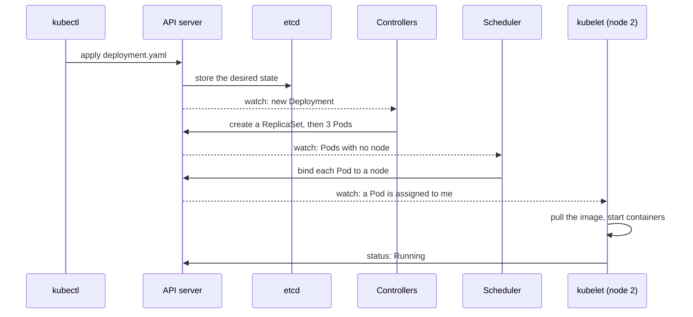

I learned Kubernetes because I had to. The services I worked on were deployed on it, and at some point every change I made ended in a `kubectl apply`. The first time, I copied a YAML file, changed the image name, ran the command, and it worked. I had no idea why. Over the following months, on a team building an ML training platform on Kubeflow Pipelines, I kept meeting new nouns: pods, ReplicaSets, Services, ingresses, kubelets, CNI. Each one made sense on its own page of the docs. None of them fitted together.

This is the explanation I wish I'd had at the start. I've written it about a year in, so it's the view of someone who uses Kubernetes every day, not someone who runs clusters for a living.

## One idea underneath everything

Kubernetes is a database of what you want, plus many small programs that keep making the world match it.

You never tell Kubernetes "start three containers". You write down "there should be three copies of this container" and store it. A controller then notices the difference between what's written and what's running, and acts to close the gap. If a machine dies and takes a copy with it, the same controller sees the gap again and starts a replacement. Nobody has to issue a new command.

<figure class="fig">
<svg viewBox="0 0 680 205" role="img" aria-labelledby="k0t k0d">
  <title id="k0t">The reconcile loop</title>
  <desc id="k0d">You declare a desired state of three replicas. A controller compares it with the observed state of two running pods and acts by starting one more pod. The loop repeats forever, and every controller runs one for its own kind of object.</desc>
  <defs><marker id="ka0" viewBox="0 0 10 10" refX="9" refY="5" markerWidth="7" markerHeight="7" orient="auto-start-reverse"><path class="arrow" d="M0,0 L10,5 L0,10 z"/></marker></defs>
  <rect class="box" x="20" y="20" width="200" height="56" rx="6"/><text class="t" x="32" y="42">You declare</text><text class="m" x="32" y="61">replicas: 3</text>
  <rect class="box" x="460" y="20" width="200" height="56" rx="6"/><text class="t" x="472" y="42">The cluster</text><text class="m" x="472" y="61">2 pods running</text>
  <rect class="box" x="240" y="120" width="200" height="56" rx="6"/><text class="t" x="252" y="142">Controller</text><text class="m" x="252" y="161">compare the two</text>
  <path class="ln" d="M120,76 L120,148 L238,148" marker-end="url(#ka0)"/><text class="m" x="128" y="112">desired</text>
  <path class="ln" d="M560,76 L560,148 L442,148" marker-end="url(#ka0)"/><text class="m" x="568" y="112">observed</text>
  <g tabindex="0"><title>The controller closes the gap: one more pod</title><path class="sa" d="M340,120 L340,48 L458,48" marker-end="url(#ka0)"/></g>
  <text class="ta" x="332" y="88" text-anchor="end">act: start 1 pod</text>
  <text class="m" x="340" y="198" text-anchor="middle">repeat forever; each controller runs this loop for its own kind of object</text>
</svg>
<figcaption>Kubernetes never runs a script of steps. It keeps comparing what you asked for with what exists, and fixes the difference.</figcaption>
</figure>

This is called reconciliation, and once I saw it, a lot of Kubernetes behaviour stopped surprising me. Deleting a pod that belongs to a deployment doesn't get rid of it: a new one appears, because the desired state still says three. Editing a YAML file and applying it again is safe, because you're replacing the target, not replaying a sequence of commands.

A deployment file is only a description of that target:

```yaml
apiVersion: apps/v1
kind: Deployment
metadata:
  name: web
spec:
  replicas: 3
  selector:
    matchLabels: {app: web}
  template:
    metadata:
      labels: {app: web}
    spec:
      containers:
        - name: web
          image: registry.example.com/web:2.1
          ports: [{containerPort: 8080}]
```

## The parts of a cluster

A cluster splits into a control plane, which decides, and nodes, which run your containers.

<figure class="fig">
<svg viewBox="0 0 680 300" role="img" aria-labelledby="k1t k1d">
  <title id="k1t">The parts of a Kubernetes cluster</title>
  <desc id="k1d">The control plane holds the API server, etcd, the scheduler and the controllers. Everything talks to the API server, and only the API server touches etcd. Each node runs a kubelet, kube-proxy, a container runtime and pods. Kubelets watch the API server for pods assigned to their node.</desc>
  <defs><marker id="ka1" viewBox="0 0 10 10" refX="9" refY="5" markerWidth="7" markerHeight="7" orient="auto-start-reverse"><path class="arrow" d="M0,0 L10,5 L0,10 z"/></marker></defs>
  <rect class="box" x="10" y="10" width="660" height="126" rx="8"/><text class="h" x="22" y="32">CONTROL PLANE</text>
  <rect class="box" x="22" y="44" width="150" height="60" rx="6"/><text class="t" x="34" y="66">API server</text><text class="m" x="34" y="85">the front door</text>
  <rect class="box" x="184" y="44" width="150" height="60" rx="6"/><text class="t" x="196" y="66">etcd</text><text class="m" x="196" y="85">stores all state</text>
  <rect class="box" x="346" y="44" width="150" height="60" rx="6"/><text class="t" x="358" y="66">scheduler</text><text class="m" x="358" y="85">picks a node</text>
  <rect class="box" x="508" y="44" width="150" height="60" rx="6"/><text class="t" x="520" y="66">controllers</text><text class="m" x="520" y="85">reconcile loops</text>
  <text class="m" x="22" y="124">everything talks to the API server; only the API server reads and writes etcd</text>
  <rect class="box" x="10" y="176" width="320" height="116" rx="8"/><text class="h" x="22" y="198">NODE 1</text>
  <rect class="box" x="350" y="176" width="320" height="116" rx="8"/><text class="h" x="362" y="198">NODE 2</text>
  <rect class="box" x="22" y="208" width="140" height="32" rx="5"/><text class="t" x="34" y="229">kubelet</text>
  <rect class="box" x="176" y="208" width="140" height="32" rx="5"/><text class="t" x="188" y="229">kube-proxy</text>
  <rect class="box" x="362" y="208" width="140" height="32" rx="5"/><text class="t" x="374" y="229">kubelet</text>
  <rect class="box" x="516" y="208" width="140" height="32" rx="5"/><text class="t" x="528" y="229">kube-proxy</text>
  <text class="m" x="22" y="272">containerd</text><text class="m" x="362" y="272">containerd</text>
  <g tabindex="0"><title>Pods on node 1</title><rect class="box sa" x="120" y="254" width="58" height="28" rx="5"/><text class="t" x="133" y="273">pod</text><rect class="box sa" x="188" y="254" width="58" height="28" rx="5"/><text class="t" x="201" y="273">pod</text></g>
  <g tabindex="0"><title>Pods on node 2</title><rect class="box sa" x="460" y="254" width="58" height="28" rx="5"/><text class="t" x="473" y="273">pod</text><rect class="box sa" x="528" y="254" width="58" height="28" rx="5"/><text class="t" x="541" y="273">pod</text><rect class="box sa" x="596" y="254" width="58" height="28" rx="5"/><text class="t" x="609" y="273">pod</text></g>
  <path class="ln" d="M92,136 L92,206" marker-end="url(#ka1)"/>
  <path class="ln" d="M92,156 L432,156 L432,206" marker-end="url(#ka1)"/>
  <text class="m" x="442" y="166">kubelets watch the API server</text>
</svg>
<figcaption>The control plane decides and records; the nodes do the work. On a managed cluster you only ever see the bottom half.</figcaption>
</figure>

The control plane:

- **API server.** The front door. `kubectl`, dashboards and every internal component talk to it over HTTP. It checks each request and is the only thing that reads and writes the store.
- **etcd.** A small, consistent key-value store holding every object, both the desired state and the reported status. Lose etcd and the cluster forgets what it was supposed to be.
- **Scheduler.** Watches for pods that have no node yet and picks one, based on the CPU and memory they request, node labels and spreading rules. It only decides. It doesn't start anything.
- **Controller manager.** A bundle of reconcile loops, one per kind of object: deployments, ReplicaSets, nodes, endpoints, jobs.

Each node runs:

- **kubelet.** The node's agent. It watches the API server for pods assigned to its node, asks the container runtime to start them, runs their health checks and reports their status.
- **Container runtime.** containerd or similar, which pulls images and runs containers.
- **kube-proxy.** Programs the node's network rules so that Service addresses work. More on this below, because it was the part I understood last.

On a managed cluster like GKE, the cloud provider runs the control plane and you only see the nodes. That's why I went months without thinking about etcd.

What took me longest to notice is that components don't call each other. The scheduler never tells a kubelet to start a pod. It writes "this pod belongs on node 2" to the API server, and node 2's kubelet, which is watching, picks it up. Every part coordinates by writing to, and watching, the same shared state.

## What happens on `kubectl apply`

Following one deployment through the cluster is what made the parts click for me:



Every arrow is either a write to the API server or a watch on it. The deployment controller creates a ReplicaSet; the ReplicaSet controller creates the pods. None of them keeps its own list of pods as the truth: each reads the current state back from the API server every time it reconciles.

## The objects you actually write

Most of what I write day to day is a handful of object kinds:

| Object | What it is |
| --- | --- |
| Pod | One or more containers that share a network address and volumes, scheduled together. The smallest thing Kubernetes runs. |
| ReplicaSet | Keeps N identical pods running. You rarely write one yourself. |
| Deployment | Manages ReplicaSets, so a new version rolls out gradually and can roll back. |
| Service | A stable name and address in front of a changing set of pods. |
| ConfigMap, Secret | Configuration and credentials, mounted as files or environment variables. |
| Ingress | HTTP routing from outside the cluster to Services. |
| Namespace | A folder for objects, used for access control and quotas. |

The objects find each other through labels. A Service doesn't keep a list of its pods. It has a selector, `app: web`, and it matches whichever pods carry that label at this moment.

<figure class="fig">
<svg viewBox="0 0 680 210" role="img" aria-labelledby="k2t k2d">
  <title id="k2t">Ownership and labels</title>
  <desc id="k2d">A Deployment named web with three replicas owns a ReplicaSet, which owns three pods labelled app=web, with addresses 10.4.1.7, 10.4.2.3 and 10.4.1.9. A Service named web, with ClusterIP 10.96.0.12 and selector app=web, sends traffic to all three pods because of their label, not because anything links them by name.</desc>
  <defs><marker id="ka2" viewBox="0 0 10 10" refX="9" refY="5" markerWidth="7" markerHeight="7" orient="auto-start-reverse"><path class="arrow" d="M0,0 L10,5 L0,10 z"/></marker></defs>
  <rect class="box" x="10" y="20" width="170" height="52" rx="6"/><text class="t" x="22" y="41">Deployment</text><text class="m" x="22" y="59">web · replicas: 3</text>
  <rect class="box" x="10" y="136" width="170" height="52" rx="6"/><text class="t" x="22" y="157">ReplicaSet</text><text class="m" x="22" y="175">web-7d9f</text>
  <path class="ln" d="M95,72 L95,134" marker-end="url(#ka2)"/><text class="m" x="103" y="108">owns</text>
  <rect class="box" x="260" y="16" width="170" height="48" rx="6"/><text class="t" x="272" y="36">pod</text><text class="m" x="272" y="53">app=web · 10.4.1.7</text>
  <rect class="box" x="260" y="82" width="170" height="48" rx="6"/><text class="t" x="272" y="102">pod</text><text class="m" x="272" y="119">app=web · 10.4.2.3</text>
  <rect class="box" x="260" y="148" width="170" height="48" rx="6"/><text class="t" x="272" y="168">pod</text><text class="m" x="272" y="185">app=web · 10.4.1.9</text>
  <path class="ln" d="M180,162 L258,40" marker-end="url(#ka2)"/><path class="ln" d="M180,162 L258,106" marker-end="url(#ka2)"/><path class="ln" d="M180,162 L258,172" marker-end="url(#ka2)"/>
  <rect class="box sa" x="500" y="68" width="170" height="76" rx="6"/><text class="t" x="512" y="90">Service web</text><text class="m" x="512" y="109">10.96.0.12</text><text class="m" x="512" y="127">selector app=web</text>
  <g tabindex="0"><title>The Service matches pods by label</title><path class="sa" d="M500,106 L432,40" marker-end="url(#ka2)"/><path class="sa" d="M500,106 L432,106" marker-end="url(#ka2)"/><path class="sa" d="M500,106 L432,172" marker-end="url(#ka2)"/></g>
</svg>
<figcaption>Grey arrows are ownership: delete the Deployment and everything under it goes. Blue arrows are a label match: the Service follows whatever pods carry app=web right now.</figcaption>
</figure>

When a deployment rolls out a new version, it creates a new ReplicaSet and scales it up while scaling the old one down. The Service never changes. The new pods carry the same label, so traffic follows them.

### Namespaces

Every object above except the cluster-wide ones lives in a namespace. A namespace is a folder with a name: two teams can each have a Service called `web` as long as they're in different namespaces. When you don't say which one, you get `default`, which is why so many tutorials never mention them.

Namespaces are also where most of the cluster's rules attach:

- **Names and DNS.** A Service's DNS name includes its namespace: `web.payments.svc.cluster.local`. From inside the same namespace, `web` is enough. From another one you write `web.payments`.
- **Access control.** Roles and role bindings grant permissions within a namespace, so a team can be allowed to deploy to its own namespace and only read others.
- **Quotas and defaults.** A ResourceQuota caps how much CPU, memory and how many objects a namespace can use; a LimitRange sets default requests and limits for pods that don't declare them.
- **Separation of environments.** A common pattern is one namespace per team, or per team and environment, such as `payments-staging` and `payments-prod`.

Namespaces don't isolate the network on their own: by default a pod in one namespace can still reach a pod in any other. Blocking that takes a NetworkPolicy. And some objects belong to the whole cluster rather than to a namespace: nodes, persistent volumes, and namespaces themselves. `kubectl` needs `-n payments`, or a default namespace set in its context, to see anything outside `default`, and forgetting that flag was the most common reason I thought something had disappeared.

## Networking, the part I understood last

Kubernetes makes two promises about the network, and hands the job of keeping them to a plugin:

- Every pod gets its own IP address.
- Any pod can reach any other pod at that address, on any node, without address translation.

A CNI (Container Network Interface) plugin keeps those promises, for example by giving each node a range of addresses and setting up routes between nodes. On GKE it's configured for you.

Pod addresses aren't much use on their own, because pods are replaced all the time and every replacement gets a new one. That's what a Service is for. Creating one gives you a DNS name, such as `web.default.svc.cluster.local` for a Service called `web` in the `default` namespace, and a virtual address, the ClusterIP, which stays the same for as long as the Service exists.

What surprised me is that the ClusterIP doesn't belong to any machine. No network interface has it. kube-proxy runs on every node, watches Services and their pods, and writes rules into the node's kernel (iptables, or IPVS) that say: a packet for 10.96.0.12 port 80 should go to one of these pod addresses instead, picked at random. The rewrite happens on the sending node, before the packet leaves it.

<figure class="fig">
<svg viewBox="0 0 680 250" role="img" aria-labelledby="k3t k3d">
  <title id="k3t">How a request finds a pod</title>
  <desc id="k3d">A client pod asks CoreDNS for the name web and gets the ClusterIP 10.96.0.12. It sends to that address. Rules on its own node, written by kube-proxy, rewrite the destination to one pod, 10.4.2.3 on node B, chosen at random once per connection. Other web pods such as 10.4.1.7 could have been chosen instead. The ClusterIP exists only as a rule.</desc>
  <defs><marker id="ka3" viewBox="0 0 10 10" refX="9" refY="5" markerWidth="7" markerHeight="7" orient="auto-start-reverse"><path class="arrow" d="M0,0 L10,5 L0,10 z"/></marker></defs>
  <rect class="box" x="10" y="10" width="170" height="52" rx="6"/><text class="t" x="22" y="31">CoreDNS</text><text class="m" x="22" y="49">web → 10.96.0.12</text>
  <rect class="box" x="10" y="110" width="170" height="56" rx="6"/><text class="t" x="22" y="132">client pod</text><text class="m" x="22" y="151">GET http://web</text>
  <path class="ln" d="M95,108 L95,64" marker-end="url(#ka3)"/><text class="m" x="103" y="90">1 look up the name</text>
  <rect class="box" x="250" y="110" width="180" height="56" rx="6"/><text class="t" x="262" y="132">node rules</text><text class="m" x="262" y="151">written by kube-proxy</text>
  <path class="ln" d="M180,138 L248,138" marker-end="url(#ka3)"/><text class="m" x="214" y="130" text-anchor="middle">2 send</text>
  <rect class="box sa" x="500" y="110" width="170" height="56" rx="6"/><text class="t" x="512" y="132">web pod, node B</text><text class="m" x="512" y="151">10.4.2.3</text>
  <g tabindex="0"><title>3 the destination is rewritten to one pod</title><path class="sa" d="M430,138 L498,138" marker-end="url(#ka3)"/></g><text class="ta" x="464" y="130" text-anchor="middle">3 rewrite</text>
  <rect class="box" x="500" y="186" width="170" height="40" rx="6"/><text class="m" x="512" y="210">web pod · 10.4.1.7</text>
  <path class="ln dash" d="M430,156 L498,200" marker-end="url(#ka3)"/>
  <text class="tb" x="340" y="190" text-anchor="middle">one pod per connection,</text><text class="tb" x="340" y="206" text-anchor="middle">picked at random</text>
  <text class="m" x="10" y="243">10.96.0.12 exists only as a rule on each node; no machine has that address</text>
</svg>
<figcaption>A Service is a set of rules copied to every node, not a box traffic passes through. The pick happens once, when the connection opens.</figcaption>
</figure>

The detail that mattered to me later is that the choice happens once per connection. A client that opens a connection and keeps it open, as HTTP/2 and gRPC clients do, sends every request down it to the same pod. With a few long-lived clients, load can end up badly uneven, even though the Service is "balancing" traffic.

Traffic from outside the cluster comes in through a Service of type `LoadBalancer`, which asks the cloud provider for a load balancer, or through an Ingress, which routes HTTP by host and path to Services.

## Where a service mesh comes in

Any discussion of Kubernetes networking eventually mentions Istio, so I read up on what a service mesh adds.

A mesh puts a small proxy, usually Envoy, next to every pod as an extra container, called a sidecar. Rules inside the pod send all its traffic in and out through that proxy, so the application talks plain HTTP and the proxy handles the rest. The mesh's control plane configures all the proxies.

<figure class="fig">
<svg viewBox="0 0 680 210" role="img" aria-labelledby="k4t k4d">
  <title id="k4t">A service mesh with sidecars</title>
  <desc id="k4d">Two pods each contain an app container and a proxy container. The app in pod A sends a plain request to its own proxy, which sends it over mutual TLS to the proxy in pod B, which hands it to the app in pod B. A mesh control plane sends configuration to both proxies.</desc>
  <defs><marker id="ka4" viewBox="0 0 10 10" refX="9" refY="5" markerWidth="7" markerHeight="7" orient="auto-start-reverse"><path class="arrow" d="M0,0 L10,5 L0,10 z"/></marker></defs>
  <rect class="box" x="240" y="10" width="200" height="52" rx="6"/><text class="t" x="252" y="31">mesh control plane</text><text class="m" x="252" y="49">istiod, in Istio</text>
  <rect class="box" x="10" y="96" width="290" height="84" rx="8"/><text class="h" x="22" y="116">POD A</text>
  <rect class="box" x="22" y="126" width="110" height="40" rx="5"/><text class="t" x="34" y="151">app</text>
  <rect class="box" x="170" y="126" width="118" height="40" rx="5"/><text class="t" x="182" y="151">proxy</text>
  <rect class="box" x="380" y="96" width="290" height="84" rx="8"/><text class="h" x="392" y="116">POD B</text>
  <rect class="box" x="392" y="126" width="118" height="40" rx="5"/><text class="t" x="404" y="151">proxy</text>
  <rect class="box" x="548" y="126" width="110" height="40" rx="5"/><text class="t" x="560" y="151">app</text>
  <path class="ln" d="M132,146 L168,146" marker-end="url(#ka4)"/>
  <g tabindex="0"><title>Proxy to proxy, encrypted with mutual TLS</title><path class="sa" d="M288,146 L390,146" marker-end="url(#ka4)"/></g><text class="ta" x="339" y="138" text-anchor="middle">mTLS</text>
  <path class="ln" d="M510,146 L546,146" marker-end="url(#ka4)"/>
  <path class="ln dash" d="M290,62 L229,124" marker-end="url(#ka4)"/><path class="ln dash" d="M390,62 L451,124" marker-end="url(#ka4)"/>
  <text class="m" x="340" y="92" text-anchor="middle">config</text>
  <text class="m" x="340" y="203" text-anchor="middle">retries, timeouts, encryption and metrics move from app code into the proxy</text>
</svg>
<figcaption>The application only ever talks to the proxy next to it. Everything between the two proxies is the mesh's job.</figcaption>
</figure>

Because the proxy understands HTTP and gRPC, it can do things kube-proxy can't:

- balance per request instead of per connection, which fixes the gRPC problem above;
- retry failed requests and enforce timeouts;
- encrypt traffic between pods with mutual TLS, without any change to application code;
- split traffic by percentage, for canary releases;
- report latency and error rates for every call between services.

The price is an extra proxy on every hop, more memory per pod, and one more system to understand when something breaks. I haven't used a mesh myself yet. Reading about one still helped me place kube-proxy: it works on connections, and a mesh works on requests.

## What made it click

- Treat YAML as a description of the end state, not a list of steps.
- When something is wrong, read the object's status and events with `kubectl describe` before the logs. They tell you which controller gave up, and why.
- Components coordinate through the API server, never directly.
- A Service is a set of rules on every node, not a box in the middle.
- Load is balanced per connection, unless something above kube-proxy does better.

Kubernetes is still big. But it's one idea applied many times, and seeing that made the rest learnable.
