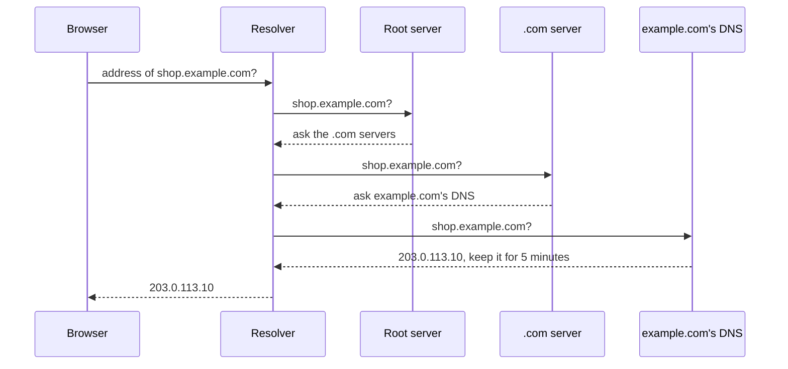

After [making sense of Kubernetes]({{ '/posts/making-sense-of-kubernetes/' | relative_url }}), I understood what happens to a request once it reaches our cluster. Everything before that was a blur. Someone types an address, and a fraction of a second later a page appears, built from data in a database in another country. I also kept hearing infra words I couldn't place: region, zone, VPC, CDN, anycast, active–active, failover.

This post follows one request from start to finish and explains each piece it meets, with an everyday analogy for each. Then it zooms out to the decisions infra and ops teams make with those pieces: where to run things, how to survive failures, and how to operate it all. It ends with the practices I'd now call best practice.

The example throughout: someone in Jakarta opens `shop.example.com`, and the shop runs in a cloud region in Singapore.

<figure class="fig">
<svg viewBox="0 0 680 300" role="img" aria-labelledby="n0t n0d">
  <title id="n0t">The path of one request</title>
  <desc id="n0d">1: the browser in Jakarta asks a DNS resolver for the shop's address. 2: it fetches static files such as images from a CDN edge in Jakarta. 3: API requests go on to a load balancer in the Singapore region, then into the Kubernetes cluster, then to an app pod. 4: the app reads from a Redis cache and a database primary. The database copies its data to a read replica in another region, Tokyo.</desc>
  <defs><marker id="na0" viewBox="0 0 10 10" refX="9" refY="5" markerWidth="7" markerHeight="7" orient="auto-start-reverse"><path class="arrow" d="M0,0 L10,5 L0,10 z"/></marker></defs>
  <rect class="box" x="10" y="20" width="140" height="52" rx="6"/><text class="t" x="22" y="41">DNS resolver</text><text class="m" x="22" y="59">name → address</text>
  <rect class="box sa" x="10" y="130" width="140" height="52" rx="6"/><text class="t" x="22" y="151">browser</text><text class="m" x="22" y="169">in Jakarta</text>
  <rect class="box" x="180" y="130" width="140" height="52" rx="6"/><text class="t" x="192" y="151">CDN edge</text><text class="m" x="192" y="169">also in Jakarta</text>
  <path class="ln" d="M80,128 L80,74" marker-end="url(#na0)"/><text class="m" x="88" y="104">1</text>
  <path class="ln" d="M150,156 L178,156" marker-end="url(#na0)"/><text class="m" x="160" y="148">2</text>
  <rect class="box" x="350" y="10" width="320" height="206" rx="8"/><text class="h" x="362" y="30">REGION: SINGAPORE</text>
  <rect class="box" x="362" y="40" width="140" height="44" rx="6"/><text class="t" x="374" y="60">load balancer</text><text class="m" x="374" y="76">public address</text>
  <rect class="box" x="362" y="100" width="140" height="44" rx="6"/><text class="t" x="374" y="120">Kubernetes</text><text class="m" x="374" y="136">ingress → Service</text>
  <rect class="box" x="362" y="160" width="140" height="44" rx="6"/><text class="t" x="374" y="180">app pods</text><text class="m" x="374" y="196">your code</text>
  <rect class="box" x="518" y="100" width="140" height="44" rx="6"/><text class="t" x="530" y="120">Redis</text><text class="m" x="530" y="136">cache</text>
  <rect class="box" x="518" y="160" width="140" height="44" rx="6"/><text class="t" x="530" y="180">database</text><text class="m" x="530" y="196">primary</text>
  <g tabindex="0"><title>3: API requests go on to the region</title><path class="sa" d="M320,156 L336,156 L336,62 L360,62" marker-end="url(#na0)"/></g><text class="ta" x="326" y="112" text-anchor="end">3</text>
  <path class="ln" d="M432,84 L432,98" marker-end="url(#na0)"/><path class="ln" d="M432,144 L432,158" marker-end="url(#na0)"/>
  <path class="ln" d="M502,176 L516,128" marker-end="url(#na0)"/><path class="ln" d="M502,182 L516,182" marker-end="url(#na0)"/><text class="m" x="524" y="156">4</text>
  <rect class="box" x="350" y="240" width="320" height="52" rx="8"/><text class="t" x="362" y="261">another region: Tokyo</text><text class="m" x="362" y="279">read replica, a little behind</text>
  <path class="ln dash" d="M588,204 L588,238" marker-end="url(#na0)"/><text class="m" x="596" y="228">copies</text>
</svg>
<figcaption>The whole trip in one picture. The rest of the post walks through it piece by piece.</figcaption>
</figure>

## The cast, in one table

Before the details, here is every component in this post with the analogy I'll use for it. The analogies are about a city and its postal system.

| Component | Analogy | What it does |
| --- | --- | --- |
| Packet | a letter | a small chunk of data with a sender and destination address |
| IP address | a street address | where a machine can be reached |
| Router | a post office | passes each packet one step closer to its destination |
| DNS | the phone book | turns a name like `shop.example.com` into an IP address |
| TCP | registered mail | numbers packets, confirms delivery, resends lost ones |
| TLS | a sealed envelope and an ID check | encrypts traffic and proves the server is who it says |
| CDN edge | a local convenience store | keeps copies of popular files close to users |
| Anycast | one hotline, answered by the nearest branch | one IP address served from many places at once |
| WAF and DDoS protection | the bouncer | turns away bad traffic before it gets in |
| Load balancer | the restaurant host | sends each guest to a free, working table |
| Region | a city | a cluster of data centres in one metro area |
| Zone | a building in that city | a data centre with its own power and cooling |
| VPC and subnets | a fenced campus with a public lobby and private offices | your private network inside the cloud |
| Firewall rules | the security guard at each door | decide which traffic may reach which machine |
| NAT gateway | the mailroom | lets private machines send mail out without having a public address |
| Kubernetes | the building manager | keeps the right number of workers at their desks |
| Pod | a worker | runs your code |
| Cache | a notepad on the desk | quick answers to repeated questions |
| Database | the filing room | the one true record of everything |
| Replica | a photocopy of the files | a copy for reading or for emergencies |

## Part 1: getting there

### The internet itself

The internet is thousands of separate networks that have agreed to carry each other's traffic. Your mobile provider is one network, a cloud provider is another, and they connect at exchange points and through undersea cables.

Everything travels as **packets**, which are like letters. Each has a sender and a destination **IP address**, such as `203.0.113.10`, the way a letter has a street address. **Routers** are the post offices: each reads the destination and passes the packet one step closer. Networks tell each other which addresses they can deliver to using a protocol called **BGP**, which is like post offices sharing their delivery maps.

One fact shaped everything else for me: distance costs time, and nothing makes it free. Light in fibre travels about 200,000 km per second. A packet from Jakarta to Singapore and back covers about 1,800 km, which takes at least 9 ms. To a US data centre and back it's over 30,000 km, at least 157 ms. Cables don't run in straight lines, so real numbers are higher.

<figure class="fig">
<svg viewBox="0 0 680 200" role="img" aria-labelledby="n1t n1d">
  <title id="n1t">Minimum round trip from Jakarta</title>
  <desc id="n1d">The theoretical minimum round-trip time from Jakarta through fibre: Singapore, 880 km, 9 ms. Tokyo, 5,780 km, 58 ms. Frankfurt, 11,000 km, 110 ms. Iowa in the US, 15,700 km, 157 ms.</desc>
  <text class="t" x="10" y="44">Singapore</text><text class="m" x="100" y="44">880 km</text>
  <g tabindex="0"><title>Singapore: 880 km, at least 9 ms round trip</title><rect class="fa" x="180" y="30" width="23.1" height="20" rx="3"/></g>
  <text class="t" x="211" y="44">9 ms</text>
  <text class="t" x="10" y="80">Tokyo</text><text class="m" x="100" y="80">5,780 km</text>
  <g tabindex="0"><title>Tokyo: 5,780 km, at least 58 ms round trip</title><rect class="fa" x="180" y="66" width="151.7" height="20" rx="3"/></g>
  <text class="t" x="340" y="80">58 ms</text>
  <text class="t" x="10" y="116">Frankfurt</text><text class="m" x="100" y="116">11,000 km</text>
  <g tabindex="0"><title>Frankfurt: 11,000 km, at least 110 ms round trip</title><rect class="fa" x="180" y="102" width="288.8" height="20" rx="3"/></g>
  <text class="t" x="477" y="116">110 ms</text>
  <text class="t" x="10" y="152">Iowa, US</text><text class="m" x="100" y="152">15,700 km</text>
  <g tabindex="0"><title>Iowa, US: 15,700 km, at least 157 ms round trip</title><rect class="fa" x="180" y="138" width="412.1" height="20" rx="3"/></g>
  <text class="t" x="600" y="152">157 ms</text>
  <line class="grid" x1="180" x2="180" y1="24" y2="172"/><text class="m" x="180" y="188" text-anchor="middle">0 ms</text>
  <line class="grid" x1="311" x2="311" y1="24" y2="172"/><text class="m" x="311" y="188" text-anchor="middle">50 ms</text>
  <line class="grid" x1="442" x2="442" y1="24" y2="172"/><text class="m" x="442" y="188" text-anchor="middle">100 ms</text>
  <line class="grid" x1="574" x2="574" y1="24" y2="172"/><text class="m" x="574" y="188" text-anchor="middle">150 ms</text>
</svg>
<figcaption>Straight-line distance at the speed of light in fibre. This is the floor; real routes add more. Every step below that needs a round trip pays this cost.</figcaption>
</figure>

That there-and-back time is the **round-trip time**. Most of the rest of this post is about how many round trips a request needs and how far each one travels.

### Step 1: DNS, the phone book

Browsers need an IP address, not a name. **DNS**, the Domain Name System, is the phone book that turns one into the other.

The browser asks a **resolver**, usually run by your internet provider or a public service like Google's `8.8.8.8`. If the resolver hasn't looked the name up recently, it walks down a chain, like asking directory enquiries, who refers you to the right regional phone book, which gives you the number:

Each answer comes with a **TTL** (time to live), which says how long it may be remembered. The resolver, the operating system and the browser all keep recent answers, so most lookups take no time at all.

**Why ops cares:**

- **TTL is a trade-off.** A short TTL, like 60 seconds, means that when you point the name somewhere new, say during a failover, the world follows within a minute. A long TTL means fewer lookups but slow changes.
- **DNS can steer traffic.** GeoDNS gives different answers depending on where the question comes from, so users in Jakarta and Frankfurt can be sent to different regions under the same name.
- **DNS is a single point of failure** if one provider hosts all your records. Big outages have come from exactly this.

### Step 2: TCP and TLS, registered mail in a sealed envelope

With an address, the browser opens a connection. Two handshakes happen before any page data moves.

- **TCP** is registered mail. Packets can be lost or arrive out of order; TCP numbers them, confirms each delivery, resends what's missing and puts them back in order. Setting it up takes one round trip.
- **TLS** is a sealed envelope plus an ID check. The server shows a **certificate** proving it owns the name, and both sides agree on keys for encryption. It's the "S" in HTTPS. TLS 1.3 takes one more round trip; older versions took two.

Only then does the browser send the actual request, and the answer takes a third round trip. So a first response on a new connection costs at least three round trips, plus the server's own work.

<figure class="fig">
<svg viewBox="0 0 680 190" role="img" aria-labelledby="n3t n3d">
  <title id="n3t">Time to the first response on a new connection</title>
  <desc id="n3d">Three round trips plus server time. A server in Iowa, 160 ms away: 320 ms of handshakes and 210 ms for the request, 530 ms in total. A server in Singapore, 10 ms away: 20 ms of handshakes and 60 ms for the request, 80 ms. A CDN edge in Jakarta, 2 ms away, serving a cached file: 4 ms of handshakes and 3 ms for the request, 7 ms.</desc>
  <rect x="190" y="10" width="14" height="10" rx="2" fill="var(--muted)"/><text class="m" x="210" y="19">TCP + TLS handshakes</text>
  <rect class="fa" x="380" y="10" width="14" height="10" rx="2"/><text class="m" x="400" y="19">request, response and server work</text>
  <text class="t" x="10" y="51">server in Iowa</text><text class="m" x="10" y="67">160 ms round trip</text>
  <g tabindex="0"><title>server in Iowa: handshakes 320 ms (TCP + TLS)</title><rect x="190" y="36" width="254.8" height="22" rx="3" fill="var(--muted)"/></g>
  <g tabindex="0"><title>server in Iowa: request and response 210 ms, including 50 ms of server work</title><rect class="fa" x="446.8" y="36" width="167.2" height="22" rx="3"/></g>
  <text class="t" x="622" y="51">530 ms</text>
  <text class="t" x="10" y="95">server in Singapore</text><text class="m" x="10" y="111">10 ms round trip</text>
  <g tabindex="0"><title>server in Singapore: handshakes 20 ms (TCP + TLS)</title><rect x="190" y="80" width="15.9" height="22" rx="3" fill="var(--muted)"/></g>
  <g tabindex="0"><title>server in Singapore: request and response 60 ms, including 50 ms of server work</title><rect class="fa" x="207.9" y="80" width="47.8" height="22" rx="3"/></g>
  <text class="t" x="264" y="95">80 ms</text>
  <text class="t" x="10" y="139">CDN edge, Jakarta</text><text class="m" x="10" y="155">2 ms round trip</text>
  <g tabindex="0"><title>CDN edge, Jakarta: handshakes 4 ms (TCP + TLS)</title><rect x="190" y="124" width="3.2" height="22" rx="3" fill="var(--muted)"/></g>
  <g tabindex="0"><title>CDN edge, Jakarta: request and response 3 ms, including 1 ms of server work</title><rect class="fa" x="195.2" y="124" width="2.4" height="22" rx="3"/></g>
  <text class="t" x="206" y="139">7 ms</text>
</svg>
<figcaption>Illustrative round-trip times, with 50 ms of server work for the app and a cached file at the edge. Distance multiplies: three round trips to Iowa cost more than the whole request to Singapore.</figcaption>
</figure>

**Why ops cares:**

- **Reuse connections.** Browsers keep them open, HTTP/2 sends many requests over one, and HTTP/3 (running on a newer transport called QUIC) combines the handshakes. Every new connection pays the handshakes again.
- **Certificates expire.** An expired certificate takes a site down as surely as a crashed server. Automate renewal, for example with Let's Encrypt or your cloud's managed certificates, and alert well before expiry.
- **Where TLS ends matters.** Usually the CDN or load balancer decrypts traffic, which is called **TLS termination**, so it can route by URL. Traffic behind it is re-encrypted or kept inside a private network.

### Step 3: the edge, a convenience store near home

Much of a web page is the same for everyone: images, scripts, stylesheets, fonts. You don't drive to the central warehouse for a bottle of water; you buy it at the shop on your street. A **CDN** (content delivery network) is that shop: a provider with servers in hundreds of cities, each keeping copies of your popular files.

For our Jakarta user, the edge is a couple of milliseconds away. The handshakes happen with it, cheaply. On a **cache hit** it answers directly. On a **miss**, it fetches the file from the region once, over a connection it already keeps open, and keeps the copy for the next person.

Many CDNs and global load balancers use **anycast**: the same IP address is announced from many locations at once, and internet routing delivers each user to the nearest one. It's like one national hotline number that's answered by whichever branch is closest to the caller.

The edge is also where the **bouncer** stands. A **WAF** (web application firewall) blocks known attack patterns, and **DDoS protection** absorbs floods of fake traffic across the whole edge network, before any of it reaches your servers.

**Why ops cares:**

- **Cache rules are yours to set.** Response headers such as `Cache-Control` tell the edge how long to keep a file.
- **Version file names**, like `app.3f9c.js`. A new release then gets a new name, so nobody sees a stale copy, and you rarely need to clear the cache by hand.
- **Put all public traffic behind the edge**, so the bouncer sees it first.

## Part 2: inside the region

### Step 4: regions, zones and the load balancer

Requests that need fresh, personal data, like "show my basket", go on to the region.

A **region** is a city: a cloud provider's group of data centres in one metro area, such as Singapore. A **zone** is one building in that city, with its own power, cooling and network, a few kilometres from the others and linked to them by fast private lines. A round trip between zones takes about a millisecond. If one building loses power, the others keep running.

The request arrives at a **load balancer**, the restaurant host. It owns the public address, ends the TLS connection, checks which tables (backends) are free and working, and seats the guest at one of them. It learns which backends work through **health checks**: it asks each one "are you OK?" every few seconds and stops sending traffic to those that don't answer.

<figure class="fig">
<svg viewBox="0 0 680 230" role="img" aria-labelledby="n4t n4d">
  <title id="n4t">A region with three zones</title>
  <desc id="n4d">A Singapore region with three zones, a, b and c. A load balancer spreads requests across app pods in all three zones. The database primary is in zone a, with a standby copy in zone b that is updated on every write. If zone a fails, the pods in b and c keep serving and the standby becomes the primary.</desc>
  <defs><marker id="na4" viewBox="0 0 10 10" refX="9" refY="5" markerWidth="7" markerHeight="7" orient="auto-start-reverse"><path class="arrow" d="M0,0 L10,5 L0,10 z"/></marker></defs>
  <rect class="box" x="250" y="10" width="180" height="40" rx="6"/><text class="t" x="262" y="35">load balancer</text>
  <rect class="box" x="10" y="80" width="210" height="140" rx="8"/><text class="h" x="22" y="100">ZONE A</text>
  <rect class="box" x="235" y="80" width="210" height="140" rx="8"/><text class="h" x="433" y="100" text-anchor="end">ZONE B</text>
  <rect class="box" x="460" y="80" width="210" height="140" rx="8"/><text class="h" x="658" y="100" text-anchor="end">ZONE C</text>
  <rect class="box" x="22" y="112" width="186" height="40" rx="5"/><text class="t" x="34" y="137">app pods</text>
  <rect class="box" x="247" y="112" width="186" height="40" rx="5"/><text class="t" x="259" y="137">app pods</text>
  <rect class="box" x="472" y="112" width="186" height="40" rx="5"/><text class="t" x="484" y="137">app pods</text>
  <g tabindex="0"><title>Database primary in zone a: takes all writes</title><rect class="box sa" x="22" y="166" width="186" height="42" rx="5"/><text class="t" x="34" y="185">database primary</text><text class="m" x="34" y="200">all writes go here</text></g>
  <rect class="box" x="247" y="166" width="186" height="42" rx="5"/><text class="t" x="259" y="185">standby</text><text class="m" x="259" y="200">takes over if A fails</text>
  <path class="ln" d="M300,50 L115,110" marker-end="url(#na4)"/><path class="ln" d="M340,50 L340,110" marker-end="url(#na4)"/><path class="ln" d="M380,50 L565,110" marker-end="url(#na4)"/>
  <path class="ln dash" d="M208,187 L245,187" marker-end="url(#na4)"/>
</svg>
<figcaption>Zones are what make a region survive a building going dark. Pods spread across all three; the database keeps a standby copy in a second zone.</figcaption>
</figure>

Load balancers come in two kinds that are worth knowing apart:

- **Layer 4** balancers look only at addresses and ports. They are fast, and they pick a backend once per connection.
- **Layer 7** balancers understand HTTP. They can route by path or hostname, retry a failed request, and balance every request separately.

Cloud providers also offer **global** load balancers: one anycast address worldwide that sends each user to the nearest healthy region. Regional ones serve a single region.

### Step 5: the private network, a fenced campus

Inside the region, your machines live in a **VPC** (virtual private cloud): a private network that only you use. Think of a fenced campus. It's split into **subnets**, which are areas of the campus:

- a **public subnet** is the lobby: only the load balancer lives there, with an address the internet can reach;
- **private subnets** are the offices: app servers and databases, with no public address at all.

**Firewall rules** (called security groups on some clouds) are the guards at each door: "the load balancer may talk to the app on port 8080", "only the app may talk to the database on port 5432". Everything else is refused.

Private machines still sometimes need to reach out, for example to download a package or call a partner's API. A **NAT gateway** is the mailroom: they hand their outgoing mail to it, it sends it with its own return address, and it passes the replies back. Nobody outside can send mail straight to an office.

### Step 6: Kubernetes, the building manager

In our setup, the load balancer hands requests to a Kubernetes cluster whose machines sit in the private subnets, spread across the zones. An **ingress** reads the hostname and path, a **Service** picks one of the matching **pods** (the workers), and the pod runs our code.

The manager's most useful habit for ops is **autoscaling**, which is calling in extra staff for the lunch rush:

- the **horizontal pod autoscaler** adds pods when CPU or request rate goes up, and removes them when it drops;
- the **cluster autoscaler** adds machines when there's no room left for new pods.

### Step 7: cache and database, the notepad and the filing room

The pod usually needs data. It has two places to get it:

- A **cache** such as Redis is a notepad on the desk. Recent answers are kept in memory, and reading one takes well under a millisecond.
- The **database** is the filing room, the single true record. Cache misses and every write go there.

Most databases have one **primary**, the only copy that accepts writes. **Replicas** are photocopies:

- a **standby** in another zone is updated on every write (**synchronous** replication), so it can take over within a minute or two if the primary's building fails;
- a **read replica** in another region is updated a moment later (**asynchronous** replication). It can serve reads near its users and is a head start if a whole region fails. It may be slightly behind.

This is where distance matters again. A page might need ten database queries, one after another. With the app and database in the same region, that's ten times about a millisecond. With the app in Singapore and the database in the US, it's ten times 160 ms, well over a second, before the page can even be built. **The app and its database live in the same region**, and to serve users far away you copy data closer to them, not only servers.

### Step 8: the way back

The response travels the same path backwards: pod, Service, ingress, load balancer, edge, browser. The browser reads the HTML, finds it needs dozens more files, fetches most of them from the edge over connections it already has open, and draws the page.

## Part 3: regional or global

Everything so far lives in one region. Where to run things, and how many copies, is one of the main decisions in infra. These are the usual options, from simplest to hardest:

<figure class="fig">
<svg viewBox="0 0 680 350" role="img" aria-labelledby="n5t n5d">
  <title id="n5t">Four ways to deploy</title>
  <desc id="n5d">One: everything in one zone; if the building fails you are down. Two: several zones in one region; survives a building, not a city. Three: two regions, active and passive; Singapore serves traffic and copies data to a standby in Tokyo; survives a region, with minutes to switch. Four: two regions, active and active, behind a global load balancer; both serve traffic; survives a region, with the hardest data problems.</desc>
  <defs><marker id="na5" viewBox="0 0 10 10" refX="9" refY="5" markerWidth="7" markerHeight="7" orient="auto-start-reverse"><path class="arrow" d="M0,0 L10,5 L0,10 z"/></marker></defs>
  <rect class="box" x="10" y="10" width="320" height="160" rx="8"/>
  <text class="t" x="22" y="30">1. One zone</text><text class="tb" x="22" y="47">a building fails: you're down</text>
  <rect class="box" x="22" y="60" width="296" height="98" rx="6"/><text class="m" x="32" y="76">Singapore</text>
  <rect class="box sa" x="32" y="86" width="90" height="60" rx="5"/><text class="t" x="42" y="108">zone a</text><text class="m" x="42" y="128">app, db</text>
  <rect class="box" x="350" y="10" width="320" height="160" rx="8"/>
  <text class="t" x="362" y="30">2. Zones in one region</text><text class="m" x="362" y="47">survives a building, not a city</text>
  <rect class="box" x="362" y="60" width="296" height="98" rx="6"/><text class="m" x="372" y="76">Singapore</text>
  <rect class="box sa" x="372" y="86" width="86" height="60" rx="5"/><text class="t" x="382" y="108">zone a</text><text class="m" x="382" y="128">app, db</text>
  <rect class="box sa" x="467" y="86" width="86" height="60" rx="5"/><text class="t" x="477" y="108">zone b</text><text class="m" x="477" y="128">app, copy</text>
  <rect class="box sa" x="562" y="86" width="86" height="60" rx="5"/><text class="t" x="572" y="108">zone c</text><text class="m" x="572" y="128">app</text>
  <rect class="box" x="10" y="180" width="320" height="160" rx="8"/>
  <text class="t" x="22" y="200">3. Two regions, active–passive</text><text class="m" x="22" y="217">survives a city; minutes to switch</text>
  <rect class="box sa" x="22" y="230" width="130" height="98" rx="6"/><text class="t" x="32" y="252">Singapore</text><text class="ta" x="32" y="270">serving</text>
  <rect class="box dash" x="188" y="230" width="130" height="98" rx="6"/><text class="t" x="198" y="252">Tokyo</text><text class="m" x="198" y="270">standing by</text>
  <path class="ln dash" d="M152,300 L186,300" marker-end="url(#na5)"/><text class="m" x="32" y="316">copies data</text>
  <rect class="box" x="350" y="180" width="320" height="160" rx="8"/>
  <text class="t" x="362" y="200">4. Two regions, active–active</text><text class="m" x="362" y="217">survives a city; hardest for data</text>
  <rect class="box" x="450" y="226" width="120" height="28" rx="5"/><text class="t" x="462" y="245">global LB</text>
  <rect class="box sa" x="362" y="272" width="130" height="56" rx="6"/><text class="t" x="372" y="294">Singapore</text><text class="ta" x="372" y="312">serving</text>
  <rect class="box sa" x="528" y="272" width="130" height="56" rx="6"/><text class="t" x="538" y="294">Tokyo</text><text class="ta" x="538" y="312">serving</text>
  <path class="ln" d="M480,254 L440,270" marker-end="url(#na5)"/><path class="ln" d="M540,254 L580,270" marker-end="url(#na5)"/>
</svg>
<figcaption>Each step up survives a bigger failure and costs more, in money and in complexity. Most services should start at 2.</figcaption>
</figure>

1. **One zone.** Everything in one building. Cheapest and simplest, and fine for experiments. If the building has a bad day, you're down.
2. **Several zones in one region.** Pods spread across three zones, the database with a standby in a second zone. This survives the most common failures, a machine or a building, at little extra cost. For most services this is the right default.
3. **Two regions, active–passive.** One region serves all traffic. A second one holds a copy of the data and a small, ready setup. If the first region fails, you **fail over**: promote the replica database, scale up, and point DNS or the global load balancer at the second region. It survives losing a whole city, but switching takes minutes, and anything not yet copied may be lost.
4. **Two regions, active–active.** Both regions serve traffic, and a global load balancer sends users to the nearer one. Users everywhere get low latency, and losing a region only means shifting traffic. The hard part is data: if both regions accept writes, they can conflict. Teams either use a database built for this (such as Google Spanner or CockroachDB), or split users so each person's data lives in one "home" region.

Two numbers make this choice concrete, and they're worth agreeing on with the business before building anything:

- **RTO** (recovery time objective): how long you may be down. "Up again within an hour" is a very different system from "within a minute".
- **RPO** (recovery point objective): how much recent data you may lose. Asynchronous copies mean a few seconds of writes can vanish in a failover. If that's unacceptable, you need synchronous writes, which cost latency.

Other things push you towards more regions:

- **Latency.** Users far from every region pay the round-trip cost on every request. A region closer to them, or at least an edge that caches more, helps.
- **Data residency.** Some countries require that personal data about their citizens stays inside the country. That can force a region there, whatever the architecture would prefer.
- **Cost.** Traffic that leaves a region, or even crosses zones, is billed (**egress**). A chatty service split across regions can cost more in data transfer than in servers.

## Part 4: operating it

Building the path is half the job. Keeping it healthy is the other half.

- **Observability** is the car's dashboard. **Metrics** are the gauges: request rate, error rate, latency. **Logs** are the trip diary: what happened, line by line. **Traces** follow one request across every service it touched, showing where the time went.
- **SLOs and alerts.** Agree on what "healthy" means from the user's side, for example "99.9% of requests succeed within 300 ms". Alert when that promise is in danger, not every time a CPU is busy. Someone woken at night should always have something to fix.
- **Safe deploys.** A **rolling** deploy replaces pods a few at a time. A **canary** sends a small share of traffic to the new version first and compares errors. **Blue–green** runs both versions side by side and switches traffic in one step. All of them need a fast, practised **rollback**.
- **Infrastructure as code.** Networks, load balancers, clusters and databases are written as code, for example with Terraform, reviewed like code and applied by a pipeline. It's the blueprint for the building: you can rebuild it, see every change, and create a second region from the same files.
- **Backups and drills.** A backup you've never restored is a hope, not a backup. Test restores regularly, and practise failing over to another zone or region before you need to.
- **Capacity and cost.** Autoscaling handles the daily rush. Planning handles the known peaks, like a big sale. Check the bill for surprises, especially data transfer.
- **Secrets and access.** Keep passwords and keys in a secret manager, not in code. Give every service and person the least access they need.

## The whole trip in numbers

| Step | What happens | Typical cost for our Jakarta user |
| --- | --- | --- |
| DNS | name to address | usually zero, it's remembered |
| TCP and TLS | open an encrypted connection | two round trips, once per connection |
| CDN edge | images, scripts, styles | a few ms on a cache hit |
| Load balancer and cluster | pick a healthy pod | about a millisecond |
| App, cache, database | build the answer | a few to tens of ms, inside the region |
| Back to the browser | response, then more files | one round trip, plus drawing the page |

## Best practices for infra and ops

This is the list I'd give my past self.

**Latency**

- Count round trips, then ask how far each one travels. Distance is the one cost you can't optimise away.
- Reuse connections, and keep TLS handshakes close to users by ending them at the edge.
- Serve everything that's the same for every user from a CDN, with versioned file names.
- Keep each app in the same region as its database. To be fast far away, copy data closer, not just servers.

**Reliability**

- Start with several zones in one region. Spread pods across zones, and keep a standby database in another zone.
- Decide RTO and RPO with the business first. They tell you whether you need a second region, and whether active–passive is enough.
- Put health checks on every backend, and make sure unhealthy ones are really taken out of rotation.
- Keep DNS TTLs short on records you may need to move quickly, and don't depend on a single DNS provider for critical names.

**Security**

- Only the edge and load balancers are public. Apps and databases sit in private subnets.
- Allow traffic by rule, deny everything else, and give every service the least access it needs.
- Automate certificate renewal and keep secrets in a secret manager.
- Put a WAF and DDoS protection in front of everything public.

**Deploying and changing**

- Describe infrastructure as code, review it, and apply it through a pipeline.
- Ship in small steps with canaries or rolling deploys, and keep rollback one command away.
- Autoscale for daily changes in traffic, and plan capacity for known peaks.

**Operating**

- Measure what users feel, set SLOs on it, and alert on those, not on machine noise.
- Collect metrics, logs and traces from day one; you can't add them during an outage.
- Test restores and failovers on a schedule. The first time shouldn't be the real one.
- Watch the bill, especially data moving between zones and regions.

The Kubernetes part I'd spent months learning turned out to be the last few metres of a long trip. Knowing the rest of the route is what makes the infra decisions make sense.
