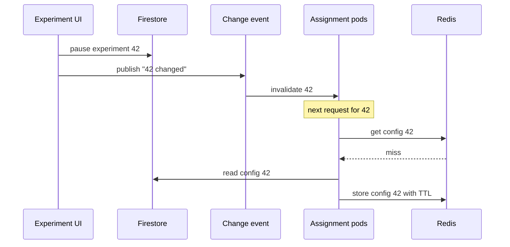

An experimentation platform looks like it's about statistics. A lot of the engineering is about something plainer: making sure that when someone changes an experiment, every service that assigns users to variants finds out, quickly and cheaply.

I led the modernisation of a platform that ran hundreds of experiments a year for dozens of product teams. This post is about one part of that work, the path config takes from where people edit it to where it's used. We went from polling to event-driven caching, cut the platform's cloud bill by 95% and API latency by 90% over a year, and ended up with a much clearer design. I'll finish with the alternatives I'd consider if I were building it again.

## Two sides with very different traffic

It helps to split the platform in two. The **control plane** is where experiments change: people create them, change traffic splits, pause them, and bandits shift traffic toward the winning variant every few hours. Across all running experiments, that was around ten changes a day. The **data plane** is where config is used: every request that needs to know which variant a user sees. That was more than 20 backend services, each running many pods on Kubernetes, plus every user of the apps.

<figure class="fig">
<svg viewBox="0 0 680 186" role="img" aria-labelledby="x0t x0d">
  <title id="x0t">Control plane and data plane of an experimentation platform</title>
  <desc id="x0d">People and a bandit updater write experiment config to a config store about ten times a day. Services and apps ask an assignment component for a variant on every request. The open question is how config gets from the store to assignment.</desc>
  <defs><marker id="xa" viewBox="0 0 10 10" refX="9" refY="5" markerWidth="7" markerHeight="7" orient="auto-start-reverse"><path class="arrow" d="M0,0 L10,5 L0,10 z"/></marker></defs>
  <text class="h" x="10" y="16">CONTROL PLANE · RARE WRITES</text>
  <text class="h" x="670" y="16" text-anchor="end">DATA PLANE · CONSTANT READS</text>
  <rect class="box" x="10" y="30" width="190" height="54" rx="6"/>
  <text class="t" x="22" y="51">Experiment UI / API</text>
  <text class="m" x="22" y="68">create, split, pause, ramp</text>
  <rect class="box" x="10" y="100" width="190" height="54" rx="6"/>
  <text class="t" x="22" y="121">Bandit updater</text>
  <text class="m" x="22" y="138">re-splits every few hours</text>
  <rect class="box" x="250" y="62" width="170" height="60" rx="6"/>
  <text class="t" x="262" y="83">Config store</text>
  <text class="m" x="262" y="100">Firestore</text>
  <rect class="box" x="480" y="30" width="190" height="54" rx="6"/>
  <text class="t" x="492" y="51">Assignment</text>
  <text class="m" x="492" y="68">picks a variant per user</text>
  <rect class="box" x="480" y="100" width="190" height="54" rx="6"/>
  <text class="t" x="492" y="121">Services and apps</text>
  <text class="m" x="492" y="138">ask on every request</text>
  <path class="ln" d="M200,57 L248,82" marker-end="url(#xa)"/>
  <path class="ln" d="M200,127 L248,104" marker-end="url(#xa)"/>
  <path class="sb dash" d="M420,92 L478,62" marker-end="url(#xa)"/>
  <text class="tb" x="452" y="116" text-anchor="middle">?</text>
  <path class="ln" d="M575,100 L575,86" marker-end="url(#xa)"/>
  <text class="m" x="105" y="176" text-anchor="middle">~10 changes a day</text>
  <text class="m" x="575" y="176" text-anchor="middle">every request, all day</text>
</svg>
<figcaption>Two sides with very different traffic. This post is about the dashed arrow: how config travels from the store to wherever assignment happens.</figcaption>
</figure>

A good design for the arrow in the middle has to meet five requirements at once:

- **Fresh:** a paused experiment stops serving quickly. That's the kill switch.
- **Consistent:** the same user gets the same variant from every service.
- **Cheap:** cost should grow with changes, not with traffic or time.
- **Fast:** assignment sits on the request path, so it can't add much latency.
- **Resilient:** if the config store has a bad minute, assignment keeps working with the last known config.

## Where we started

The first architecture had two clients, and each failed one requirement badly.

**The backend polled.** Every pod asked Firestore for the current config every two minutes. That's 720 polls a day from every pod, to catch about ten changes spread across the whole company. Firestore bills per document read, so the cost was roughly:

```text
pods × documents per poll × polls per day
```

The rate of change doesn't appear in that formula. The bill grew with fleet size and the number of hours in a day. Adding a service, adding experiments, or scaling out for a traffic peak all made it bigger, while the answer stayed "no change" nearly every time.

<figure class="fig">
<svg viewBox="0 0 680 250" role="img" aria-labelledby="f2t f2d">
  <title id="f2t">Firestore reads over a day, polling versus events</title>
  <desc id="f2d">Illustrative. Polling reads rise in a straight line through the day. Event-driven reads stay low and step up slightly at each config change.</desc>
  <line class="sb" x1="60" x2="80" y1="14" y2="14"/><text class="t" x="86" y="18">Polling</text>
  <line class="sa" x1="160" x2="180" y1="14" y2="14"/><text class="t" x="186" y="18">Events + cache + TTL</text>
  <line class="grid" x1="60" x2="640" y1="210" y2="210"/>
  <line class="grid" x1="60" x2="60" y1="40" y2="210"/>
  <text class="m" transform="translate(44 210) rotate(-90)">Firestore reads, cumulative</text>
  <text class="m" x="60" y="228" text-anchor="middle">00:00</text>
  <text class="m" x="205" y="228" text-anchor="middle">06:00</text>
  <text class="m" x="350" y="228" text-anchor="middle">12:00</text>
  <text class="m" x="495" y="228" text-anchor="middle">18:00</text>
  <text class="m" x="640" y="228" text-anchor="middle">24:00</text>
  <g tabindex="0"><title>Polling: reads grow with pods × time, whether or not anything changed</title>
    <path class="sb" d="M60,210 L640,50"/>
    <path d="M60,210 L640,50" style="stroke:transparent;stroke-width:14;fill:none"/>
  </g>
  <g tabindex="0"><title>Events + cache + TTL: a step per config change, plus a slow slope from TTL reloads</title>
    <path class="sa" d="M60,210 L84.2,209.6 L84.2,206.6 L132.5,205.8 L132.5,202.8 L180.8,201.9 L180.8,198.9 L253.3,197.7 L253.3,194.7 L277.5,194.2 L277.5,191.2 L325.8,190.4 L325.8,187.4 L398.3,186.2 L398.3,183.2 L422.5,182.8 L422.5,179.8 L470.8,178.9 L470.8,175.9 L543.3,174.7 L543.3,171.7 L640,170.0"/>
    <path d="M60,210 L84.2,209.6 L84.2,206.6 L132.5,205.8 L132.5,202.8 L180.8,201.9 L180.8,198.9 L253.3,197.7 L253.3,194.7 L277.5,194.2 L277.5,191.2 L325.8,190.4 L325.8,187.4 L398.3,186.2 L398.3,183.2 L422.5,182.8 L422.5,179.8 L470.8,178.9 L470.8,175.9 L543.3,174.7 L543.3,171.7 L640,170.0" style="stroke:transparent;stroke-width:14;fill:none"/>
  </g>
  <text class="tb" x="630" y="42" text-anchor="end">grows with pods × time</text>
  <text class="ta" x="630" y="162" text-anchor="end">grows with changes</text>
</svg>
<figcaption>The shape of the problem (illustrative, not measured). Polling pays every pod, every interval. Events pay once per change; the slow slope is TTL reloads.</figcaption>
</figure>

**The apps assigned on the device.** The app fetched config at start-up and computed each user's variant locally. That was cheap, but config only refreshed when the app restarted, and a backgrounded mobile app might not restart for days or weeks. When a team paused a broken experiment, users who hadn't restarted kept seeing it. It also meant the assignment logic existed twice, in the backend and in the apps, and the two had to stay identical.

So the backend paid to stay fresh when it didn't need to, and the apps stayed stale when it mattered most.

## Where we ended up

The redesign moved assignment into one service and changed how that service learns about changes.

<figure class="fig">
<svg viewBox="0 0 680 310" role="img" aria-labelledby="f1t f1d">
  <title id="f1t">Config flow before and after</title>
  <desc id="f1d">Before: backend services poll Firestore on a schedule and apps fetch config only at start. After: an edit publishes an event to the assignment service, whose pods cache locally and share Redis, reading Firestore only on a miss.</desc>
  <defs><marker id="f1a" viewBox="0 0 10 10" refX="9" refY="5" markerWidth="7" markerHeight="7" orient="auto-start-reverse"><path class="arrow" d="M0,0 L10,5 L0,10 z"/></marker></defs>
  <text class="h" x="10" y="16">BEFORE</text>
  <rect class="box" x="10" y="28" width="190" height="46" rx="6"/>
  <text class="t" x="22" y="47">Backend services</text><text class="m" x="22" y="64">20+ services, many pods</text>
  <rect class="box" x="10" y="88" width="190" height="46" rx="6"/>
  <text class="t" x="22" y="107">Mobile and web apps</text><text class="m" x="22" y="124">assign on the device</text>
  <rect class="box" x="470" y="50" width="200" height="60" rx="6"/>
  <text class="t" x="482" y="74">Firestore</text><text class="m" x="482" y="92">billed per document read</text>
  <path class="sb" d="M200,51 C320,51 350,70 468,74" marker-end="url(#f1a)"/>
  <text class="tb" x="335" y="48" text-anchor="middle">polls on a schedule, all day</text>
  <path class="ln dash" d="M200,111 C320,111 350,95 468,90" marker-end="url(#f1a)"/>
  <text class="m" x="335" y="126" text-anchor="middle">fetches once, at app start</text>
  <line class="grid" x1="10" x2="670" y1="152" y2="152"/>
  <text class="h" x="10" y="176">AFTER</text>
  <rect class="box" x="10" y="188" width="190" height="46" rx="6"/>
  <text class="t" x="22" y="207">Experiment edited</text><text class="m" x="22" y="224">~10 changes a day</text>
  <rect class="box" x="10" y="250" width="190" height="46" rx="6"/>
  <text class="t" x="22" y="269">Services and apps</text><text class="m" x="22" y="286">ask the service to assign</text>
  <rect class="box" x="270" y="206" width="180" height="72" rx="6"/>
  <text class="t" x="282" y="228">Assignment service</text><text class="m" x="282" y="246">local cache per pod</text><text class="m" x="282" y="263">TTL as a backstop</text>
  <rect class="box" x="500" y="188" width="170" height="46" rx="6"/>
  <text class="t" x="512" y="207">Redis</text><text class="m" x="512" y="224">shared across pods</text>
  <rect class="box" x="500" y="250" width="170" height="46" rx="6"/>
  <text class="t" x="512" y="269">Firestore</text><text class="m" x="512" y="286">read on a miss only</text>
  <path class="sa" d="M200,211 L268,226" marker-end="url(#f1a)"/>
  <text class="ta" x="236" y="208" text-anchor="middle">event</text>
  <path class="ln" d="M200,273 L268,262" marker-end="url(#f1a)"/>
  <path class="ln" d="M450,230 L498,213" marker-end="url(#f1a)"/>
  <path class="ln dash" d="M450,258 L498,272" marker-end="url(#f1a)"/>
</svg>
<figcaption>Before, the cost path ran from every pod to Firestore all day. After, Firestore is only read when a change or a TTL expiry actually needs it.</figcaption>
</figure>

1. **One assignment service.** Backend services and, eventually, the apps ask the service for variants instead of computing them. One implementation, one place to fix bugs, and a kill switch that works for everyone.
2. **A local cache in each pod.** Config is read from memory on the request path. That alone removed most Firestore reads and most of the per-request latency.
3. **A change event on every config update.** Saving an experiment, or a bandit re-split, publishes an event, and pods invalidate their cache when they receive it. Reads now scale with the number of changes, not the number of seconds.
4. **A TTL as a backstop.** If an event is lost or delayed, the entry expires and gets reloaded anyway.
5. **Redis as a shared layer.** Because the service ran as many pods, each local cache was its own copy. Two pods could disagree for a while, and every pod reloaded from Firestore separately. Redis between the pods and Firestore gave them one shared copy and turned many reloads into one.

Here's what happens when someone pauses an experiment:



The service itself was rewritten in Go, handling requests concurrently with worker pools. Together with serving config from memory instead of a Firestore round trip, that's where the 90% latency drop came from.

### Freshness is the real requirement

Caching trades cost for correctness, so the key question is how stale config is allowed to be. We never had a serious incident from it, but the what-if drove the design. Suppose a team ships a broken experiment, say a variant that fails at checkout, and pauses it. If the pause doesn't reach the serving path, users keep landing in the broken variant, and every minute of that is lost sales.

<figure class="fig">
<svg viewBox="0 0 680 185" role="img" aria-labelledby="f3t f3d">
  <title id="f3t">How long a paused experiment keeps serving</title>
  <desc id="f3d">Log time scale. With an event: seconds. If the event is lost: up to the TTL. With assignment on the device: until the app restarts, days or weeks.</desc>
  <line class="grid" x1="230" x2="230" y1="30" y2="160"/><line class="grid" x1="358" x2="358" y1="30" y2="160"/>
  <line class="grid" x1="486" x2="486" y1="30" y2="160"/><line class="grid" x1="585" x2="585" y1="30" y2="160"/>
  <line class="grid" x1="646" x2="646" y1="30" y2="160"/>
  <text class="m" x="230" y="176" text-anchor="middle">1 s</text><text class="m" x="358" y="176" text-anchor="middle">1 min</text>
  <text class="m" x="486" y="176" text-anchor="middle">1 h</text><text class="m" x="585" y="176" text-anchor="middle">1 day</text>
  <text class="m" x="646" y="176" text-anchor="middle">1 week</text>
  <text class="t" x="10" y="51">Event reaches the pod</text>
  <text class="t" x="10" y="96">Event lost, TTL expires</text>
  <text class="t" x="10" y="141">Assigned on the device</text>
  <g tabindex="0"><title>Event reaches the pod: seconds</title><rect class="fa" x="210" y="40" width="42" height="14" rx="4"/></g>
  <text class="m" x="260" y="51">seconds</text>
  <g tabindex="0"><title>Event lost: stale until the TTL expires</title><rect class="fa" x="210" y="85" width="190" height="14" rx="4"/></g>
  <text class="m" x="408" y="96">up to the TTL</text>
  <g tabindex="0"><title>Client-side assignment: stale until the app restarts, days or weeks</title><rect class="fb" x="210" y="130" width="436" height="14" rx="4"/></g>
  <text class="m" x="646" y="124" text-anchor="end">until the app restarts</text>
</svg>
<figcaption>How long a paused experiment keeps serving, on a log scale. The TTL is drawn as minutes for illustration.</figcaption>
</figure>

With client-side assignment, "a while" meant until each user restarted the app. With events, it means seconds; if an event is lost, one TTL at most. So the TTL should come from the worst staleness you can accept for a kill switch, not from how many reads it saves.

### The stampede that didn't happen

When many pods cache the same entries with the same TTL, they expire together, miss together, and reload together, briefly recreating the load the cache was meant to remove. We never did anything about it, because at our pod count the burst was small and Redis absorbed it. With a much larger fleet I'd randomise TTLs slightly so expiries spread out, and let one caller reload a key while the others wait for its result.

### What it changed

- **Cloud cost fell 95% year over year**, measured on actual billing with some shared services allocated by estimate. Two things drove it: removing the polling, and right-sizing the workloads once they no longer had to absorb that load.
- **API latency fell 90%**, from in-memory config plus the concurrent Go service.
- An **earlier phase** of making the API asynchronous had already cut resource use by 50%; I count that separately.
- The less measurable win was **control**: one assignment path, and a kill switch that reaches every user within seconds.

## What I'd consider now

The design above works, but it has more moving parts than the problem needs: an event channel, Redis, a TTL and a fallback read path, all to keep a small, rarely changing dataset fresh. These are the alternatives I'd weigh today, starting with the smallest change.

### 1. Let Firestore push the changes

Firestore can already push changes itself. A **snapshot listener** subscribes to a query and receives an update whenever a matching document changes. Each assignment pod could listen to the config collection and keep the result in memory.

<figure class="fig">
<svg viewBox="0 0 680 150" role="img" aria-labelledby="x1t x1d">
  <title id="x1t">Firestore snapshot listeners</title>
  <desc id="x1d">Each assignment pod opens a snapshot listener on the Firestore config collection. Firestore pushes changed documents to every pod, which keeps config in memory.</desc>
  <defs><marker id="a1" viewBox="0 0 10 10" refX="9" refY="5" markerWidth="7" markerHeight="7" orient="auto-start-reverse"><path class="arrow" d="M0,0 L10,5 L0,10 z"/></marker></defs>
  <rect class="box" x="10" y="40" width="170" height="60" rx="6"/>
  <text class="t" x="22" y="61">Firestore</text>
  <text class="m" x="22" y="78">config collection</text>
  <text class="m" x="10" y="124">sends only changed</text><text class="m" x="10" y="140">documents</text>
  <rect class="box" x="430" y="14" width="240" height="38" rx="6"/>
  <text class="t" x="442" y="38">Pod 1</text>
  <text class="m" x="510" y="38">config held in memory</text>
  <path class="sa" d="M180,70 C300,70 320,33 428,33" marker-end="url(#a1)"/>
  <rect class="box" x="430" y="58" width="240" height="38" rx="6"/>
  <text class="t" x="442" y="82">Pod 2</text>
  <text class="m" x="510" y="82">config held in memory</text>
  <path class="sa" d="M180,70 C300,70 320,77 428,77" marker-end="url(#a1)"/>
  <rect class="box" x="430" y="102" width="240" height="38" rx="6"/>
  <text class="t" x="442" y="126">Pod 3</text>
  <text class="m" x="510" y="126">config held in memory</text>
  <path class="sa" d="M180,70 C300,70 320,121 428,121" marker-end="url(#a1)"/>
  <text class="ta" x="250" y="118" text-anchor="middle">snapshot listeners</text>
</svg>
<figcaption>Each pod subscribes to the config collection. Firestore sends the full set once on connect, then only the documents that change.</figcaption>
</figure>

This replaces the change event, the TTL, and arguably Redis: the source of truth notifies the pods directly, so there's no separate channel to fall out of sync. The costs are different rather than zero. Each listener pays for reading the full result set when it connects and for each changed document after that. A listener that stays disconnected too long is billed as a new query when it reconnects. And every pod holds an open connection to the database. At ten changes a day and tens of pods, that's cheap. I'd still keep a slow periodic resync, in case a listener silently stops.

### 2. Publish versioned snapshots

Treat config like a build artefact. On every change, a publisher writes the complete config as an immutable file, `config-v42.json`, and updates a tiny pointer saying which version is current. Clients poll the pointer with a conditional request, and only download the new version when the pointer changes.

<figure class="fig">
<svg viewBox="0 0 680 156" role="img" aria-labelledby="x2t x2d">
  <title id="x2t">Versioned config snapshots with conditional fetch</title>
  <desc id="x2d">A publisher writes an immutable config file for each version to a bucket and updates a small pointer. Pods and SDKs poll the pointer with a conditional request, which returns 304 when nothing changed, and download the new version only after a change.</desc>
  <defs><marker id="a2" viewBox="0 0 10 10" refX="9" refY="5" markerWidth="7" markerHeight="7" orient="auto-start-reverse"><path class="arrow" d="M0,0 L10,5 L0,10 z"/></marker></defs>
  <rect class="box" x="10" y="20" width="150" height="54" rx="6"/>
  <text class="t" x="22" y="41">Publisher</text>
  <text class="m" x="22" y="58">on every change</text>
  <rect class="box" x="220" y="20" width="200" height="54" rx="6"/>
  <text class="t" x="232" y="41">config-v42.json</text>
  <text class="m" x="232" y="58">immutable, in a bucket</text>
  <rect class="box" x="220" y="90" width="200" height="54" rx="6"/>
  <text class="t" x="232" y="111">current → v42</text>
  <text class="m" x="232" y="128">tiny pointer, CDN cached</text>
  <rect class="box" x="480" y="20" width="190" height="54" rx="6"/>
  <text class="t" x="492" y="41">Pods and SDKs</text>
  <text class="m" x="492" y="58">poll the pointer</text>
  <path class="ln" d="M160,47 L218,47" marker-end="url(#a2)"/>
  <path class="ln" d="M160,60 L218,110" marker-end="url(#a2)"/>
  <path class="ln" d="M478,62 L422,110" marker-end="url(#a2)" marker-start="url(#a2)"/>
  <text class="m" x="470" y="118">If-None-Match → 304</text><text class="m" x="470" y="134">(nothing changed)</text>
  <path class="sa" d="M478,40 L422,40" marker-end="url(#a2)"/>
  <text class="ta" x="450" y="34" text-anchor="middle">fetch</text>
</svg>
<figcaption>Still polling, but almost free: the frequent check is a cached request for a pointer, and the full config is only downloaded when the version changes. Rolling back means pointing at an older file.</figcaption>
</figure>

This is polling again, but polling done cheaply. The check is a cached request that usually returns *304 Not Modified*. It works for anything that can make an HTTP request, including mobile apps through a CDN. It also gives you a history of every config version and makes rollback trivial. Freshness is bounded by the poll interval, so it suits config better than kill switches unless the interval is short.

### 3. Run a config push service

The most advanced option is a dedicated service that holds a long-lived stream, over gRPC or server-sent events, to every pod and SDK, and pushes a diff the moment config changes.

<figure class="fig">
<svg viewBox="0 0 680 170" role="img" aria-labelledby="x3t x3d">
  <title id="x3t">A dedicated config push service</title>
  <desc id="x3d">A config push service reads from the config store and keeps long-lived streams open to every pod and app SDK, sending diffs when config changes.</desc>
  <defs><marker id="a3" viewBox="0 0 10 10" refX="9" refY="5" markerWidth="7" markerHeight="7" orient="auto-start-reverse"><path class="arrow" d="M0,0 L10,5 L0,10 z"/></marker></defs>
  <rect class="box" x="10" y="50" width="160" height="54" rx="6"/>
  <text class="t" x="22" y="71">Config store</text>
  <text class="m" x="22" y="88">source of truth</text>
  <rect class="box" x="220" y="40" width="200" height="74" rx="6"/>
  <text class="t" x="232" y="61">Config push service</text>
  <text class="m" x="232" y="78">holds open streams</text>
  <text class="m" x="232" y="94">sends diffs</text>
  <path class="ln" d="M170,77 L218,77" marker-end="url(#a3)"/>
  <rect class="box" x="480" y="10" width="190" height="38" rx="6"/>
  <text class="t" x="492" y="34">Pod</text>
  <path class="sa" d="M420,77 C450,77 450,29 478,29" marker-end="url(#a3)"/>
  <rect class="box" x="480" y="60" width="190" height="38" rx="6"/>
  <text class="t" x="492" y="84">Pod</text>
  <path class="sa" d="M420,77 C450,77 450,79 478,79" marker-end="url(#a3)"/>
  <rect class="box" x="480" y="110" width="190" height="38" rx="6"/>
  <text class="t" x="492" y="134">SDK in an app</text>
  <path class="sa" d="M420,77 C450,77 450,129 478,129" marker-end="url(#a3)"/>
  <text class="ta" x="440" y="162">gRPC / server-sent events</text>
</svg>
<figcaption>The pattern feature-flag vendors and service meshes use. Freshest, but you now operate a service whose job is holding thousands of open connections.</figcaption>
</figure>

This is how feature-flag vendors and service meshes distribute configuration, and it gives sub-second freshness everywhere. It's also a service whose whole job is holding thousands of open connections and handling reconnects. It's worth building when you have many clients and strict freshness needs, not before.

### 4. Evaluate locally

Any of the three can feed a different idea: move the decision into the caller. An **evaluation SDK** inside each backend service holds the config and assigns variants itself, by hashing the user id with the experiment's salt into a bucket.

<figure class="fig">
<svg viewBox="0 0 680 146" role="img" aria-labelledby="x4t x4d">
  <title id="x4t">Local evaluation SDK</title>
  <desc id="x4d">Config is delivered into each backend service process, where an evaluation SDK hashes the user with the experiment salt to pick a bucket and variant, so no network call is needed per assignment.</desc>
  <defs><marker id="a4" viewBox="0 0 10 10" refX="9" refY="5" markerWidth="7" markerHeight="7" orient="auto-start-reverse"><path class="arrow" d="M0,0 L10,5 L0,10 z"/></marker></defs>
  <rect class="box dash" x="200" y="14" width="470" height="120" rx="8" style="fill:none"/>
  <text class="m" x="212" y="32">inside each backend service process</text>
  <rect class="box" x="10" y="50" width="150" height="54" rx="6"/>
  <text class="t" x="22" y="71">Config</text>
  <text class="m" x="22" y="88">via 1, 2 or 3</text>
  <rect class="box" x="220" y="44" width="180" height="70" rx="6"/>
  <text class="t" x="232" y="65">Evaluation SDK</text>
  <text class="m" x="232" y="82">hash(user, salt)</text>
  <text class="m" x="232" y="98">→ bucket → variant</text>
  <rect class="box" x="470" y="52" width="180" height="54" rx="6"/>
  <text class="t" x="482" y="73">Request handler</text>
  <text class="m" x="482" y="90">gets a variant in µs</text>
  <path class="ln" d="M160,77 L218,77" marker-end="url(#a4)"/>
  <path class="sa" d="M400,79 L468,79" marker-end="url(#a4)"/>
</svg>
<figcaption>Move the decision into the caller. Assignment becomes a hash and a lookup in memory, with no network hop, but the SDK must behave identically in every language that uses it.</figcaption>
</figure>

Assignment becomes a hash and a lookup in memory, with no network hop. The catch is familiar from our app-side assignment: every language's SDK must produce exactly the same variant for the same user, so the hashing and bucketing need shared test vectors and strict versioning.

### Side by side

| Design | Freshness | Read cost | Moving parts | Main risk |
| --- | --- | --- | --- | --- |
| What we built | seconds; one TTL if an event is lost | Firestore on cache misses only | event channel, Redis, TTL | event and cache paths drifting apart |
| Firestore listeners | seconds | initial load + each change, per listener | Firestore only | open connections; reconnect re-reads |
| Versioned snapshots | the poll interval | near zero; checks served from cache | publisher, bucket, CDN | staleness up to one interval |
| Push service | under a second | none per read | a service holding many streams | operating the fan-out |
| Local evaluation | whatever feeds it | none per assignment | an SDK per language | SDKs drifting apart |

For the scale we had, around ten changes a day and a few dozen pods, I'd move the backend to **Firestore listeners** with a slow resync as a backstop. It deletes the most moving parts and keeps the freshness we needed. Apps would stay on server-side assignment, for the kill switch. If client count or read volume grew by an order of magnitude, I'd move to **versioned snapshots** behind a CDN, and add a push service only if sub-second freshness became a hard requirement.

## What I took from it

If a system reads something far more often than it changes, look at what you're paying for the reads, in money and in latency. Polling is the easiest design to build and the hardest to notice, because each poll is tiny and the total only shows up on the bill.

The version I'd defend now:

- make reads free (serve them from memory) and make changes loud (push them);
- pick the staleness bound from the kill switch, not from cost;
- keep assignment in one place you control;
- and before adding infrastructure to push changes, check whether your data store can already push them.
