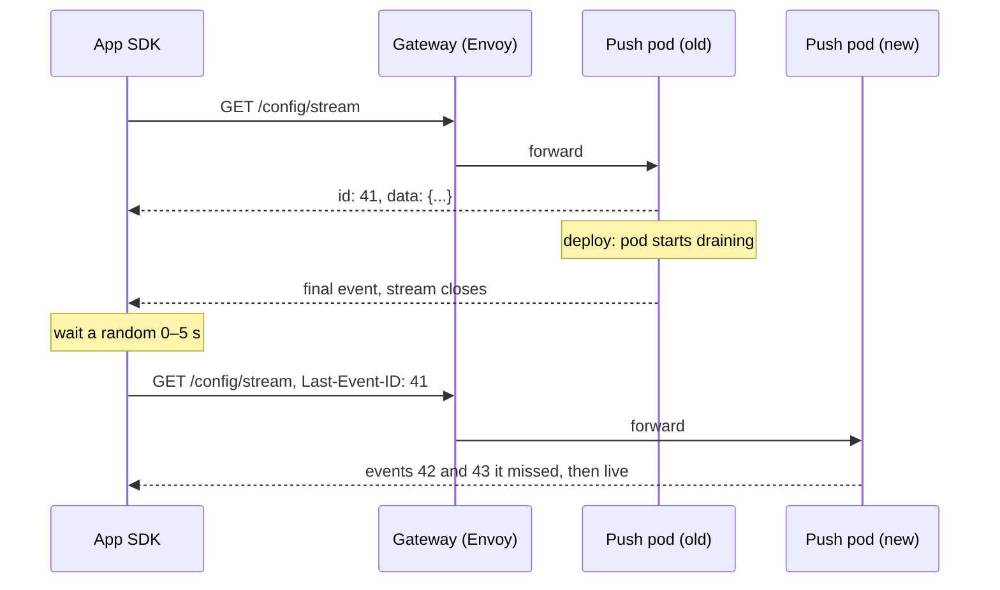

I want the experimentation service to be event-driven. Today, the services that assign users to variants still pull their config: they read it through a cache that events and a TTL keep fresh, and apps ask on every request. Most of those reads get the same answer as last time. What I'd like instead is for the service to tell its clients when something changes, and stay quiet when nothing does. A paused experiment should reach every client within a second, and an unchanged config should cost nothing.

When I wrote about [getting experiment config to every service]({{ '/posts/from-polling-to-push/' | relative_url }}), that design was the most advanced option: a push service that holds an open stream to every pod and app, and sends a change the moment it happens. I held back from it because I was worried about how long-lived connections behave inside Kubernetes. I didn't know the network well enough to say whether the worry was justified, so I went and learned.

Service meshes come up in almost every discussion of long-lived connections on Kubernetes, so this post starts there: what a mesh is, and how Istio works. Then it goes back to server-sent events (SSE) and checks each worry against what a mesh does. Some it fixes, one it makes worse, and one it doesn't touch.

## Server-sent events in one screen

SSE is plain HTTP. The client makes a GET request, and the server answers with `Content-Type: text/event-stream` and never finishes the response. Each event is a few lines of text followed by a blank line:

```text
id: 42
event: config
data: {"experiment":"checkout-cta","status":"paused"}

: heartbeat

id: 43
event: config
data: {"experiment":"search-rank","traffic":0.5}
```

A line starting with a colon is a comment. Clients ignore it, which makes it a free heartbeat. The `id` matters when the connection drops: a browser's `EventSource` reconnects by itself and sends the last id it saw in a `Last-Event-ID` header, so the server can replay what the client missed. SDKs in other languages do the same.

Unlike WebSockets, SSE only goes from server to client, which is all config delivery needs. And because it's ordinary HTTP, the proxies, authentication and logging you already have mostly work with it. The "mostly" is what the rest of this post is about.

## What a service mesh is

In a system with many services, each one needs the same networking features: timeouts, retries, encryption between services, metrics on every call, a way to send 5% of traffic to a new version. Without a mesh, each team builds these into its code, usually through a library per language, and the libraries drift apart.

A service mesh moves those features out of the application and into a proxy that runs next to every instance. The application sends plain requests. The proxy beside it applies the policy, encrypts the traffic and records what happened, and the proxy on the receiving side does the same in reverse.

Like the config system in the earlier post, a mesh has two halves:

- The **data plane** is the proxies, which handle every request.
- The **control plane** tells every proxy its configuration: where each service's instances are, which routing rules apply, which certificates to use.

<figure class="fig">
<svg viewBox="0 0 680 280" role="img" aria-labelledby="s0t s0d">
  <title id="s0t">Istio's architecture</title>
  <desc id="s0d">istiod, the control plane, pushes configuration and certificates to every Envoy proxy over long-lived gRPC streams. Traffic enters through an ingress gateway, which is a standalone Envoy, and reaches the frontend pod's Envoy sidecar. Calls from the frontend to the push service go from the frontend's Envoy to the push service's Envoy over mutual TLS.</desc>
  <defs><marker id="sa0" viewBox="0 0 10 10" refX="9" refY="5" markerWidth="7" markerHeight="7" orient="auto-start-reverse"><path class="arrow" d="M0,0 L10,5 L0,10 z"/></marker></defs>
  <rect class="box" x="240" y="10" width="200" height="56" rx="6"/><text class="t" x="252" y="32">istiod</text><text class="m" x="252" y="51">config · certificates</text>
  <text class="m" x="452" y="32">pushes config to every proxy</text><text class="m" x="452" y="48">over long-lived gRPC (xDS)</text>
  <rect class="box" x="10" y="140" width="150" height="56" rx="6"/><text class="t" x="22" y="162">ingress gateway</text><text class="m" x="22" y="181">Envoy at the edge</text>
  <rect class="box" x="190" y="112" width="220" height="100" rx="8"/><text class="m" x="202" y="132">pod: frontend</text>
  <rect class="box" x="202" y="146" width="92" height="44" rx="5"/><text class="t" x="214" y="173">Envoy</text>
  <rect class="box" x="306" y="146" width="92" height="44" rx="5"/><text class="t" x="318" y="173">app</text>
  <rect class="box" x="450" y="112" width="220" height="100" rx="8"/><text class="m" x="462" y="132">pod: push service</text>
  <rect class="box" x="462" y="146" width="92" height="44" rx="5"/><text class="t" x="474" y="173">Envoy</text>
  <rect class="box" x="566" y="146" width="92" height="44" rx="5"/><text class="t" x="578" y="173">app</text>
  <path class="ln dash" d="M300,66 L90,138" marker-end="url(#sa0)"/><path class="ln dash" d="M330,66 L256,110" marker-end="url(#sa0)"/><path class="ln dash" d="M380,66 L500,110" marker-end="url(#sa0)"/>
  <g tabindex="0"><title>Requests from outside enter through the gateway</title><path class="sa" d="M160,168 L200,168" marker-end="url(#sa0)"/></g>
  <g tabindex="0"><title>Service-to-service calls go proxy to proxy, over mutual TLS</title><path class="sa" d="M248,190 L248,240 L508,240 L508,192" marker-end="url(#sa0)"/></g>
  <text class="ta" x="378" y="258" text-anchor="middle">mTLS between proxies</text>
</svg>
<figcaption>Dashed lines are the control plane, solid blue lines are traffic. Every hop between services passes through two Envoys, one on each side.</figcaption>
</figure>

## Istio, specifically

Istio is the most widely used mesh on Kubernetes. Its parts:

- **Envoy**, an open-source proxy, is the data plane. Istio adds it to each pod as a sidecar container. An admission webhook injects it automatically into pods in any namespace labelled `istio-injection=enabled`, and an init step writes iptables rules so that all the pod's inbound and outbound traffic passes through Envoy.
- **istiod** is the control plane. It watches the Kubernetes API for Services and pods, turns them and Istio's own resources into Envoy configuration, and issues the certificates each proxy uses for mutual TLS.
- **Gateways** are standalone Envoys at the edge of the mesh, for traffic entering or leaving the cluster.

You configure it with Kubernetes objects of its own:

- `VirtualService`: routing rules such as "send 10% of requests to v2", plus timeouts and retries.
- `DestinationRule`: what happens once a destination is chosen, such as the load-balancing policy, connection limits and outlier detection, which takes misbehaving pods out of rotation.
- `Gateway`: which hosts and ports an edge gateway accepts.
- `PeerAuthentication`: whether mutual TLS is required between services.

Istio also has a newer "ambient" mode without sidecars. A shared proxy on each node, called ztunnel, handles encryption and connection-level work, and optional Envoy "waypoints" handle HTTP features for a namespace. The trade-offs for long-lived streams are similar, so I'll stick to sidecars here.

One detail I enjoyed: istiod sends configuration to every Envoy over long-lived gRPC streams, using Envoy's xDS protocol. The mesh itself is built on the pattern I was nervous about, at the scale of every pod in the cluster.

## The path an SSE stream takes

Without a mesh, a stream from an app to a push service passes through a cloud load balancer and an ingress controller. With Istio, it passes through the cloud load balancer, the ingress gateway and the push service's sidecar. Each hop is a proxy with its own timers, and any of them can end the stream.

<figure class="fig">
<svg viewBox="0 0 680 290" role="img" aria-labelledby="s1t s1d">
  <title id="s1t">Every hop on an SSE stream has a timer</title>
  <desc id="s1d">An SSE stream goes from the app or SDK through a cloud load balancer, the Istio ingress gateway, the push service's Envoy sidecar, and into the push service. The load balancer has an idle timeout, 60 seconds by default on AWS's Application Load Balancer. Envoy's route timeout is 15 seconds by default, but Istio turns it off. Envoy's stream idle timeout is 5 minutes. On deploy, Istio drains for 5 seconds by default. Without heartbeats, a quiet stream is cut after 60 seconds; with a comment line every 20 seconds, no idle timer fires.</desc>
  <defs><marker id="sa1" viewBox="0 0 10 10" refX="9" refY="5" markerWidth="7" markerHeight="7" orient="auto-start-reverse"><path class="arrow" d="M0,0 L10,5 L0,10 z"/></marker></defs>
  <rect class="box" x="10" y="20" width="120" height="52" rx="6"/><text class="t" x="22" y="41">app / SDK</text><text class="m" x="22" y="59">reconnects</text>
  <rect class="box" x="147" y="20" width="120" height="52" rx="6"/><text class="t" x="159" y="41">cloud LB</text><text class="m" x="159" y="59">load balancer</text>
  <rect class="box" x="284" y="20" width="120" height="52" rx="6"/><text class="t" x="296" y="41">gateway</text><text class="m" x="296" y="59">Envoy</text>
  <rect class="box" x="421" y="20" width="120" height="52" rx="6"/><text class="t" x="433" y="41">sidecar</text><text class="m" x="433" y="59">Envoy</text>
  <rect class="box" x="558" y="20" width="112" height="52" rx="6"/><text class="t" x="570" y="41">push</text><text class="m" x="570" y="59">holds streams</text>
  <path class="ln" d="M130,46 L145,46" marker-end="url(#sa1)"/><path class="ln" d="M267,46 L282,46" marker-end="url(#sa1)"/><path class="ln" d="M404,46 L419,46" marker-end="url(#sa1)"/><path class="ln" d="M541,46 L556,46" marker-end="url(#sa1)"/>
  <text class="ta" x="70" y="98" text-anchor="middle">backoff</text><text class="m" x="70" y="114" text-anchor="middle">and jitter</text>
  <text class="tb" x="207" y="98" text-anchor="middle">idle timeout</text><text class="m" x="207" y="114" text-anchor="middle">60 s on AWS ALB</text>
  <text class="tb" x="344" y="98" text-anchor="middle">route timeout</text><text class="m" x="344" y="114" text-anchor="middle">15 s in Envoy,</text><text class="m" x="344" y="130" text-anchor="middle">off in Istio</text>
  <text class="tb" x="481" y="98" text-anchor="middle">stream idle</text><text class="m" x="481" y="114" text-anchor="middle">5 min in Envoy</text>
  <text class="tb" x="614" y="98" text-anchor="middle">drain on deploy</text><text class="m" x="614" y="114" text-anchor="middle">5 s in Istio</text>
  <line class="grid" x1="10" x2="670" y1="152" y2="152"/>
  <text class="h" x="10" y="176">ONE QUIET STREAM, FIRST 5 MINUTES</text>
  <text class="m" x="10" y="208">no heartbeat</text>
  <g tabindex="0"><title>No heartbeat: the load balancer cuts the stream after 60 s idle</title><line class="sb" x1="150" x2="252" y1="204" y2="204"/><path class="sb" d="M246,198 L258,210 M258,198 L246,210"/></g>
  <text class="tb" x="266" y="208">cut after 60 s idle</text>
  <text class="m" x="10" y="248">comment every 20 s</text>
  <g tabindex="0"><title>With a comment line every 20 s, no idle timer fires</title><line class="sa" x1="150" x2="660" y1="244" y2="244"/>
  <circle class="fa" cx="184" cy="244" r="4"/><circle class="fa" cx="218" cy="244" r="4"/><circle class="fa" cx="252" cy="244" r="4"/><circle class="fa" cx="286" cy="244" r="4"/><circle class="fa" cx="320" cy="244" r="4"/><circle class="fa" cx="354" cy="244" r="4"/><circle class="fa" cx="388" cy="244" r="4"/><circle class="fa" cx="422" cy="244" r="4"/><circle class="fa" cx="456" cy="244" r="4"/><circle class="fa" cx="490" cy="244" r="4"/><circle class="fa" cx="524" cy="244" r="4"/><circle class="fa" cx="558" cy="244" r="4"/><circle class="fa" cx="592" cy="244" r="4"/><circle class="fa" cx="626" cy="244" r="4"/></g>
  <text class="m" x="150" y="276">0</text><text class="m" x="660" y="276" text-anchor="end">5 min</text>
</svg>
<figcaption>The shortest idle timer on the path decides how long a quiet stream lives. A heartbeat shorter than all of them keeps every one from firing. The defaults shown are examples; check your own.</figcaption>
</figure>

Going through the worries I had, with a mesh in place:

**Idle timeouts: still yours, but easy.** Every hop has an idle timer. AWS's Application Load Balancer closes idle connections after 60 seconds by default, and Envoy closes a stream that has been quiet for five minutes. Envoy also has a route timeout, 15 seconds by default for a complete response, which would kill every SSE stream. Istio turns it off for HTTP routes by default, but setting a `timeout` in a VirtualService turns it back on for that route. A comment line every 15 to 30 seconds resets every idle timer on the path.

**Buffering: better with a mesh.** Envoy passes response bodies through as they arrive. Buffering usually comes from elsewhere: NGINX-based ingress controllers buffer responses unless the server sends `X-Accel-Buffering: no` or buffering is turned off for that route. Compression can also hold small events back until a block fills, so leave `text/event-stream` out of compression rules.

**Rebalancing: not fixed.** This surprised me. Envoy balances per request, which fixes the uneven load that long-lived gRPC connections cause with plain kube-proxy. But an SSE stream is a single request that never ends. Once it lands on a pod, it stays there, mesh or no mesh. When the push service scales from three pods to four, the new pod only receives the streams that happen to reconnect.

The fix belongs to the server: close each stream after a maximum lifetime, with jitter, so clients reconnect and spread across the pods that exist now. Envoy can enforce a maximum stream duration too, but doing it in the application lets the server send a final event before it closes.

<figure class="fig">
<svg viewBox="0 0 680 260" role="img" aria-labelledby="s2t s2d">
  <title id="s2t">Share of streams on a newly added pod</title>
  <desc id="s2d">Simulation of 4,000 streams on three push pods when a fourth pod starts. With no cap on stream lifetime, and streams ending naturally about every three hours, the new pod holds 1% of streams after 10 minutes and 6% after an hour. With streams capped at 10 plus or minus 2 minutes, it holds 21% after 10 minutes and about 25%, an even share, from 15 minutes on.</desc>
  <text class="h" x="10" y="20">SHARE OF STREAMS ON THE NEW POD</text>
  <line class="grid" x1="60" x2="600" y1="210" y2="210"/><text class="m" x="52" y="214" text-anchor="end">0%</text>
  <line class="grid" x1="60" x2="600" y1="153" y2="153"/><text class="m" x="52" y="157" text-anchor="end">10%</text>
  <line class="grid" x1="60" x2="600" y1="97" y2="97"/><text class="m" x="52" y="101" text-anchor="end">20%</text>
  <line class="grid" x1="60" x2="600" y1="40" y2="40"/><text class="m" x="52" y="44" text-anchor="end">30%</text>
  <text class="m" x="60" y="228" text-anchor="middle">0</text>
  <text class="m" x="150" y="228" text-anchor="middle">10</text>
  <text class="m" x="240" y="228" text-anchor="middle">20</text>
  <text class="m" x="330" y="228" text-anchor="middle">30</text>
  <text class="m" x="420" y="228" text-anchor="middle">40</text>
  <text class="m" x="510" y="228" text-anchor="middle">50</text>
  <text class="m" x="600" y="228" text-anchor="middle">60</text>
  <text class="m" x="330" y="248" text-anchor="middle">minutes after the fourth pod starts</text>
  <line class="ln dash" x1="60" x2="600" y1="68" y2="68"/>
  <text class="m" x="606" y="72">even: 25%</text>
  <g tabindex="0"><title>No cap: 1% on the new pod after 10 min, 6% after 60 min</title><path class="sb" d="M60.0,210.0 L69.0,209.6 L78.0,209.3 L87.0,208.4 L96.0,208.3 L105.0,207.6 L114.0,206.7 L123.0,205.9 L132.0,205.0 L141.0,204.5 L150.0,203.9 L159.0,203.2 L168.0,201.9 L177.0,201.2 L186.0,199.5 L195.0,198.9 L204.0,198.2 L213.0,197.4 L222.0,197.1 L231.0,196.5 L240.0,196.3 L249.0,195.7 L258.0,195.1 L267.0,193.7 L276.0,193.4 L285.0,192.9 L294.0,192.6 L303.0,192.0 L312.0,191.6 L321.0,191.7 L330.0,191.2 L339.0,191.2 L348.0,190.7 L357.0,189.6 L366.0,188.6 L375.0,187.3 L384.0,186.8 L393.0,186.1 L402.0,185.5 L411.0,185.1 L420.0,184.4 L429.0,184.5 L438.0,183.9 L447.0,182.8 L456.0,182.1 L465.0,181.7 L474.0,181.0 L483.0,180.4 L492.0,179.3 L501.0,178.7 L510.0,178.7 L519.0,177.8 L528.0,177.6 L537.0,176.7 L546.0,176.0 L555.0,176.0 L564.0,175.6 L573.0,174.9 L582.0,174.0 L591.0,174.0 L600.0,174.0"/></g>
  <g tabindex="0"><title>Capped at 10 ± 2 min: 21% after 10 min, 26% after 20 min</title><path class="sa" d="M60.0,210.0 L69.0,199.5 L78.0,186.5 L87.0,174.4 L96.0,162.5 L105.0,149.1 L114.0,137.3 L123.0,124.9 L132.0,115.4 L141.0,104.3 L150.0,90.4 L159.0,79.0 L168.0,66.2 L177.0,64.8 L186.0,64.5 L195.0,63.8 L204.0,64.9 L213.0,64.6 L222.0,64.9 L231.0,64.6 L240.0,62.7 L249.0,63.9 L258.0,64.9 L267.0,66.6 L276.0,66.2 L285.0,64.1 L294.0,64.1 L303.0,62.8 L312.0,62.9 L321.0,63.8 L330.0,63.4 L339.0,62.4 L348.0,65.5 L357.0,66.8 L366.0,68.0 L375.0,68.6 L384.0,71.4 L393.0,75.0 L402.0,76.1 L411.0,77.0 L420.0,77.7 L429.0,76.6 L438.0,74.8 L447.0,71.3 L456.0,70.3 L465.0,69.3 L474.0,65.8 L483.0,63.1 L492.0,63.5 L501.0,64.9 L510.0,65.9 L519.0,63.5 L528.0,64.1 L537.0,67.2 L546.0,70.0 L555.0,70.9 L564.0,69.3 L573.0,70.2 L582.0,68.9 L591.0,68.3 L600.0,65.2"/></g>
  <text class="tb" x="606" y="178">no cap</text>
  <text class="ta" x="140" y="140">capped at 10 ± 2 min</text>
</svg>
<figcaption>Simulated, illustrative numbers. Without a lifetime cap, the new pod sits almost idle for hours while the old ones stay loaded. A cap with jitter lets clients spread out within one cap period.</figcaption>
</figure>

**Reconnect storms: partly helped.** When a push pod is replaced, Istio drains its connections for a short window, five seconds by default, and then they close. A mesh won't retry a stream that has already started sending, so every client on that pod reconnects by itself. Clients still need backoff with jitter, and the server still needs to resume from `Last-Event-ID` or send the full config on reconnect. What the mesh adds is outlier detection and connection limits, which stop a wave of reconnects from piling onto a pod that is already struggling.

A mesh can also cause its own trap here. In older setups the sidecar could shut down before the application finished, cutting streams before the server had a chance to send a final event. Kubernetes now supports native sidecar containers, which start before and stop after the main container, and Istio can use them.



**Cost per connection: worse with a mesh.** Each open stream is now held by the push service, by the Envoy sidecar in front of it, and by the gateway. That's memory in every proxy on the path, plus TLS state for each connection. It's modest per stream, but measure it before you have hundreds of thousands of them.

**What the mesh adds.** Some things I didn't think about at the time come for free: mutual TLS between the push service and every backend pod without touching code; metrics on open streams and their durations from Envoy; and traffic splitting, so a new version of the push service can take a small share of new streams first.

## Side by side

| Concern | Plain Kubernetes | With Istio | Still yours |
| --- | --- | --- | --- |
| Idle timeouts | load balancer and ingress timers | adds Envoy's timers | heartbeats every 15–30 s |
| Buffering | ingress may buffer | Envoy streams through | buffering off, no compression |
| Rebalancing on scale-out | pinned per connection | pinned per stream | cap stream lifetime, with jitter |
| Reconnect storms | every client at once | drain window, outlier detection | backoff, jitter, resume from last id |
| Cost per stream | the push service | the push service and each proxy | measure, size the pods |
| Encryption and metrics | build it yourself | included | nothing |

## Would I build it now

For the config system as it is, with around ten changes a day, not yet. ETag polling every couple of minutes, or Firestore listeners, meets the need with much less to run, and a mesh would be a lot to adopt for one push service.

If I needed sub-second freshness for many clients, I'd build SSE with the list above: heartbeats, a capped stream lifetime, resumable ids, jittered reconnects, buffering off, and polling as the fallback when a stream can't be opened. I'd use a mesh only if the cluster already ran one, or needed one for other reasons. None of what makes SSE reliable depends on it.

So I was right about which problems exist, and I overestimated how hard they are. Each has a known fix, and most of the fixes are a few dozen lines of server and client code, not network infrastructure.
