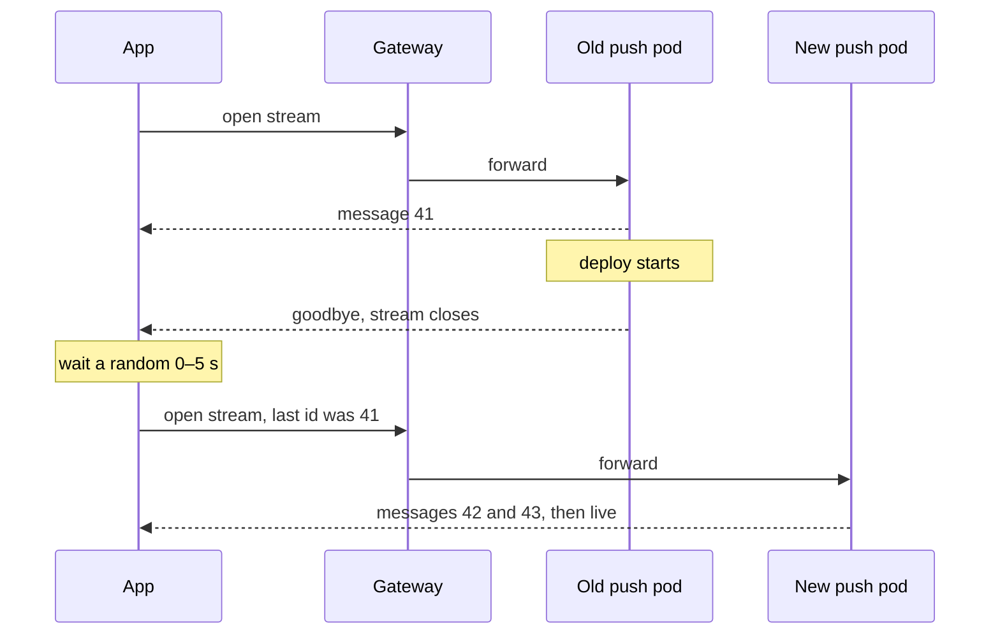

I want the experimentation service to be event-driven: when someone changes an experiment, the service should tell everyone who needs to know, straight away. When nothing changes, it should stay quiet.

That isn't how it works today. The services that assign users to variants pull their config: they read it through a cache that events and a TTL keep fresh, and apps ask on every request. Most of those reads get the same answer as last time.

<figure class="fig">
<svg viewBox="0 0 680 170" role="img" aria-labelledby="s9t s9d">
  <title id="s9t">Polling compared with push</title>
  <desc id="s9d">Over ten minutes, a client polling every two minutes checks six times. Five checks return no change. The config changes at minute 6.5, and the poll at minute 8 finds it, so the client is stale for 1.5 minutes. With push, the server sends one message at minute 6.5, the moment the change happens.</desc>
  <line class="grid dash" x1="489" x2="489" y1="26" y2="140"/><text class="m" x="489" y="18" text-anchor="middle">config changes</text>
  <text class="t" x="10" y="56">polling every 2 min</text><text class="m" x="10" y="72">5 of 6 checks: no change</text>
  <line class="grid" x1="190" x2="650" y1="60" y2="60"/>
  <g tabindex="0"><title>Polls at 0, 2, 4 and 6 min: no change</title><circle cx="190" cy="60" r="5" fill="var(--muted)"/><circle cx="282" cy="60" r="5" fill="var(--muted)"/><circle cx="374" cy="60" r="5" fill="var(--muted)"/><circle cx="466" cy="60" r="5" fill="var(--muted)"/></g>
  <g tabindex="0"><title>Stale from 6.5 to 8 min</title><line class="sb" x1="489" x2="558" y1="60" y2="60"/></g>
  <text class="tb" x="524" y="44" text-anchor="middle">stale 1.5 min</text>
  <g tabindex="0"><title>Poll at 8 min finds the change</title><circle class="fa" cx="558" cy="60" r="5"/></g>
  <g tabindex="0"><title>Poll at 10 min: no change</title><circle cx="650" cy="60" r="5" fill="var(--muted)"/></g>
  <text class="t" x="10" y="116">push (SSE)</text><text class="m" x="10" y="132">one message, when needed</text>
  <line class="grid" x1="190" x2="650" y1="120" y2="120"/>
  <g tabindex="0"><title>Push: sent at 6.5 min, the moment it changes</title><circle class="fa" cx="489" cy="120" r="6"/></g>
  <text class="ta" x="477" y="140" text-anchor="end">sent the moment it changes</text>
  <text class="m" x="190" y="162">0</text><text class="m" x="650" y="162" text-anchor="end">10 min</text>
</svg>
<figcaption>Polling is checking the mailbox every two minutes. Push is a doorbell: nothing happens until there's something to deliver.</figcaption>
</figure>

When I wrote about [getting experiment config to every service]({{ '/posts/from-polling-to-push/' | relative_url }}), push was the most advanced option, and I held back from it. Push means keeping a connection open to every client for hours, and I didn't know how well that works inside Kubernetes. So I went and learned. This post is what I found, in the order I wish I'd learned it:

1. What server-sent events (SSE) are.
2. Why long-lived connections are tricky.
3. What a service mesh is, and what Istio does.
4. Each problem again, and whether a mesh fixes it.

## 1. Server-sent events

SSE is a normal HTTP request whose answer never finishes. The client asks once. The server replies, keeps the connection open, and writes a new message into it whenever something happens. Think of a phone call where only one side talks, and only when there's news.

This is what the client receives over time:

```text
id: 42
data: {"experiment":"checkout-cta","status":"paused"}

: ping

id: 43
data: {"experiment":"search-rank","traffic":0.5}
```

Three things in there matter later:

- **Each message ends with a blank line.** The client handles it as soon as it arrives.
- **A line starting with a colon is a comment.** The client ignores it. The server can send one every few seconds just to show the line is still alive: a heartbeat.
- **Each message can have an `id`.** If the connection drops, the client reconnects and says "the last one I got was 42". The server then sends whatever came after it. Browsers do this automatically, through a header called `Last-Event-ID`.

SSE only goes one way, from server to client. That's all config delivery needs. If you need both directions, WebSockets are the usual choice.

## 2. Why long connections are tricky

Most web infrastructure is built for short requests: a question comes in, an answer goes out, done in under a second. An SSE connection can stay open for hours. Between the client and the server there are several middlemen, such as load balancers and proxies, and each one was tuned with short requests in mind.

Four things can go wrong:

1. **A middleman hangs up on a quiet line.** Most proxies close connections that have been silent for a while, often after a minute.
2. **A middleman holds messages back.** Some proxies collect a response in a buffer before passing it on. For a normal request that's fine. For SSE, the messages sit in the buffer and arrive late or not at all.
3. **New servers get no clients.** A client picks a server when it connects and stays there. If you add a server because the others are busy, existing clients don't move to it.
4. **Everyone calls back at once.** When a server restarts during a deploy, all its clients lose their connection at the same moment and reconnect together.

There's also a fifth, smaller one: every open connection takes some memory on every machine it passes through.

## 3. What a service mesh is

With many services, each one needs the same networking features: timeouts, retries, encrypted traffic, and metrics on every call. Without help, every team builds these into its own code, in its own way.

A service mesh takes those features out of the application and puts them into a small proxy next to every copy of every service. An analogy that helped me: each service gets a personal assistant that handles its calls. The service just says "call the push service". The assistant finds a healthy copy, encrypts the call, retries if it fails, and writes down how long it took. A manager gives every assistant the same rulebook.

**Istio** is the most common service mesh on Kubernetes. In Istio's terms:

- The assistants are **Envoy** proxies. Istio adds one to every pod automatically, as an extra container called a **sidecar**, and routes all the pod's traffic through it.
- The manager is **istiod**. It tells every Envoy where the other services are, what the rules are, and which certificates to use for encryption.
- The front desk is the **ingress gateway**, a standalone Envoy where traffic from outside the cluster comes in.

You write the rules as Kubernetes objects, for example "send 10% of requests to version 2" or "time out after 3 seconds".

<figure class="fig">
<svg viewBox="0 0 680 280" role="img" aria-labelledby="s0t s0d">
  <title id="s0t">Istio's architecture</title>
  <desc id="s0d">istiod, the control plane, pushes configuration and certificates to every Envoy proxy over long-lived gRPC streams. Traffic enters through an ingress gateway, which is a standalone Envoy, and reaches the frontend pod's Envoy sidecar. Calls from the frontend to the push service go from the frontend's Envoy to the push service's Envoy over mutual TLS.</desc>
  <defs><marker id="sa0" viewBox="0 0 10 10" refX="9" refY="5" markerWidth="7" markerHeight="7" orient="auto-start-reverse"><path class="arrow" d="M0,0 L10,5 L0,10 z"/></marker></defs>
  <rect class="box" x="240" y="10" width="200" height="56" rx="6"/><text class="t" x="252" y="32">istiod</text><text class="m" x="252" y="51">config · certificates</text>
  <text class="m" x="452" y="32">pushes config to every proxy</text><text class="m" x="452" y="48">over long-lived gRPC (xDS)</text>
  <rect class="box" x="10" y="140" width="150" height="56" rx="6"/><text class="t" x="22" y="162">ingress gateway</text><text class="m" x="22" y="181">Envoy at the edge</text>
  <rect class="box" x="190" y="112" width="220" height="100" rx="8"/><text class="m" x="202" y="132">pod: frontend</text>
  <rect class="box" x="202" y="146" width="92" height="44" rx="5"/><text class="t" x="214" y="173">Envoy</text>
  <rect class="box" x="306" y="146" width="92" height="44" rx="5"/><text class="t" x="318" y="173">app</text>
  <rect class="box" x="450" y="112" width="220" height="100" rx="8"/><text class="m" x="462" y="132">pod: push service</text>
  <rect class="box" x="462" y="146" width="92" height="44" rx="5"/><text class="t" x="474" y="173">Envoy</text>
  <rect class="box" x="566" y="146" width="92" height="44" rx="5"/><text class="t" x="578" y="173">app</text>
  <path class="ln dash" d="M300,66 L90,138" marker-end="url(#sa0)"/><path class="ln dash" d="M330,66 L256,110" marker-end="url(#sa0)"/><path class="ln dash" d="M380,66 L500,110" marker-end="url(#sa0)"/>
  <g tabindex="0"><title>Requests from outside enter through the gateway</title><path class="sa" d="M160,168 L200,168" marker-end="url(#sa0)"/></g>
  <g tabindex="0"><title>Service-to-service calls go proxy to proxy, over mutual TLS</title><path class="sa" d="M248,190 L248,240 L508,240 L508,192" marker-end="url(#sa0)"/></g>
  <text class="ta" x="378" y="258" text-anchor="middle">mTLS between proxies</text>
</svg>
<figcaption>Dashed lines: istiod handing out the rulebook. Blue lines: real traffic, which always goes from one Envoy to another, never straight between apps.</figcaption>
</figure>

There's a nice irony here. istiod sends its rules to every Envoy over long-lived connections that stay open all the time. The mesh itself runs on the pattern I was nervous about.

## 4. The four problems, with a mesh

With Istio, an SSE connection from an app to our push service passes through three middlemen: the cloud load balancer, the ingress gateway, and the Envoy sidecar next to the push service. Each has its own timers.

<figure class="fig">
<svg viewBox="0 0 680 290" role="img" aria-labelledby="s1t s1d">
  <title id="s1t">Every hop on an SSE stream has a timer</title>
  <desc id="s1d">An SSE stream goes from the app or SDK through a cloud load balancer, the Istio ingress gateway, the push service's Envoy sidecar, and into the push service. The load balancer has an idle timeout, 60 seconds by default on AWS's Application Load Balancer. Envoy's route timeout is 15 seconds by default, but Istio turns it off. Envoy's stream idle timeout is 5 minutes. On deploy, Istio drains for 5 seconds by default. Without heartbeats, a quiet stream is cut after 60 seconds; with a comment line every 20 seconds, no idle timer fires.</desc>
  <defs><marker id="sa1" viewBox="0 0 10 10" refX="9" refY="5" markerWidth="7" markerHeight="7" orient="auto-start-reverse"><path class="arrow" d="M0,0 L10,5 L0,10 z"/></marker></defs>
  <rect class="box" x="10" y="20" width="120" height="52" rx="6"/><text class="t" x="22" y="41">app / SDK</text><text class="m" x="22" y="59">reconnects</text>
  <rect class="box" x="147" y="20" width="120" height="52" rx="6"/><text class="t" x="159" y="41">cloud LB</text><text class="m" x="159" y="59">load balancer</text>
  <rect class="box" x="284" y="20" width="120" height="52" rx="6"/><text class="t" x="296" y="41">gateway</text><text class="m" x="296" y="59">Envoy</text>
  <rect class="box" x="421" y="20" width="120" height="52" rx="6"/><text class="t" x="433" y="41">sidecar</text><text class="m" x="433" y="59">Envoy</text>
  <rect class="box" x="558" y="20" width="112" height="52" rx="6"/><text class="t" x="570" y="41">push</text><text class="m" x="570" y="59">holds streams</text>
  <path class="ln" d="M130,46 L145,46" marker-end="url(#sa1)"/><path class="ln" d="M267,46 L282,46" marker-end="url(#sa1)"/><path class="ln" d="M404,46 L419,46" marker-end="url(#sa1)"/><path class="ln" d="M541,46 L556,46" marker-end="url(#sa1)"/>
  <text class="ta" x="70" y="98" text-anchor="middle">backoff</text><text class="m" x="70" y="114" text-anchor="middle">and jitter</text>
  <text class="tb" x="207" y="98" text-anchor="middle">idle timeout</text><text class="m" x="207" y="114" text-anchor="middle">60 s on AWS ALB</text>
  <text class="tb" x="344" y="98" text-anchor="middle">route timeout</text><text class="m" x="344" y="114" text-anchor="middle">15 s in Envoy,</text><text class="m" x="344" y="130" text-anchor="middle">off in Istio</text>
  <text class="tb" x="481" y="98" text-anchor="middle">stream idle</text><text class="m" x="481" y="114" text-anchor="middle">5 min in Envoy</text>
  <text class="tb" x="614" y="98" text-anchor="middle">drain on deploy</text><text class="m" x="614" y="114" text-anchor="middle">5 s in Istio</text>
  <line class="grid" x1="10" x2="670" y1="152" y2="152"/>
  <text class="h" x="10" y="176">ONE QUIET STREAM, FIRST 5 MINUTES</text>
  <text class="m" x="10" y="208">no heartbeat</text>
  <g tabindex="0"><title>No heartbeat: the load balancer cuts the stream after 60 s idle</title><line class="sb" x1="150" x2="252" y1="204" y2="204"/><path class="sb" d="M246,198 L258,210 M258,198 L246,210"/></g>
  <text class="tb" x="266" y="208">cut after 60 s idle</text>
  <text class="m" x="10" y="248">comment every 20 s</text>
  <g tabindex="0"><title>With a comment line every 20 s, no idle timer fires</title><line class="sa" x1="150" x2="660" y1="244" y2="244"/>
  <circle class="fa" cx="184" cy="244" r="4"/><circle class="fa" cx="218" cy="244" r="4"/><circle class="fa" cx="252" cy="244" r="4"/><circle class="fa" cx="286" cy="244" r="4"/><circle class="fa" cx="320" cy="244" r="4"/><circle class="fa" cx="354" cy="244" r="4"/><circle class="fa" cx="388" cy="244" r="4"/><circle class="fa" cx="422" cy="244" r="4"/><circle class="fa" cx="456" cy="244" r="4"/><circle class="fa" cx="490" cy="244" r="4"/><circle class="fa" cx="524" cy="244" r="4"/><circle class="fa" cx="558" cy="244" r="4"/><circle class="fa" cx="592" cy="244" r="4"/><circle class="fa" cx="626" cy="244" r="4"/></g>
  <text class="m" x="150" y="276">0</text><text class="m" x="660" y="276" text-anchor="end">5 min</text>
</svg>
<figcaption>The shortest idle timer on the path decides how long a quiet stream lives. A heartbeat shorter than all of them keeps every one from firing. The defaults shown are examples; check your own.</figcaption>
</figure>

### A middleman hangs up on a quiet line

**Does the mesh fix it?** No, it adds more timers. But the fix is easy.

Every hop has an idle timer. For example, AWS's load balancer closes connections that have been quiet for 60 seconds, and Envoy closes a stream after five quiet minutes. Envoy also has a 15-second limit on how long a whole response may take, which would cut every SSE connection. Istio switches that limit off by default, but it comes back if you set a timeout on the route yourself.

**Fix:** send a heartbeat comment every 15 to 30 seconds. That's shorter than every idle timer on the path, so none of them fire.

### A middleman holds messages back

**Does the mesh fix it?** Yes, mostly. Envoy passes messages through as they arrive.

Buffering usually comes from other places. NGINX-based ingress controllers buffer responses unless the server sends the header `X-Accel-Buffering: no`. Compression can also hold small messages back until it has enough to compress.

**Fix:** turn buffering off for the stream, and don't compress `text/event-stream` responses.

### New servers get no clients

**Does the mesh fix it?** No. This one surprised me.

Envoy is smarter than plain Kubernetes about spreading load: it balances every request, instead of every connection. But an SSE connection is one request that never ends. Once it lands on a server, it stays there, mesh or no mesh.

**Fix:** have the server close each connection after a while, say every 10 minutes, with a little randomness so they don't all close together. The client reconnects, and that time it may land on the new server.

<figure class="fig">
<svg viewBox="0 0 680 260" role="img" aria-labelledby="s2t s2d">
  <title id="s2t">Share of streams on a newly added pod</title>
  <desc id="s2d">Simulation of 4,000 streams on three push pods when a fourth pod starts. With no cap on stream lifetime, and streams ending naturally about every three hours, the new pod holds 1% of streams after 10 minutes and 6% after an hour. With streams capped at 10 plus or minus 2 minutes, it holds 21% after 10 minutes and about 25%, an even share, from 15 minutes on.</desc>
  <text class="h" x="10" y="20">SHARE OF STREAMS ON THE NEW POD</text>
  <line class="grid" x1="60" x2="600" y1="210" y2="210"/><text class="m" x="52" y="214" text-anchor="end">0%</text>
  <line class="grid" x1="60" x2="600" y1="153" y2="153"/><text class="m" x="52" y="157" text-anchor="end">10%</text>
  <line class="grid" x1="60" x2="600" y1="97" y2="97"/><text class="m" x="52" y="101" text-anchor="end">20%</text>
  <line class="grid" x1="60" x2="600" y1="40" y2="40"/><text class="m" x="52" y="44" text-anchor="end">30%</text>
  <text class="m" x="60" y="228" text-anchor="middle">0</text>
  <text class="m" x="150" y="228" text-anchor="middle">10</text>
  <text class="m" x="240" y="228" text-anchor="middle">20</text>
  <text class="m" x="330" y="228" text-anchor="middle">30</text>
  <text class="m" x="420" y="228" text-anchor="middle">40</text>
  <text class="m" x="510" y="228" text-anchor="middle">50</text>
  <text class="m" x="600" y="228" text-anchor="middle">60</text>
  <text class="m" x="330" y="248" text-anchor="middle">minutes after the fourth pod starts</text>
  <line class="ln dash" x1="60" x2="600" y1="68" y2="68"/>
  <text class="m" x="606" y="72">even: 25%</text>
  <g tabindex="0"><title>Never closed: 1% on the new pod after 10 min, 6% after 60 min</title><path class="sb" d="M60.0,210.0 L69.0,209.6 L78.0,209.3 L87.0,208.4 L96.0,208.3 L105.0,207.6 L114.0,206.7 L123.0,205.9 L132.0,205.0 L141.0,204.5 L150.0,203.9 L159.0,203.2 L168.0,201.9 L177.0,201.2 L186.0,199.5 L195.0,198.9 L204.0,198.2 L213.0,197.4 L222.0,197.1 L231.0,196.5 L240.0,196.3 L249.0,195.7 L258.0,195.1 L267.0,193.7 L276.0,193.4 L285.0,192.9 L294.0,192.6 L303.0,192.0 L312.0,191.6 L321.0,191.7 L330.0,191.2 L339.0,191.2 L348.0,190.7 L357.0,189.6 L366.0,188.6 L375.0,187.3 L384.0,186.8 L393.0,186.1 L402.0,185.5 L411.0,185.1 L420.0,184.4 L429.0,184.5 L438.0,183.9 L447.0,182.8 L456.0,182.1 L465.0,181.7 L474.0,181.0 L483.0,180.4 L492.0,179.3 L501.0,178.7 L510.0,178.7 L519.0,177.8 L528.0,177.6 L537.0,176.7 L546.0,176.0 L555.0,176.0 L564.0,175.6 L573.0,174.9 L582.0,174.0 L591.0,174.0 L600.0,174.0"/></g>
  <g tabindex="0"><title>Closed every 10 ± 2 min: 21% after 10 min, 26% after 20 min</title><path class="sa" d="M60.0,210.0 L69.0,199.5 L78.0,186.5 L87.0,174.4 L96.0,162.5 L105.0,149.1 L114.0,137.3 L123.0,124.9 L132.0,115.4 L141.0,104.3 L150.0,90.4 L159.0,79.0 L168.0,66.2 L177.0,64.8 L186.0,64.5 L195.0,63.8 L204.0,64.9 L213.0,64.6 L222.0,64.9 L231.0,64.6 L240.0,62.7 L249.0,63.9 L258.0,64.9 L267.0,66.6 L276.0,66.2 L285.0,64.1 L294.0,64.1 L303.0,62.8 L312.0,62.9 L321.0,63.8 L330.0,63.4 L339.0,62.4 L348.0,65.5 L357.0,66.8 L366.0,68.0 L375.0,68.6 L384.0,71.4 L393.0,75.0 L402.0,76.1 L411.0,77.0 L420.0,77.7 L429.0,76.6 L438.0,74.8 L447.0,71.3 L456.0,70.3 L465.0,69.3 L474.0,65.8 L483.0,63.1 L492.0,63.5 L501.0,64.9 L510.0,65.9 L519.0,63.5 L528.0,64.1 L537.0,67.2 L546.0,70.0 L555.0,70.9 L564.0,69.3 L573.0,70.2 L582.0,68.9 L591.0,68.3 L600.0,65.2"/></g>
  <text class="tb" x="600" y="164" text-anchor="end">never closed</text>
  <text class="ta" x="140" y="140">closed every ~10 min</text>
</svg>
<figcaption>Simulated, illustrative numbers for a fourth server added to three busy ones. If connections never close, the new server stays almost empty for hours. If each connection closes after about 10 minutes, the load evens out within one cycle.</figcaption>
</figure>

### Everyone calls back at once

**Does the mesh fix it?** Partly.

During a deploy, Istio gives the old server a short grace period, five seconds by default, and then closes its connections. The mesh won't reconnect for the client, so every client does it on its own. What the mesh does add is protection for the servers: it can limit connections and stop sending traffic to a server that is struggling.

**Fix:** clients wait a random few seconds before reconnecting, and send the last `id` they saw so they don't miss anything.



One trap is specific to meshes. In older setups, the sidecar could shut down before the application, cutting connections before the server could say goodbye. Newer Kubernetes versions let sidecars start first and stop last, and Istio can use that.

### And the memory cost

**Does the mesh fix it?** No, it makes it a bit worse. Each open connection is now also held by the gateway and the sidecar. It's small per connection, but worth measuring before you have hundreds of thousands.

### What the mesh adds

Some things come for free with a mesh: encrypted traffic between services without code changes, metrics on how many streams are open and how long they last, and the option to send a new version of the push service only a small share of new connections at first.

## Summary

| Problem | Does a mesh fix it? | What you do |
| --- | --- | --- |
| Middlemen hang up on quiet lines | No, adds more timers | heartbeat every 15–30 s |
| Middlemen hold messages back | Mostly | buffering off, no compression |
| New servers get no clients | No | close connections every ~10 min, with randomness |
| Everyone calls back at once | Partly | random wait, resume from last id |
| Memory per connection | No, a bit worse | measure it |

## Would I build it now

For our config system, with around ten changes a day, not yet. Polling cheaply with ETags, or Firestore listeners, gives us enough freshness with far less to run. And adopting a whole service mesh for one push service would be a lot.

If we needed changes to reach every client within a second, I'd build SSE with the fixes above: heartbeats, connections that close every few minutes, message ids for resuming, random waits on reconnect, buffering off, and polling as a fallback. I'd only use a mesh if the cluster already had one. None of the fixes depend on it.

My worry was right about which problems exist. I overestimated how hard they are: each one has a known fix, and most of the fixes are a few lines of server and client code.
