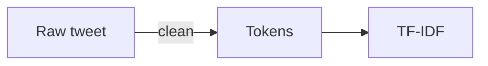

# Editing the site

The site is built from YAML and Markdown. You can change the content without editing HTML, CSS or JavaScript.

## Publish a post

Create a file in `_posts/` named with the date and a lowercase slug:

```text
_posts/2026-10-01-a-short-title.md
```

Add this front matter, then write the post below it:

```markdown
---
layout: post
title: A short title
date: 2026-10-01
tags: [agents]
summary: One sentence that explains why the post is worth reading.
---

The essay starts here.
```

The site computes the URL, reading time, lane, date formatting, and previous/next links. The post appears on the Posts page under its year, with a dot in its lane colour, automatically.

### Diagrams in a post

Write a fenced `mermaid` block anywhere in a post and it renders as a diagram, coloured from the site theme and redrawn when the reader switches light/dark:

````markdown

````

Any Mermaid diagram type works (flowchart, sequence, state, and so on). The Mermaid library only loads on posts that contain such a block. For figures that need exact layout, an inline `<figure class="fig"><svg …></svg></figure>` also works; see the existing posts for examples.

## Add a note

The filename is the note id. Create `_notes/retrieval-recall.md` like this:

```markdown
---
layout: note
title: Retrieval recall
tag: agents
links: [rag, evals]
---

Did the right documents make it into context at all?
```

`links` creates graph edges and outgoing links. Backlinks are computed automatically. Inline `[[rag]]` links are cosmetic; add `rag` to `links` if the relationship should appear in the graph. A link to an unknown id is shown as a development warning.

## Change your profile and stats

Edit `_data/profile.yml` for your name, role, location, headline, bio, current focus, off-hours interests, roots, and the things you care about. `short_role` and `city` are the short versions shown under your name in the header and in the footer ("ML engineer · Stockholm").

`off_hours` may start each interest with an emoji, and `flag` (quoted, e.g. `"🇸🇪"`) is shown after the location in the About inspector. Emojis are content, so they live in YAML, never in templates. The Fadhil node's `subtitle` in `_data/workflow.yml` is a literal copy of the location; update it alongside `profile.yml`. The node's `desc` is a separate one-line tagline, distinct from the `bio` shown at the top of the page; edit it in `workflow.yml`.

`roots` (optional, e.g. `Indonesia 🇮🇩`) adds an "originally from" row after "based in" in the Fadhil inspector. `cares_about` (optional) is a list of short lines, each may start with an emoji; they render one per line as a "cares about" row after "off-hours". Both are inspector-only and stay out of the JSON panel. `bio` uses a YAML block scalar (`>-`) so apostrophes and emoji are safe.

List hobbies once, in `off_hours`. Toolkits in `_data/skills.yml` flow into Work on the pipeline, so keep them to things you have used in work, with `where` naming a company or project.

`_data/stats.yml` holds outcome tiles. The current design does not show them; they are kept for later:

```yaml
- value: "6,000"
  label: monthly employees on the assistant I help run
```

Keep values quoted when they contain punctuation, a percent sign, or a leading zero.

## Soft depth and motion

All depth, avatar and animation styling lives in `assets/css/depth.css`. Every rule is
scoped to `html[data-depth="soft"]`, which `_layouts/base.html` sets. **To go back to the
flat look, remove that attribute or the `depth.css` link in `_includes/head.html`.** The
avatar is hidden by a one-line `.avatar { display: none }` in `workflow.css`, so reverting
hides it too.

- Colours and shadows are variables at the top of the file (`--depth-*`). Change the circle
  colour with `--depth-circle` (one value for light, one for dark).
- `--depth-avatar-shadow` controls the cast shadow (lighter in dark mode). The avatar's
  CSS projection is clipped to the circle; the visible head has no shadow onto the panel.
  Keep its background sizing aligned with `.avatar__img` if you change the crop.
- Raised panels share `--depth-shadow-rest`, `--depth-shadow-raised` and `--depth-shadow-hover`.
  Add a new raised element by adding its selector to the `:is(...)` list in "Surfaces".
- The Posts and Projects page headings are intentionally flat. Do not add them to that list.
- Motion is in section 7: a staggered page-load rise, an avatar pop-in, a smooth theme
  switch and a 2px hover lift on cards. It only runs under `prefers-reduced-motion: no-preference`
  (the hover lift also requires `hover: hover`), so reduced-motion users get a static page.
- Workflow nodes and full base lines always stay visible. A short accent travels along
  the lines in a 2.4-second loop; `--depth-flow-period` controls speed. The SVG template
  adds one `.wf-flow` projection per edge with `pathLength="1"` for equal travel duration.
  Its stage comes from the edge-group order. Reduced-motion hides the projection and
  leaves the original graph static. The phone accordion has no added motion.
- Avatar: `assets/css/avatar-images.css` holds transparent 300 and 600 px WebP cutouts
  as base64 data URIs in `--avatar-image`. The browser chooses the 1x or 2x source; both
  the visible cutout and circle-only shadow use it. No binary files are required. To
  replace the avatar, export the same transparent cutout at both widths with the same
  aspect ratio, base64-encode each WebP, and replace the two data URIs. If the aspect
  ratio changes, update `.avatar__img` in `depth.css`. The wrapper stays `aria-hidden`
  because the heading already names Fadhil. The circle clips the body; the head rises
  above it. This asset stylesheet loads only on About and adds no new JavaScript.

Check About, Posts, Projects and Notes at 390 and 1280 px in both themes, and with
reduced motion on, after changing any of this.

## Add jobs, degrees, projects, and papers

Add entries to the matching data file. For example:

```yaml
# _data/experience.yml
- years: Oct 2026 — Now
  role: Senior ML Platform Engineer
  org: Example Company
  note: Building reliable training and evaluation infrastructure.
```

The other files use the same pattern:

```yaml
# _data/projects.yml
- name: Agentic knowledge assistant
  year: 2025 —
  desc: One or two sentences about what it is and what you owned.
  tags: agents · evals

# _data/publications.yml
- title: Paper title
  venue: IEEE
  year: "2016"
  href: https://example.org/paper

# _data/contact.yml
- label: email
  value: you@example.com
  href: mailto:you@example.com
```

Education and experience entries take an optional quoted `flag` (e.g. `flag: "🇸🇪"`), shown after the organisation. Experience entries also take an optional `place` (e.g. `place: Stockholm`), which appears in the JSON panel as plain text. Skill items take an optional `emoji`, shown before the name in the inspector (the JSON panel stays emoji-free).

New entries appear in the relevant workflow inspector automatically, and node subtitles such as `8 roles` and `8 items` update themselves.

## Add a node to the About workflow

Add a new toolkit to `_data/skills.yml`. It becomes a new node at the toolkit level:

```yaml
- key: systems
  group: Systems
  glyph: "◇"
  color: l3
  desc: What I reach for in systems work, and where I used it.
  items:
    - name: Distributed systems
      where: Example Company
```

For a new kind of content, add a node to `_data/workflow.yml` using `source: custom`:

```yaml
- id: awards
  level: 4
  glyph: "★"
  title: Awards
  subtitle: auto
  kind: output
  color: l1
  desc: A few from the robotics years.
  source: custom
  rows:
    - { k: "2017", v: "2nd place, Go-Hackathon, Gojek Indonesia" }
    - { k: "2016", v: "1st place, i-Caps International Joint Capstone Design, Incheon" }
  output:
    awards: 2
```

The layout is computed from `level`; do not add coordinates. The node id must be unique. Nodes at the same level stack vertically and the canvas grows to fit.

To connect a new node, add an edge to `edges:` in the same file. `"@skills"` means every toolkit node:

```yaml
edges:
  - { from: work, to: awards }
  - { from: "@skills", to: awards }
```

`subtitle: auto` is replaced with a count, such as `8 roles`, `5 tools` or `8 items`. Any other value is shown as written.

The profile location (with its flag) is intentionally written literally as the Fadhil node's `subtitle` in `_data/workflow.yml` so the workflow file stays easy to read; update it there whenever `profile.yml` changes.

## Add or recolour a topic lane

Edit `_data/lanes.yml`:

```yaml
- key: research
  title: Research        # filter chip on Posts
  label: research        # footer legend
  long: Research notes
  color: l0
  tags: [research, experiments]
```

Posts use their raw `tags`; notes use one raw `tag`. A matching lane decides where each item appears and which colour it uses. `color` is one of `l0` to `l5` or `fg`.

Each raw tag also needs a display label in `_data/tags.yml`; that file's order is the order of groups in the Notes explorer:

```yaml
- key: research
  label: Research
```

A lane with `branch: false` (like `meta`) groups notes in the explorer but gets no filter chip on Posts and no footer entry.

## What not to edit

Do not edit `_layouts/`, `_includes/`, or `assets/` for normal content changes. They contain the site structure, styling, and behavior.

## Preview locally

Install Ruby 3.1 or newer, then run:

```bash
bundle install
bundle exec jekyll serve
```

Open <http://localhost:4000>. The development build also shows broken note-link warnings.

## Publish

Commit and push to `master`. GitHub Actions builds the site, runs HTML-Proofer, and deploys it to GitHub Pages. If a build fails, open the failed workflow run in the repository's **Actions** tab; the build step usually identifies the YAML, Markdown, or link that needs attention.

## Browser editing

For existing blog posts, use the [CMS setup and review guide](CMS.md). The first
version edits full source in plain text, including YAML front matter, HTML/SVG,
JavaScript and Liquid. Saves create review PRs and cannot publish from the CMS.
Keep using GitHub or your local editor for new post filenames, notes and assets.
